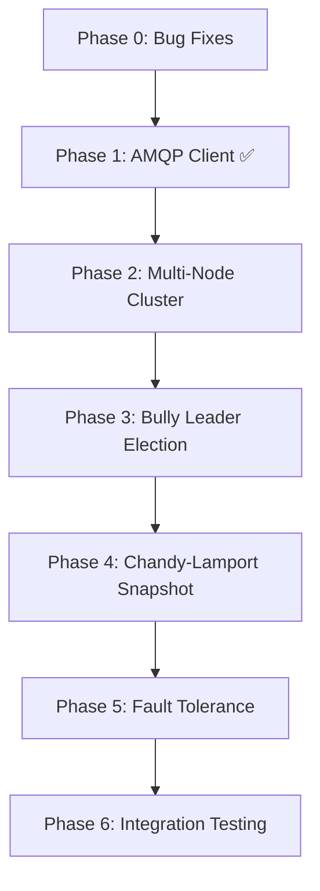

# Implementation Plan: Distributed Systems Features for Distributed Crazy Time

## Background & Goal

The Distributed Crazy Time project is a real-time betting web app with a hybrid Java/Erlang architecture. The **web layer** (Spring Boot gateway, HTML/CSS/JS frontend) and the **game logic** (Erlang wheel + 4 mini-games) are fully functional on a **single Erlang node** using HTTP Management API polling for RabbitMQ.

**What's missing** (per the project specification PDF):
1. **Native AMQP integration** — Replace fragile HTTP Management API polling with `amqp_client` (proper AMQP 0-9-1)
2. **Multi-node Erlang cluster** — Run the game engine across 2+ Erlang nodes
3. **Leader Election algorithm** — Bully Algorithm to elect a single "Dealer" node that runs the game
4. **Chandy-Lamport Snapshot algorithm** — Consistent global state capture at "No more bets"
5. **Fault tolerance & recovery** — Detect dealer crash, elect new leader, refund in-flight bets

> [!IMPORTANT]
> This plan is designed so that each phase builds on the previous one. Complete them in order. Each phase includes the exact files to create/modify, the Erlang code structure, and the integration points. **Start with Phase 0 (Bug Fixes)** to stabilize the existing codebase before adding distributed features.

---

## Phase 0: Bug Fixes (Existing Codebase) (dovrebbero essere a posto ma ricontrollare)
(manca da vedere che nelle scelte default ricevo come bonus -1x)

**Goal**: Fix all bugs, race conditions, logic errors, and security issues found during the comprehensive code review. These must be fixed **before** adding distributed features, as they would compound with the increased complexity.

> [!CAUTION]
> Issues marked 🔴 CRITICAL can cause data corruption, money loss, or exploitable vulnerabilities. Fix these first.

---

### 0.1 — Java Gateway Fixes

---

#### 🔴 FIX 0.1.1: Double-Spending Race Condition in Bet Placement

**File**: [WalletController.java](file:///C:/Users/cacak/OneDrive/Desktop/distributed_crazy_time/java-gateway/src/main/java/com/crazytime/controller/WalletController.java) (lines 60–96)

**Problem**: No synchronization or DB-level locking during balance deduction. Two concurrent HTTP requests for `/api/wallet/place-bet` can both read the same balance, both pass the check, and both deduct — allowing a player with $100 to place two $100 bets (spending $200).

**Fix**: Add `@Transactional` and pessimistic locking. Add a `@Version` field to `Player` for optimistic locking, OR use `@Lock(LockModeType.PESSIMISTIC_WRITE)` on the repository query:

```java
// In PlayerRepository.java — add:
@Lock(LockModeType.PESSIMISTIC_WRITE)
@Query("SELECT p FROM Player p WHERE p.username = :username")
Optional<Player> findByUsernameForUpdate(@Param("username") String username);

// In WalletController.java — wrap placeBet with @Transactional and use the locking query:
@Transactional
@PostMapping("/place-bet")
public ResponseEntity<Map<String, Object>> placeBet(...) {
    Player updatedPlayer = playerRepository.findByUsernameForUpdate(player.getUsername())
        .orElseThrow(() -> new RuntimeException("Player not found"));
    
    if (updatedPlayer.getBalance().compareTo(amount) < 0) {
        return ResponseEntity.badRequest().body(Map.of("success", false, "error", "Saldo insufficiente"));
    }
    updatedPlayer.setBalance(updatedPlayer.getBalance().subtract(amount));
    playerRepository.save(updatedPlayer);
    // ... rest of bet logic ...
}
```

---

#### 🔴 FIX 0.1.2: Lost Update Race Condition in PayoutListener

**File**: [PayoutListener.java](file:///C:/Users/cacak/OneDrive/Desktop/distributed_crazy_time/java-gateway/src/main/java/com/crazytime/rabbitmq/PayoutListener.java) (lines 36, 79–86)

**Problem**: `PayoutListener` reads player balance, adds payout, and saves — but can execute concurrently with `WalletController` (bet deductions) or `RefundListener` (refund credits). This causes lost updates where one operation overwrites the other.

**Fix**: Add `@Transactional` to `processPayouts` and use the pessimistic locking query:

```java
@Transactional
public void processPayouts(String message) {
    // ... parsing ...
    Player player = playerRepository.findByUsernameForUpdate(bet.getUsername())
        .orElse(null);
    if (player != null) {
        player.setBalance(player.getBalance().add(finalPayout));
        playerRepository.save(player);
    }
}
```

---

#### 🔴 FIX 0.1.3: RefundListener Never Updates Bet Status → Double Payout Exploit

**File**: [RefundListener.java](file:///C:/Users/cacak/OneDrive/Desktop/distributed_crazy_time/java-gateway/src/main/java/com/crazytime/rabbitmq/RefundListener.java) (lines 44–50)

**Problem**: When Erlang rejects a late bet and sends a refund, `RefundListener` restores the player's balance but **never marks the `Bet` entity as `REFUNDED`**. The bet stays `PENDING`. When the round completes, `PayoutListener` finds this `PENDING` bet and, if the segment matches the winner, pays the player winnings **on a bet that was already refunded**. This is a free money exploit.

**Fix**: After crediting the refund, find and update the matching bet:

```java
@Transactional
@RabbitListener(queues = "refunds_queue")
public void receiveRefund(String message) {
    // ... parse username, amount, segment ...
    
    Player player = playerRepository.findByUsernameForUpdate(username).orElse(null);
    if (player != null) {
        player.setBalance(player.getBalance().add(amount));
        playerRepository.save(player);
    }
    
    // CRITICAL FIX: Mark the bet as REFUNDED so PayoutListener ignores it
    List<Bet> pendingBets = betRepository.findByUsernameAndStatus(username, "PENDING");
    for (Bet bet : pendingBets) {
        if (bet.getAmount().compareTo(amount) == 0) {
            bet.setStatus("REFUNDED");
            bet.setPayout(amount);
            betRepository.save(bet);
            break;  // Refund one matching bet at a time
        }
    }
}
```

---

#### 🔴 FIX 0.1.4: Duplicate Payout for Multiple Winning Bets

**File**: [PayoutListener.java](file:///C:/Users/cacak/OneDrive/Desktop/distributed_crazy_time/java-gateway/src/main/java/com/crazytime/rabbitmq/PayoutListener.java) (lines 50–76)

**Problem**: If a player placed multiple bets on the winning segment, and Erlang's `payoutsNode` has a single aggregated payout per username, each Java `Bet` entity finds the **same** payout entry and credits the **full** aggregated amount for each bet. Result: payout multiplied by number of bets.

**Fix**: Track which payout entries have been consumed, OR use a per-bet payout calculation instead of looking up the aggregated payout for each bet:

```java
// Option A: After finding a matching payout entry, remove it from the list
// Option B: Calculate payout per-bet using the multiplier
if (payoutsNode == null || !payoutsNode.isArray() || payoutsNode.isEmpty()) {
    // Fallback: calculate from multiplier
    finalPayout = bet.getAmount().add(bet.getAmount().multiply(BigDecimal.valueOf(multiplier)));
} else {
    // Find and REMOVE the matching entry to prevent re-use
    Iterator<JsonNode> it = payoutsNode.iterator();
    while (it.hasNext()) {
        JsonNode p = it.next();
        if (p.has("username") && p.get("username").asText().equals(bet.getUsername())) {
            finalPayout = new BigDecimal(p.get("payout").asText());
            it.remove();  // Prevent this entry from being matched again
            break;
        }
    }
}
```

---

#### 🟡 FIX 0.1.5: Missing `@Transactional` on `placeBet`

**File**: [WalletController.java](file:///C:/Users/cacak/OneDrive/Desktop/distributed_crazy_time/java-gateway/src/main/java/com/crazytime/controller/WalletController.java) (line 60)

**Problem**: `placeBet` deducts balance, saves a `Bet`, and sends to RabbitMQ without a transaction. If saving the `Bet` fails or RabbitMQ throws, the balance deduction is already committed → player loses money without a bet.

**Fix**: Add `@Transactional` annotation (already addressed in Fix 0.1.1 above).

---

#### 🟡 FIX 0.1.6: No Game Phase Check Before Accepting Bets

**File**: [WalletController.java](file:///C:/Users/cacak/OneDrive/Desktop/distributed_crazy_time/java-gateway/src/main/java/com/crazytime/controller/WalletController.java) (lines 60–111)

**Problem**: The gateway accepts bets during any phase (`spinning`, `minigame`, `cooldown`), deducts balance, and relies on Erlang to reject and trigger an async refund. This is unnecessary churn.

**Fix**: Check phase before deducting:

```java
String phase = gameStateCache.getPhase();
if (!"betting".equals(phase)) {
    return ResponseEntity.badRequest().body(Map.of(
        "success", false,
        "error", "Le scommesse sono chiuse (fase: " + phase + ")"
    ));
}
```

---

#### 🟡 FIX 0.1.7: Dev Force-Result Endpoint Exposed to All Players

**File**: [WalletController.java](file:///C:/Users/cacak/OneDrive/Desktop/distributed_crazy_time/java-gateway/src/main/java/com/crazytime/controller/WalletController.java) (lines 51–57)

**Problem**: `/api/wallet/force-result` lets any authenticated player force the wheel outcome. A player can force `segment=10`, bet on 10, and guarantee a win.

**Fix**: Either remove the endpoint entirely, guard it with an admin-only check, or disable it in production:

```java
@PostMapping("/force-result")
public ResponseEntity<?> forceResult(@RequestParam String segment, 
                                     @RequestAttribute("player") Player player) {
    // Only allow admin users (or disable entirely)
    if (!"admin".equals(player.getUsername())) {
        return ResponseEntity.status(403).body(Map.of("error", "Admin only"));
    }
    // ... existing logic ...
}
```

---

#### 🟡 FIX 0.1.8: NPE and JSON Injection in `GameController.makeChoice`

**File**: [GameController.java](file:///C:/Users/cacak/OneDrive/Desktop/distributed_crazy_time/java-gateway/src/main/java/com/crazytime/controller/GameController.java) (lines 38–48)

**Problem**: 
1. If `request.minigame()` or `request.choice()` is null → `NullPointerException`.
2. Manual `String.format` JSON doesn't escape `\n`, `\r`, `\` → JSON injection.

**Fix**: Add null checks and use Jackson `ObjectMapper`:

```java
@PostMapping("/choice")
public ResponseEntity<?> makeChoice(@RequestAttribute("player") Player player,
                                    @RequestBody GameChoiceRequest request) {
    if (request.minigame() == null || request.choice() == null) {
        return ResponseEntity.badRequest().body(Map.of("error", "Minigame e choice richiesti"));
    }
    
    ObjectMapper mapper = new ObjectMapper();
    ObjectNode payload = mapper.createObjectNode();
    payload.put("type", "minigame_choice");
    payload.put("username", player.getUsername());
    payload.put("minigame", request.minigame());
    payload.put("choice", request.choice());
    
    rabbitTemplate.convertAndSend("bets_queue", payload.toString());
    return ResponseEntity.ok(Map.of("success", true));
}
```

---

#### 🟢 FIX 0.1.9: Non-Atomic `GameStateCache` Updates

**File**: [GameStateCache.java](file:///C:/Users/cacak/OneDrive/Desktop/distributed_crazy_time/java-gateway/src/main/java/com/crazytime/rabbitmq/GameStateCache.java) (lines 13–29)

**Problem**: `phase`, `timeLeft`, `round` are separate `volatile` fields updated sequentially. A reader can see new round with old phase.

**Fix**: Use an immutable state record or `AtomicReference`:

```java
@Component
public class GameStateCache {
    private record GameState(String phase, int timeLeft, int round, String lastResult) {}
    private volatile GameState state = new GameState("waiting", 0, 0, "{}");

    public void update(String phase, int timeLeft, int round) {
        state = new GameState(phase, timeLeft, round, state.lastResult());
    }
    public String getPhase()  { return state.phase(); }
    public int getTimeLeft()  { return state.timeLeft(); }
    public int getRound()     { return state.round(); }
    // ...
}
```

---

#### 🟢 FIX 0.1.10: Regex JSON Parsing in Listeners — Use Jackson

**Files**: [GameResultListener.java](file:///C:/Users/cacak/OneDrive/Desktop/distributed_crazy_time/java-gateway/src/main/java/com/crazytime/rabbitmq/GameResultListener.java) (lines 71–77), [RefundListener.java](file:///C:/Users/cacak/OneDrive/Desktop/distributed_crazy_time/java-gateway/src/main/java/com/crazytime/rabbitmq/RefundListener.java) (lines 58–62)

**Problem**: `extractField()` uses `Pattern.compile` on every call, fails on nested JSON, and misses fields with commas/braces in values.

**Fix**: Replace all `extractField` calls with Jackson `ObjectMapper`:

```java
private final ObjectMapper objectMapper = new ObjectMapper();

private String extractField(String json, String field) {
    try {
        JsonNode node = objectMapper.readTree(json);
        JsonNode fieldNode = node.get(field);
        return fieldNode != null ? fieldNode.asText() : null;
    } catch (Exception e) {
        log.warn("Failed to parse JSON field '{}': {}", field, e.getMessage());
        return null;
    }
}
```

---

#### 🟢 FIX 0.1.11: Case-Sensitive Directory/Package Mismatch

**Files**: `Repository/BetRepository.java`, `Repository/PlayerRepository.java`

**Problem**: Directory is `Repository` (capital R) but package declaration is `com.crazytime.repository` (lowercase r). Breaks on Linux/CI.

**Fix**: Rename the directory from `Repository` to `repository` on disk.

---

#### 🟢 FIX 0.1.12: Missing UTF-8 Encoding in AuthInterceptor Response

**File**: [AuthInterceptor.java](file:///C:/Users/cacak/OneDrive/Desktop/distributed_crazy_time/java-gateway/src/main/java/com/crazytime/security/AuthInterceptor.java) (lines 37–40)

**Fix**: Add `response.setCharacterEncoding("UTF-8");` before `getWriter()`.

---

#### 🟢 FIX 0.1.13: Logout Button Doesn't Call Server

**File**: [app.js](file:///C:/Users/cacak/OneDrive/Desktop/distributed_crazy_time/java-gateway/src/main/resources/static/app.js) (lines 1698–1721)

**Problem**: Frontend logout only clears local storage and disconnects STOMP, but never calls `POST /api/auth/logout` to invalidate the server-side session token.

**Fix**: Add the server call before clearing local state:

```javascript
logoutBtn.addEventListener('click', async () => {
    try {
        await authFetch('/api/auth/logout', { method: 'POST' });
    } catch (e) { /* ignore errors on logout */ }
    
    if (stompClient) { stompClient.disconnect(); stompClient = null; }
    sessionStorage.removeItem('token');
    currentUser = null;
    // ... rest of existing logic ...
});
```

---

### 0.2 — Erlang Engine Fixes

---

#### 🔴 FIX 0.2.1: Missing Catch-All in `segment_type/1` → Crashes `wheel_process`

**File**: [wheel_process.erl](file:///C:/Users/cacak/OneDrive/Desktop/distributed_crazy_time/erlang-engine/game_engine/src/wheel_process.erl) (lines 300–307)

**Problem**: No fallback clause. If an invalid segment is forced (e.g., as a charlist or unknown name), `segment_type/1` throws `function_clause` and crashes the entire `wheel_process` gen_server, disrupting the game for all players.

**Fix**: Add a catch-all:

```erlang
segment_type(<<"1">>)         -> {multiplier, 1};
segment_type(<<"2">>)         -> {multiplier, 2};
segment_type(<<"5">>)         -> {multiplier, 5};
segment_type(<<"10">>)        -> {multiplier, 10};
segment_type(<<"Pachinko">>)  -> {minigame, pachinko};
segment_type(<<"CoinFlip">>)  -> {minigame, coinflip};
segment_type(<<"CashHunt">>)  -> {minigame, cashhunt};
segment_type(<<"CrazyTime">>) -> {minigame, crazytime};
segment_type(Unknown) ->
    io:format("[WHEEL] WARNING: Unknown segment '~p', defaulting to 1x~n", [Unknown]),
    {multiplier, 1}.
```

---

#### 🔴 FIX 0.2.2: `undo_bets` Crashes on Missing Map Keys

**File**: [wheel_process.erl](file:///C:/Users/cacak/OneDrive/Desktop/distributed_crazy_time/erlang-engine/game_engine/src/wheel_process.erl) (lines 104–108)

**Problem**: Uses `maps:get/2` (no default) — crashes with `{badkey, ...}` if a malformed bet map is in the list.

**Fix**: Use `maps:get/3` with defaults:

```erlang
UserBets = lists:filter(fun(B) -> 
    maps:get(<<"username">>, B, <<"">>) == Username 
end, Bets),
OtherBets = lists:filter(fun(B) -> 
    maps:get(<<"username">>, B, <<"">>) =/= Username 
end, Bets),
TotalRefund = lists:foldl(fun(B, Acc) -> 
    Acc + maps:get(<<"amount">>, B, 0.0) 
end, 0.0, UserBets),
```

---

#### 🟡 FIX 0.2.3: Async Minigames Publish `multiplier: 0` → Zero Payouts

**File**: [wheel_process.erl](file:///C:/Users/cacak/OneDrive/Desktop/distributed_crazy_time/erlang-engine/game_engine/src/wheel_process.erl) (lines 253–254)

**Problem**: `resolve_async_minigame` calls `build_result_json` with `Multiplier = 0`. If Java's `PayoutListener` falls back to `multiplier` field for calculation, all winning bets get `0` payout.

**Fix**: Calculate a representative multiplier from the per-user payouts, or explicitly pass `result_type = "async_minigame"` so Java knows to use the `payouts` array exclusively:

```erlang
%% Use a marker value that Java ignores when payouts array is present
Payload = build_result_json(SegName, <<"async_minigame">>, -1, WinnerIndex, Details, Payouts, State#state.round),
```

And ensure `PayoutListener.java` checks `result_type` before falling back to `multiplier`.

---

#### 🟡 FIX 0.2.4: Hardcoded `time_left: 16` for CashHunt (Should Be 30)

**File**: [wheel_process.erl](file:///C:/Users/cacak/OneDrive/Desktop/distributed_crazy_time/erlang-engine/game_engine/src/wheel_process.erl) (lines 418–425)

**Problem**: `publish_minigame_start/5` hardcodes `"time_left": 16`, but CashHunt uses `WaitTimeAsync = 30000` (30 seconds). Frontend shows 16s countdown instead of 30s.

**Fix**: Pass actual `TimeLeftSec` to `publish_minigame_start`:

```erlang
%% Change publish_minigame_start/5 to accept TimeLeft as parameter:
publish_minigame_start(Round, MinigameName, WinnerIndex, Details, History, TimeLeftSec) ->
    HistStr = format_history(History),
    DetailsJSON = json_value(Details),
    Payload = lists:flatten(io_lib:format(
        "{\"type\":\"timer\",\"round\":~p,\"time_left\":~p,\"phase\":\"minigame\",\"minigame\":\"~s\",\"winner_index\":~p,\"details\":~s,\"history\":~s}",
        [Round, TimeLeftSec, MinigameName, WinnerIndex, DetailsJSON, HistStr])),
    publish_to_queue("state_queue", Payload).
```

Update the call site in `handle_info({start_minigame, ...})`:

```erlang
publish_minigame_start(State#state.round, SegName, WinnerIndex, Details, 
                       State#state.history, TimeLeftSec),
```

---

#### 🟡 FIX 0.2.5: CrazyTime Flapper Positions Are Wrong (1 Apart vs 120°)

**File**: [crazytime.erl](file:///C:/Users/cacak/OneDrive/Desktop/distributed_crazy_time/erlang-engine/game_engine/src/crazytime.erl) (lines 38–40)

**Problem**: Green and Yellow flappers are at `WinnerIdx ± 1` (adjacent segments), but in the real game they are spaced 120° apart (~21 segments on a 64-segment wheel).

**Fix**:

```erlang
NumSegments = 64,
Spacing = NumSegments div 3,  %% ~21 segments apart
BlueMult  = ResolveVal(WinnerIdx),
GreenMult = ResolveVal((WinnerIdx + Spacing) rem NumSegments),
YellowMult = ResolveVal((WinnerIdx + 2 * Spacing) rem NumSegments),
```

---

#### 🟡 FIX 0.2.6: CashHunt Choice Type Mismatch → Silent Default Fallback

**File**: [cashhunt.erl](file:///C:/Users/cacak/OneDrive/Desktop/distributed_crazy_time/erlang-engine/game_engine/src/cashhunt.erl) (lines 63–74)

**Problem**: `binary_to_integer/1` only works on binaries like `<<"42">>`. If the choice arrives as integer `42` or charlist `"42"`, it crashes and silently falls back to `DefaultCell`.

**Fix**: Create a robust parser:

```erlang
parse_cell_index(C, DefaultCell) when is_integer(C), C >= 0, C < 108 -> C;
parse_cell_index(C, DefaultCell) when is_binary(C) ->
    try binary_to_integer(C) of
        Int when Int >= 0, Int < 108 -> Int;
        _ -> DefaultCell
    catch _:_ -> DefaultCell end;
parse_cell_index(C, DefaultCell) when is_list(C) ->
    try list_to_integer(C) of
        Int when Int >= 0, Int < 108 -> Int;
        _ -> DefaultCell
    catch _:_ -> DefaultCell end;
parse_cell_index(_, DefaultCell) -> DefaultCell.
```

---

#### 🟡 FIX 0.2.7: Charlist Values Serialize as Integer Arrays in JSON

**File**: [wheel_process.erl](file:///C:/Users/cacak/OneDrive/Desktop/distributed_crazy_time/erlang-engine/game_engine/src/wheel_process.erl) (lines 381–384)

**Problem**: `json_value(L) when is_list(L)` treats all lists as JSON arrays. Erlang strings (charlists like `"heads"`) become `[104,101,97,100,115]` in JSON.

**Fix**: Add a charlist detection guard:

```erlang
json_value(L) when is_list(L) ->
    case io_lib:printable_unicode_list(L) of
        true ->
            %% It's a string — serialize as JSON string
            "\"" ++ L ++ "\"";
        false ->
            %% It's a proper list — serialize as JSON array
            Items = lists:map(fun(I) -> json_value(I) end, L),
            "[" ++ string:join(Items, ",") ++ "]"
    end;
```

---

#### 🟡 FIX 0.2.8: Pachinko Unbounded DOUBLE Recursion

**File**: [pachinko.erl](file:///C:/Users/cacak/OneDrive/Desktop/distributed_crazy_time/erlang-engine/game_engine/src/pachinko.erl) (lines 75–81)

**Problem**: No cap on consecutive `<<"DOUBLE">>` hits. Exponential multiplier growth and unbounded recursion.

**Fix**: Add a max drop count parameter:

```erlang
-define(MAX_DROPS, 7).

simulate_drops(Slots, AccDrops) ->
    simulate_drops(Slots, AccDrops, ?MAX_DROPS).

simulate_drops(_Slots, AccDrops, 0) ->
    %% Max drops reached — use highest non-DOUBLE value
    AccDrops;
simulate_drops(Slots, AccDrops, RemainingDrops) ->
    %% ... existing drop logic ...
    case LandedVal of
        <<"DOUBLE">> ->
            NewSlots = double_slots(Slots),
            simulate_drops(NewSlots, AccDrops ++ [DropData], RemainingDrops - 1);
        _Num ->
            AccDrops ++ [DropData]
    end.
```

Also fix the O(N²) list concatenation by using `[DropData | AccDrops]` and reversing at the end.

---

#### 🟡 FIX 0.2.9: Redundant `inets:start()` in `game_engine_app.erl` and `worker.erl`

**Files**: [game_engine_app.erl](file:///C:/Users/cacak/OneDrive/Desktop/distributed_crazy_time/erlang-engine/game_engine/src/game_engine_app.erl) (line 13), [worker.erl](file:///C:/Users/cacak/OneDrive/Desktop/distributed_crazy_time/erlang-engine/game_engine/src/worker.erl) (line 20)

**Problem**: `inets:start()` called manually in two places. Should be declared in `.app.src` and started by OTP.

**Fix**: Remove both `inets:start()` calls. Ensure `inets` is in the `applications` list in `game_engine.app.src` (it already is).

> [!NOTE]
> ✅ **RISOLTO dalla Fase 1**: le chiamate HTTP sono state sostituite da AMQP nativo e `inets` è stato **rimosso** dalla lista `applications` di `game_engine.app.src`. Nel codice non resta nessuna chiamata a `inets:start()` né a `httpc`.

---

#### 🟡 FIX 0.2.10: `find_segment_index/3` Returns Wrong Index for Unfound Segments

**File**: [wheel_process.erl](file:///C:/Users/cacak/OneDrive/Desktop/distributed_crazy_time/erlang-engine/game_engine/src/wheel_process.erl) (lines 295–297)

**Problem**: If `ForcedSeg` is not found (e.g., typo or wrong type), returns `0` which is `<<"CrazyTime">>`. Combined with `{Idx, ForcedSeg}`, sends mismatched `winner_index=0` with `winner="SomeInvalidName"` to frontend.

**Fix**: Return `undefined` on miss and handle it:

```erlang
find_segment_index(Target, [Target|_], Idx) -> Idx;
find_segment_index(Target, [_|T], Idx) -> find_segment_index(Target, T, Idx+1);
find_segment_index(_, [], _) -> undefined.

%% In the forced segment handling:
case find_segment_index(ForcedSeg, Segments, 0) of
    undefined ->
        io:format("[WHEEL] WARNING: Forced segment '~s' not found, using random~n", [ForcedSeg]),
        Idx = rand:uniform(54) - 1,
        {Idx, lists:nth(Idx + 1, Segments)};
    Idx ->
        {Idx, ForcedSeg}
end
```

---

#### 🟢 FIX 0.2.11: CrazyTime Choice Case-Sensitivity

**File**: [crazytime.erl](file:///C:/Users/cacak/OneDrive/Desktop/distributed_crazy_time/erlang-engine/game_engine/src/crazytime.erl) (lines 78–83)

**Problem**: Only exact binary matches (`<<"green">>`, `<<"yellow">>`) work. `"green"`, `<<"Green">>`, `<<"GREEN">>` all fall through to default `BlueMult`.

**Fix**: Normalize the choice:

```erlang
NormalizedChoice = string:lowercase(UserChoice),
UserMult = case NormalizedChoice of
    <<"green">> -> GreenMult;
    <<"yellow">> -> YellowMult;
    _ -> BlueMult
end,
```

---

#### 🟢 FIX 0.2.12: JSON Injection Risk in `publish_refund/1`

**File**: [worker.erl](file:///C:/Users/cacak/OneDrive/Desktop/distributed_crazy_time/erlang-engine/game_engine/src/worker.erl) (lines 199–203)

**Problem**: Usernames with quotes or backslashes produce malformed JSON.

**Fix**: Escape the username before formatting:

```erlang
escape_json_string(Str) when is_binary(Str) ->
    escape_json_string(binary_to_list(Str));
escape_json_string(Str) ->
    lists:flatmap(fun($") -> "\\\""; ($\\) -> "\\\\"; (C) -> [C] end, Str).
```

---

#### 🟢 FIX 0.2.13: Synchronous `Module:play/1` Inside `handle_info` — Deadlock Risk

**File**: [wheel_process.erl](file:///C:/Users/cacak/OneDrive/Desktop/distributed_crazy_time/erlang-engine/game_engine/src/wheel_process.erl) (line 191)

**Problem**: `wheel_process` does a synchronous `gen_server:call` to mini-game workers inside `handle_info`. If a mini-game is blocked, `wheel_process` blocks for 5s (default timeout), potentially causing a cascade.

**Fix**: Add an explicit timeout to prevent long hangs:

```erlang
case gen_server:call(Module, {play, BonusBets}, 10000) of
```

Or convert to async pattern with `gen_server:cast` + a response message.

---

### 0.3 — Frontend Fixes

---

#### 🟡 FIX 0.3.1: CashHunt Default Choice Never Sent to Backend

**File**: [app.js](file:///C:/Users/cacak/OneDrive/Desktop/distributed_crazy_time/java-gateway/src/main/resources/static/app.js) (lines 978–995)

**Problem**: Line 978 assigns `pickedIndex = defaultCell` if negative. Then line 986 checks `if (pickedIndex < 0)` — this is **always false** because it was just set. If a player doesn't click, no choice is sent to the backend.

**Fix**: Remove the first assignment or restructure:

```javascript
setTimeout(() => {
    clearInterval(countdownIv);
    timerBar.classList.remove('visible');
    
    allCells.forEach(cell => {
        cell.classList.remove('pickable');
        cell.style.cursor = 'default';
    });

    // If user never picked, send default choice to backend
    if (pickedIndex < 0) {
        pickedIndex = defaultCell;
        if (currentUser) {
            authFetch(`/api/game/choice`, {
                method: 'POST',
                body: {minigame: 'CashHunt', choice: pickedIndex.toString()}
            }).catch(e => console.error("Errore invio scelta", e));
        }
    }

    startPhase6(pickedIndex);
}, pickDuration * 1000);
```

---

#### 🟡 FIX 0.3.2: CrazyTime Duplicate Choice Submission

**File**: [app.js](file:///C:/Users/cacak/OneDrive/Desktop/distributed_crazy_time/java-gateway/src/main/resources/static/app.js) (lines 1600–1633)

**Problem**: Choice is sent once on click (line 1601) and again when timer expires in `finishSelection()` (line 1629). Duplicate message to RabbitMQ.

**Fix**: Add a `choiceSent` flag:

```javascript
let choiceSent = false;

// On click:
if (!choiceSent) {
    choiceSent = true;
    authFetch('/api/game/choice', { method: 'POST', body: { ... } });
}

// In finishSelection():
if (!choiceSent) {
    choiceSent = true;
    authFetch('/api/game/choice', { method: 'POST', body: { ... } });
}
```

---

#### 🟢 FIX 0.3.3: Image Cache Busting on Every Round

**File**: [app.js](file:///C:/Users/cacak/OneDrive/Desktop/distributed_crazy_time/java-gateway/src/main/resources/static/app.js) (lines 623, 722, 1050)

**Problem**: `Date.now()` query params force full HTTP re-download of large PNGs every round.

**Fix**: Remove `?v=${Date.now()}` or use a static version string:

```javascript
// Before:  background-image: url('img/coinflip.png?v=${Date.now()}');
// After:   background-image: url('img/coinflip.png');
```

---

#### 🟢 FIX 0.3.4: Division by Zero in Multiplier Calculation

**File**: [app.js](file:///C:/Users/cacak/OneDrive/Desktop/distributed_crazy_time/java-gateway/src/main/resources/static/app.js) (line 454)

**Fix**:

```javascript
myMultiplier = myBetAmount > 0 ? Math.round((winAmount - myBetAmount) / myBetAmount) : 0;
```

---

### Bug Fix Summary Matrix

| ID | Severity | Component | Description |
|---|---|---|---|
| 0.1.1 | 🔴 CRITICAL | Java | Double-spending race condition on bet placement |
| 0.1.2 | 🔴 CRITICAL | Java | Lost update race between payout and bet operations |
| 0.1.3 | 🔴 CRITICAL | Java | Refund doesn't update bet status → double payout exploit |
| 0.1.4 | 🔴 CRITICAL | Java | Duplicate payout for multiple winning bets per user |
| 0.2.1 | 🔴 CRITICAL | Erlang | Missing catch-all in `segment_type/1` crashes wheel |
| 0.2.2 | 🔴 CRITICAL | Erlang | `undo_bets` crashes on missing map keys |
| 0.1.5 | 🟡 HIGH | Java | Missing `@Transactional` on wallet operations |
| 0.1.6 | 🟡 HIGH | Java | No phase check before accepting bets |
| 0.1.7 | 🟡 HIGH | Java | Dev force-result endpoint unprotected |
| 0.1.8 | 🟡 HIGH | Java | NPE + JSON injection in game choice |
| 0.2.3 | 🟡 HIGH | Erlang | Async minigames send `multiplier: 0` |
| 0.2.4 | 🟡 HIGH | Erlang | Hardcoded `time_left: 16` for CashHunt |
| 0.2.5 | 🟡 HIGH | Erlang | CrazyTime flapper 1-apart instead of 120° |
| 0.2.6 | 🟡 HIGH | Erlang | CashHunt choice type mismatch |
| 0.2.7 | 🟡 HIGH | Erlang | Charlists serialize as integer arrays |
| 0.2.8 | 🟡 HIGH | Erlang | Pachinko unbounded DOUBLE recursion |
| 0.2.10 | 🟡 HIGH | Erlang | `find_segment_index` returns wrong index |
| 0.3.1 | 🟡 HIGH | Frontend | CashHunt default choice never sent |
| 0.3.2 | 🟡 HIGH | Frontend | CrazyTime double choice submission |
| 0.1.9 | 🟢 MEDIUM | Java | Non-atomic GameStateCache |
| 0.1.10 | 🟢 MEDIUM | Java | Regex JSON parsing (use Jackson) |
| 0.1.11 | 🟢 MEDIUM | Java | Repository directory case mismatch |
| 0.1.12 | 🟢 MEDIUM | Java | Missing UTF-8 encoding in 401 response |
| 0.1.13 | 🟢 MEDIUM | Frontend | Logout doesn't call server |
| 0.2.9 | 🟢 MEDIUM | Erlang | Redundant `inets:start()` |
| 0.2.11 | 🟢 MEDIUM | Erlang | CrazyTime choice case-sensitivity |
| 0.2.12 | 🟢 MEDIUM | Erlang | JSON injection in `publish_refund` |
| 0.2.13 | 🟢 MEDIUM | Erlang | Sync `Module:play` deadlock risk |
| 0.3.3 | 🟢 LOW | Frontend | Image cache busting every round |
| 0.3.4 | 🟢 LOW | Frontend | Division by zero in multiplier calc |

---

## Phase 1: Native AMQP Client Integration ✅ IMPLEMENTATA

**Goal**: Replace all `httpc` HTTP Management API calls with proper AMQP 0-9-1 protocol using the `amqp_client` Erlang library. This is the foundation for everything else — multi-node communication through RabbitMQ must be robust.

> [!NOTE]
> **Questa sezione è stata allineata al codice realmente implementato.** In fase di revisione sono emerse 6 divergenze rispetto alla stesura originale: sono elencate nella tabella qui sotto e segnalate inline con il marcatore **🔧 MODIFICA #n** nei punti in cui il piano è cambiato.

### Divergenze rispetto alla stesura originale

| # | Stesura originale | Problema | Soluzione adottata |
|---|---|---|---|
| 1 | `{amqp_client, "3.12.14"}` | La macchina di sviluppo ha **OTP 28 / ERTS 16.1** (rebar3 3.27.0). La serie 3.12.x precede OTP 27/28 e non compila. | `{amqp_client, "4.3.4"}` — verificata, compila pulita su OTP 28. |
| 2 | `app.src`: aggiungere solo `amqp_client` | Dopo la migrazione non resta nessun `httpc` nel codice Erlang, ma `inets` restava dichiarato. | Rimosso anche `inets` (chiude il **FIX 0.2.9**) e aggiunta la configurazione del broker in `env`. |
| 3 | Manager riceve le delivery e le inoltra con `gen_server:cast(worker, ...)`, senza ack | Con `rest_for_one` il `worker` parte **per ultimo**: un messaggio consegnato prima che sia registrato verrebbe scartato in silenzio da `gen_server:cast`. Senza ack, inoltre, un crash del nodo perde la scommessa. | Il manager sottoscrive `bets_queue` passando **il PID del worker come consumer**: le delivery arrivano direttamente al worker, che fa **ack manuale** dopo l'elaborazione, con `prefetch_count`. |
| 4 | La connessione viene aperta dentro `init/1` | Se RabbitMQ non è ancora su, `init` fallisce → 5 restart in 10 s → l'**intera applicazione si spegne**. | `init/1` ritorna subito con connessione `undefined` e ritenta in background ogni 5 s; il manager non crasha mai su disconnessione. |
| 5 | `publish/2` implementata come chiamata al gen_server | Un `gen_server:call` serializzerebbe tutte le pubblicazioni e bloccherebbe `wheel_process` (che pubblica **ogni secondo**) mentre il manager è occupato a riconnettersi. | Il PID del publish channel è esposto in una **tabella ETS pubblica**: `publish/2` lo legge e fa `amqp_channel:cast` diretto, senza hop né blocco. |
| 6 | `list_to_binary(Payload)` | I payload contengono username arbitrari: un carattere accentato è un codepoint > 255 e `list_to_binary` solleva `badarg`. | `unicode:characters_to_binary/1`. |

### Why this matters
The current implementation uses HTTP POST to `localhost:15672/api/...` for both consuming (`worker.erl`) and publishing (`wheel_process.erl`). This is:
- Fragile (regex-based JSON parsing of HTTP responses)
- Slow (HTTP overhead per message vs persistent AMQP connection)
- Not suitable for distributed nodes (each node needs its own AMQP connection)

---

### [MODIFY] [rebar.config](erlang-engine/game_engine/rebar.config)

Add `amqp_client` as a dependency — **🔧 MODIFICA #1: versione 4.3.4, non 3.12.14**:

```erlang
{erl_opts, [debug_info]}.
{deps, [
    {amqp_client, "4.3.4"}
]}.

{shell, [
    {apps, [game_engine]}
]}.
```

> [!IMPORTANT]
> La serie **3.12.x non compila su OTP 28**. La 4.3.4 sì, ed è quella verificata. Le dipendenze transitive scaricate sono `rabbit_common 4.3.4`, `credentials_obfuscation 3.5.0`, `ranch 2.2.0`, `recon 2.5.6`, `thoas 1.2.1`. Fallback in caso di problemi su un'altra macchina: 4.1.6 → 4.0.3.

---

### [MODIFY] [game_engine.app.src](erlang-engine/game_engine/src/game_engine.app.src)

**🔧 MODIFICA #2**: oltre ad aggiungere `amqp_client`, si **rimuove `inets`** (non resta nessun `httpc`) e si aggiunge la configurazione del broker in `env`, così le Fasi 2-3 potranno sovrascriverla per nodo:

```erlang
{application, game_engine, [
    {description, "Distributed Crazy Time - Erlang Game Engine"},
    {vsn, "0.1.0"},
    {registered, [rabbitmq_manager, wheel_process, worker, minigames_sup,
                  pachinko, coinflip, cashhunt, crazytime]},
    {mod, {game_engine_app, []}},
    {applications, [
        kernel,
        stdlib,
        crypto,
        amqp_client     %% <-- AGGIUNTO   (inets RIMOSSO)
    ]},
    {env, [
        {rabbitmq, #{
            host => "localhost",
            port => 5672,
            username => <<"guest">>,
            password => <<"guest">>,
            vhost => <<"/">>,
            prefetch => 10,
            retry_interval => 5000
        }}
    ]},
    {modules, []},
    {licenses, ["Apache-2.0"]},
    {links, []}
 ]}.
```

---

### [NEW] [rabbitmq_manager.erl](erlang-engine/game_engine/src/rabbitmq_manager.erl)

Un `gen_server` che possiede la connessione AMQP e i suoi canali. Centralizza il ciclo di vita della connessione a RabbitMQ.

**Behavior**: `gen_server`, registrato come `rabbitmq_manager`, con `-include_lib("amqp_client/include/amqp_client.hrl")`.

**State**:
```erlang
%% Una sottoscrizione attiva
-record(sub, {queue, pid, mref, tag = undefined}).

-record(state, {
    conn = undefined, conn_ref = undefined,
    pub_ch = undefined, pub_ref = undefined,
    cons_ch = undefined, cons_ref = undefined,
    subs = [] :: [#sub{}],
    cfg = ?DEFAULT_CFG
}).
```

**API**:
```erlang
-export([start_link/0, publish/2, subscribe/2, ack/1, is_connected/0]).

%% publish(Queue :: binary(), Payload :: binary()) -> ok | {error, Reason}
%% subscribe(Queue :: binary(), ConsumerPid :: pid()) -> ok
%% ack(DeliveryTag) -> ok | {error, Reason}
%% is_connected() -> boolean()
```

**Init logic** — **🔧 MODIFICA #4: nessuna connessione dentro `init/1`**:
1. `process_flag(trap_exit, true)` — i processi di `amqp_client` possono essere linkati e non devono abbattere il manager.
2. Creare la tabella ETS pubblica `rabbitmq_manager_tab` (`named_table, public, set, read_concurrency`).
3. Leggere la config con `maps:merge(?DEFAULT_CFG, application:get_env(game_engine, rabbitmq, #{}))`.
4. `self() ! connect` e **ritornare `{ok, State}` senza mai fallire**.

**Connessione** (`handle_info(connect, ...)`):
1. `amqp_connection:start(#amqp_params_network{host, port, username, password, virtual_host})`.
2. Errore → log + `erlang:send_after(5000, self(), connect)`. **Mai un crash**: fallire qui farebbe scattare il limite di restart del supervisor e spegnerebbe l'applicazione.
3. Successo → `amqp_connection:open_channel/1` **×2** (uno publish, uno consume).
4. Dichiarare le 4 code con `amqp_channel:call(PubCh, #'queue.declare'{queue = Q, durable = true})` — `bets_queue`, `state_queue`, `results_queue`, `refunds_queue`. **`durable = true` è obbligatorio**: il gateway Java le dichiara così in `GatewayApplication.java`, e parametri diversi darebbero `PRECONDITION_FAILED`.
5. `#'basic.qos'{prefetch_count = N}` sul canale consume.
6. `ets:insert(?TAB, [{pub_ch, PubCh}, {cons_ch, ConsCh}])` e `erlang:monitor/2` su connessione e canali.
7. Riattivare tutte le sottoscrizioni memorizzate.

**Publish** — **🔧 MODIFICA #5: non passa dal gen_server**:
```erlang
publish(Queue, Payload) when is_binary(Queue), is_binary(Payload) ->
    case lookup_channel(pub_ch) of          %% lettura diretta dalla ETS
        {ok, Ch} ->
            amqp_channel:cast(Ch,
                              #'basic.publish'{exchange = <<>>, routing_key = Queue},
                              #amqp_msg{payload = Payload});
        Error -> Error                       %% {error, not_connected} | {error, not_started}
    end.
```
Exchange di default + routing key = nome della coda: l'esatto equivalente della vecchia POST su `amq.default`.

**Subscribe** — **🔧 MODIFICA #3: il consumer è il PID del chiamante**:
```erlang
amqp_channel:subscribe(ConsCh, #'basic.consume'{queue = Queue, no_ack = false}, Pid)
```
Il terzo argomento è il processo che riceverà le delivery: passando il PID del `worker`, i messaggi finiscono **direttamente nella sua mailbox**, senza rimbalzare sul manager. Se la connessione non è ancora pronta la sottoscrizione viene memorizzata e attivata al primo `connect` riuscito. Il PID del consumer è monitorato: se il worker muore, la sottoscrizione viene cancellata; se si ri-registra (dopo un restart) quella vecchia viene sostituita.

**Ack**: `ack(Tag)` legge `cons_ch` dalla ETS e fa `amqp_channel:cast(Ch, #'basic.ack'{delivery_tag = Tag})`.

**Resilienza**: `handle_info({'DOWN', ...})` su connessione o canali (e `{'EXIT', ...}` sui processi AMQP) → `teardown` (pulizia ETS, demonitor, chiusura) + retry dopo 5 s. Le sottoscrizioni sopravvivono con `tag = undefined` e vengono riattivate da sole. **Il manager non crasha mai su disconnessione**, così `rest_for_one` non resetta il round in corso a ogni singhiozzo del broker.

**Supervision**: `rabbitmq_manager` è il **primo** figlio di `game_engine_sup`, prima di `worker` e `wheel_process` che dipendono da lui.

---

### [MODIFY] [worker.erl](erlang-engine/game_engine/src/worker.erl)

**Major changes**:
- **Remove** tutta la logica di polling HTTP (`handle_info(poll, ...)`, `httpc:request/4`, `extract_payload/1`, i define `?POLL_IDLE`/`?POLL_ACTIVE`).
- **Add** `-include_lib("amqp_client/include/amqp_client.hrl")`.
- **Init**: `ok = rabbitmq_manager:subscribe(<<"bets_queue">>, self())`.
- **Keep** tutta la logica di parsing (`parse_bet_json/1`, `extract_string_field/2`, `extract_number_field/2`, `escape_json_string/1`) — funziona già sul payload JSON grezzo.
- `process_message/1` **conserva firma e corpo** (dispatch `force_segment` / `minigame_choice` / `UNDO_BETS` / `FORCE_*` / `place_bet` + rimborso): cambia solo il fatto che riceve il payload direttamente, senza il wrapper della Management API da sbucciare con `extract_payload/1`.

**🔧 MODIFICA #3 — il worker è il consumer, con ack manuale**:
```erlang
handle_info(#'basic.consume_ok'{}, State) -> {noreply, State};
handle_info(#'basic.cancel_ok'{}, State)  -> {noreply, State};
handle_info(#'basic.cancel'{}, State) ->
    io:format("[WORKER] Consumer cancellato dal broker.~n"),
    {noreply, State};

handle_info({#'basic.deliver'{delivery_tag = Tag}, #amqp_msg{payload = Payload}}, State) ->
    %% L'ack viene sempre inviato, anche in caso di errore di parsing: un
    %% messaggio malformato rimesso in coda verrebbe riconsegnato all'infinito.
    try
        process_message(binary_to_list(Payload))
    catch
        Class:Err:Stack ->
            io:format("[WORKER] Errore elaborazione messaggio: ~p:~p~nStacktrace: ~p~n",
                      [Class, Err, Stack])
    end,
    rabbitmq_manager:ack(Tag),
    {noreply, State};
```

> [!TIP]
> L'ack manuale è ciò che rende possibile la Fase 5: se il nodo dealer muore mentre elabora una scommessa, il messaggio non-ackato viene **riconsegnato** dal broker invece di andare perso (il vecchio `ack_requeue_false` HTTP lo cancellava subito).

**New publish_refund** — **🔧 MODIFICA #6: `unicode:characters_to_binary`, non `list_to_binary`**:
```erlang
publish_refund(BetMap) ->
    Username = maps:get(<<"username">>, BetMap, <<"unknown">>),
    Amount = maps:get(<<"amount">>, BetMap, 0),
    Payload = lists:flatten(io_lib:format(
        "{\"username\":\"~s\",\"amount\":~p,\"reason\":\"betting_closed\"}",
        [escape_json_string(Username), Amount])),
    case rabbitmq_manager:publish(<<"refunds_queue">>, unicode:characters_to_binary(Payload)) of
        ok ->
            io:format("[WORKER] Rimborso pubblicato per ~s ($~p)~n", [Username, Amount]);
        {error, Reason} ->
            io:format("[WORKER] Errore pubblicazione rimborso: ~p~n", [Reason])
    end.
```
Sparisce il doppio escaping (`EscapedPayload`), che serviva solo al wrapper JSON dell'HTTP.

---

### [MODIFY] [wheel_process.erl](erlang-engine/game_engine/src/wheel_process.erl)

**Change**: sostituire la sola `publish_to_queue/2` — **🔧 MODIFICA #6**:

```erlang
%% unicode:characters_to_binary/1 (e non list_to_binary/1) perche' i payload
%% contengono username arbitrari: un accento e' un codepoint > 255.
publish_to_queue(QueueName, Payload) ->
    case rabbitmq_manager:publish(list_to_binary(QueueName),
                                  unicode:characters_to_binary(Payload)) of
        ok -> ok;
        {error, Reason} ->
            io:format("[WHEEL] Publish fallita su ~s: ~p~n", [QueueName, Reason])
    end.
```

È una sostituzione di una sola funzione. Tutti i chiamanti (`publish_timer`, `publish_spinning`, `publish_minigame_start`, `resolve_round`, ecc.) usano già `publish_to_queue/2` e passano `QueueName` come stringa letterale e `Payload` come stringa piatta: passano automaticamente ad AMQP nativo senza altre modifiche.

---

### [MODIFY] [game_engine_sup.erl](erlang-engine/game_engine/src/game_engine_sup.erl)

Aggiungere `rabbitmq_manager` come **primo** figlio, con strategia `rest_for_one` (se il manager crasha, worker e wheel_process vanno riavviati anch'essi, nell'ordine):

```erlang
init([]) ->
    SupFlags = #{strategy => rest_for_one, intensity => 5, period => 10},
    ChildSpecs = [
        #{id => rabbitmq_manager,
          start => {rabbitmq_manager, start_link, []},
          restart => permanent,
          type => worker},
        #{id => wheel_process,
          start => {wheel_process, start_link, []},
          restart => permanent,
          type => worker},
        #{id => minigames_sup,
          start => {minigames_sup, start_link, []},
          restart => permanent,
          type => supervisor},
        #{id => worker,
          start => {worker, start_link, []},
          restart => permanent,
          type => worker}
    ],
    {ok, {SupFlags, ChildSpecs}}.
```

---

### Nota sul build

Da questa fase l'engine **richiede `rebar3`** (`../rebar3 shell` / `../rebar3 compile`): `Emakefile` e `erl_compile.escript` non gestiscono le dipendenze e restano solo come fallback legacy.

---

### Verification for Phase 1 — ✅ eseguita

| # | Test | Esito |
|---|---|---|
| 1 | `../rebar3 compile` con `amqp_client` risolto | ✅ pulito, zero warning; deps in `_build/default/lib/` |
| 2 | `grep -rn "httpc\|15672\|inets" src/` | ✅ nessun residuo HTTP |
| 3 | Avvio dell'engine **senza broker** | ✅ parte lo stesso, logga `Broker non raggiungibile`, ritenta ogni 5 s, tutti e 4 i figli vivi (verifica della **MODIFICA #4**) |
| 4 | Avvio con broker attivo | ✅ `is_connected = true`, 4 code dichiarate `durable=true` senza `PRECONDITION_FAILED`, timer accumulati su `state_queue` |
| 5 | Bet pubblicata su `bets_queue` | ✅ `[WORKER] Bet ricevuta` → `[WHEEL] Scommessa accettata` → coda a 0, ack confermato |
| 6 | Stop e restart del broker a caldo | ✅ disconnessione rilevata, manager/wheel/worker restano vivi, riconnessione e **ri-sottoscrizione automatiche**; la bet successiva arriva in fase `spinning` → rifiutata → rimborso pubblicato su `refunds_queue` via AMQP |

Test end-to-end con il gateway Java (bet → payout dal browser) non ancora eseguito: da fare con `mvn spring-boot:run` seguendo `comandi_avvio.md`.

> [!NOTE]
> **Scelta lasciata aperta**: i messaggi sono pubblicati **transient** (`delivery_mode` di default), identico al comportamento HTTP precedente — le code sono durable ma i messaggi non sopravvivono a un riavvio del broker. Per `results_queue` e `refunds_queue` la persistenza (`#'P_basic'{delivery_mode = 2}`) avrebbe senso: va valutata nella **Fase 5 (Fault Tolerance)**, non qui.

---

## Phase 2: Multi-Node Erlang Cluster

**Goal**: Run the Erlang game engine on multiple nodes (e.g., `node1@host`, `node2@host`, `node3@host`) that form a cluster and can discover each other. Only **one node** runs the game (the Leader/Dealer); others are hot standby.

---

### [NEW] [cluster_manager.erl](file:///C:/Users/cacak/OneDrive/Desktop/distributed_crazy_time/erlang-engine/game_engine/src/cluster_manager.erl)

A `gen_server` responsible for:
1. **Joining the cluster** — On init, attempts `net_adm:ping/1` to a list of known peer nodes.
2. **Monitoring nodes** — Uses `net_kernel:monitor_nodes(true)` to receive `{nodeup, Node}` and `{nodedown, Node}` messages.
3. **Tracking cluster membership** — Maintains a list of connected nodes.
4. **Triggering leader election** when the cluster topology changes.

**Behavior**: `gen_server`, registered as `cluster_manager`

**State**:
```erlang
-record(state, {
    known_nodes = [] :: [node()],        %% Configured peer nodes
    connected_nodes = [] :: [node()],    %% Currently connected nodes
    self_node :: node()
}).
```

**Init logic**:
1. Read peer nodes from application environment: `application:get_env(game_engine, peer_nodes, [])`.
2. Call `net_kernel:monitor_nodes(true)` to subscribe to cluster events.
3. Attempt to connect to each peer via `net_adm:ping(Node)`.
4. After a short delay (2s), trigger initial leader election via `leader_election:start_election()`.

**Message handling**:
```erlang
handle_info({nodeup, Node}, State) ->
    io:format("[CLUSTER] Node connected: ~p~n", [Node]),
    NewConnected = lists:usort([Node | State#state.connected_nodes]),
    %% A new node joined — trigger election so it learns who the leader is
    leader_election:start_election(),
    {noreply, State#state{connected_nodes = NewConnected}};

handle_info({nodedown, Node}, State) ->
    io:format("[CLUSTER] Node disconnected: ~p~n", [Node]),
    NewConnected = lists:delete(Node, State#state.connected_nodes),
    %% If the leader went down, we need a new election
    case leader_election:get_leader() of
        {ok, Node} ->
            io:format("[CLUSTER] LEADER DOWN! Starting emergency election...~n"),
            leader_election:start_election();
        _ -> ok
    end,
    {noreply, State#state{connected_nodes = NewConnected}}.
```

**API**:
```erlang
-export([start_link/0, get_nodes/0, get_connected_nodes/0]).
```

---

### [MODIFY] [game_engine.app.src](file:///C:/Users/cacak/OneDrive/Desktop/distributed_crazy_time/erlang-engine/game_engine/src/game_engine.app.src)

Add `cluster_manager` and `leader_election` to the registered processes list and add `peer_nodes` to env:

```erlang
{registered, [wheel_process, worker, minigames_sup, pachinko, coinflip, 
              cashhunt, crazytime, rabbitmq_manager, cluster_manager, leader_election]},
...
{env, [
    {peer_nodes, ['game2@localhost', 'game3@localhost']}
]},
```

> [!NOTE]
> When starting nodes, use short names: `erl -sname game1@localhost -setcookie crazytime`. Each node should have a different `peer_nodes` list pointing to the other nodes.

---

### [MODIFY] [game_engine_sup.erl](file:///C:/Users/cacak/OneDrive/Desktop/distributed_crazy_time/erlang-engine/game_engine/src/game_engine_sup.erl)

Add `cluster_manager` and `leader_election` (from Phase 3) as children. The new supervision tree order:

```
game_engine_sup (rest_for_one)
  ├── rabbitmq_manager      (worker)      — AMQP connection
  ├── cluster_manager       (worker)      — Node discovery & monitoring
  ├── leader_election       (worker)      — Bully algorithm
  ├── wheel_process         (worker)      — Game loop (active only on leader)
  ├── minigames_sup         (supervisor)  — 4 mini-game actors
  └── worker                (worker)      — RabbitMQ consumer (active only on leader)
```

---

### Node Startup Scripts

Create helper scripts for starting multiple nodes. Each node will be started with:

```bash
# Node 1 (e.g., the initial leader)
erl -sname game1@localhost -setcookie crazytime -pa _build/default/lib/*/ebin -eval "application:ensure_all_started(game_engine)"

# Node 2 (standby)
erl -sname game2@localhost -setcookie crazytime -pa _build/default/lib/*/ebin -eval "application:ensure_all_started(game_engine)"

# Node 3 (standby)
erl -sname game3@localhost -setcookie crazytime -pa _build/default/lib/*/ebin -eval "application:ensure_all_started(game_engine)"
```

> [!IMPORTANT]
> All nodes must use the **same Erlang cookie** (`-setcookie crazytime`) to form a cluster. On the same machine, use `-sname` (short names). For multiple machines, use `-name` with full hostnames.

---

## Phase 3: Bully Leader Election Algorithm

**Goal**: Implement the Bully Election algorithm so that exactly **one node** is elected as the "Dealer" (leader). The leader runs the game loop (`wheel_process` active, `worker` consuming bets). Standby nodes keep their processes alive but in a dormant/passive state.

---

### [NEW] [leader_election.erl](file:///C:/Users/cacak/OneDrive/Desktop/distributed_crazy_time/erlang-engine/game_engine/src/leader_election.erl)

**Behavior**: `gen_server`, registered **globally** as `leader_election` on each node (but using local registration + inter-node message passing).

**The Bully Algorithm** (adapted for Erlang):
- Each node has a unique ID: its node name (e.g., `game1@localhost`). Nodes are ordered lexicographically — the **highest** ID wins.
- When an election starts:
  1. The initiating node sends `{election, self_node}` to all nodes with **higher** IDs.
  2. If any higher node responds with `{alive, higher_node}`, the initiating node **stops** and waits (the higher node will win).
  3. If **no higher node responds** within a timeout (3 seconds), the initiating node declares itself the leader and broadcasts `{coordinator, self_node}` to **all** nodes.
  4. When a node receives `{coordinator, Leader}`, it accepts that node as the leader.

**State**:
```erlang
-record(state, {
    leader = undefined :: node() | undefined,
    election_in_progress = false :: boolean(),
    election_timer = undefined :: reference() | undefined,
    role = standby :: leader | standby
}).
```

**API**:
```erlang
-export([start_link/0, start_election/0, get_leader/0, is_leader/0]).

start_election() -> gen_server:cast(?MODULE, start_election).
get_leader()     -> gen_server:call(?MODULE, get_leader).
is_leader()      -> gen_server:call(?MODULE, is_leader).
```

**Key implementation details**:

```erlang
%% Initiate election: send {election, MyNode} to all higher nodes
handle_cast(start_election, State) ->
    MyNode = node(),
    AllNodes = [node() | nodes()],
    HigherNodes = [N || N <- AllNodes, N > MyNode],
    
    case HigherNodes of
        [] ->
            %% I'm the highest — declare myself leader
            declare_victory(MyNode),
            {noreply, State#state{leader = MyNode, role = leader, 
                                  election_in_progress = false}};
        _ ->
            %% Send election message to higher nodes
            lists:foreach(fun(N) ->
                gen_server:cast({leader_election, N}, {election, MyNode})
            end, HigherNodes),
            %% Set timeout — if no response, I win
            TRef = erlang:send_after(3000, self(), election_timeout),
            {noreply, State#state{election_in_progress = true, 
                                  election_timer = TRef}}
    end;

%% Received election from a lower node — respond "I'm alive" and start own election
handle_cast({election, FromNode}, State) ->
    gen_server:cast({leader_election, FromNode}, {alive, node()}),
    %% Start my own election (I'm higher, so I should win or defer to even higher)
    self() ! trigger_election,
    {noreply, State};

%% Received alive response — a higher node exists, stop my election
handle_cast({alive, _HigherNode}, State) ->
    cancel_timer(State#state.election_timer),
    {noreply, State#state{election_in_progress = false, election_timer = undefined}};

%% Received coordinator announcement — accept the leader
handle_cast({coordinator, Leader}, State) ->
    cancel_timer(State#state.election_timer),
    io:format("[ELECTION] New leader elected: ~p~n", [Leader]),
    NewRole = case Leader =:= node() of true -> leader; false -> standby end,
    apply_role(NewRole),  %% Activate or deactivate game processes
    {noreply, State#state{leader = Leader, role = NewRole, 
                          election_in_progress = false}};

%% Election timeout — no higher node responded, I win!
handle_info(election_timeout, State) ->
    declare_victory(node()),
    {noreply, State#state{leader = node(), role = leader, 
                          election_in_progress = false}}.
```

**`declare_victory/1`** — Broadcasts `{coordinator, MyNode}` to all connected nodes:
```erlang
declare_victory(MyNode) ->
    io:format("~n*** [ELECTION] I am the new LEADER: ~p ***~n~n", [MyNode]),
    AllNodes = nodes(),
    lists:foreach(fun(N) ->
        gen_server:cast({leader_election, N}, {coordinator, MyNode})
    end, AllNodes),
    apply_role(leader).
```

**`apply_role/1`** — Activates or deactivates the game based on role:
```erlang
apply_role(leader) ->
    %% Tell wheel_process to activate (start accepting bets, running rounds)
    gen_server:cast(wheel_process, activate),
    %% Tell worker to start consuming from bets_queue
    gen_server:cast(worker, activate),
    io:format("[ROLE] This node is now the ACTIVE DEALER~n");

apply_role(standby) ->
    %% Tell wheel_process to go dormant (stop ticking, reject bets)
    gen_server:cast(wheel_process, deactivate),
    %% Tell worker to stop consuming
    gen_server:cast(worker, deactivate),
    io:format("[ROLE] This node is now STANDBY~n").
```

---

### [MODIFY] [wheel_process.erl](file:///C:/Users/cacak/OneDrive/Desktop/distributed_crazy_time/erlang-engine/game_engine/src/wheel_process.erl)

Add an `active` field to the state record:

```erlang
-record(state, {
    phase = betting,
    time_left = ?BET_DURATION,
    round = 1,
    bets = [],
    forced_segment = undefined,
    history = [],
    minigame_choices = #{},
    active = false          %% <-- NEW: only leader processes game ticks
}).
```

**Changes**:
1. In `init/1`, do **not** start the tick timer immediately. Set `active = false`. The timer will be started when `leader_election` calls `activate`:
   ```erlang
   init([]) ->
       io:format("[WHEEL] Process started (waiting for leader election)~n"),
       {ok, #state{active = false}}.
   ```

2. Add `handle_cast(activate, ...)` and `handle_cast(deactivate, ...)`:
   ```erlang
   handle_cast(activate, State = #state{active = false}) ->
       io:format("[WHEEL] ACTIVATED as leader — starting game loop~n"),
       erlang:send_after(1000, self(), tick),
       publish_timer(?BET_DURATION, State#state.round, State#state.history),
       {noreply, State#state{active = true, phase = betting, time_left = ?BET_DURATION}};
   handle_cast(activate, State = #state{active = true}) ->
       {noreply, State};  %% Already active
   
   handle_cast(deactivate, State) ->
       io:format("[WHEEL] DEACTIVATED — going standby~n"),
       {noreply, State#state{active = false}}.
   ```

3. Guard all `handle_info(tick, ...)` clauses with `active = true`:
   ```erlang
   handle_info(tick, State = #state{active = false}) ->
       {noreply, State};  %% Ignore ticks when standby
   handle_info(tick, State = #state{active = true, phase = betting, time_left = T}) when T > 1 ->
       %% ... existing tick logic ...
   ```

4. Guard `place_bet` to also check `active`:
   ```erlang
   handle_call({place_bet, _Bet}, _From, State = #state{active = false}) ->
       {reply, {error, not_leader}, State};
   ```

---

### [MODIFY] [worker.erl](file:///C:/Users/cacak/OneDrive/Desktop/distributed_crazy_time/erlang-engine/game_engine/src/worker.erl)

Add `active` state tracking:

```erlang
-record(state, {
    active = false :: boolean()
}).
```

- `handle_cast(activate, State)` → Set `active = true`.
- `handle_cast(deactivate, State)` → Set `active = false`.
- `handle_cast({amqp_message, _Payload}, State = #state{active = false})` → Ignore the message (or requeue it).

---

## Phase 4: Chandy-Lamport Snapshot Algorithm

**Goal**: When the betting window closes ("No more bets"), execute the Chandy-Lamport algorithm to capture a **consistent global snapshot** of all accepted bets across the distributed system. This ensures that no bet is lost or double-counted when the leader locks the state.

### Context

In the PDF specification, the Chandy-Lamport snapshot is used to:
1. Guarantee that the set of bets used for payout calculation is **exactly** the set of bets accepted before the cut-off.
2. Capture any bets that may be "in transit" in the RabbitMQ channels at the instant the timer expires.

Since the current architecture has a **single worker** consuming from `bets_queue` and forwarding to `wheel_process` on the **same node** (the leader), the "channels" in Chandy-Lamport terminology are:
- **C1**: `bets_queue` → `worker` → `wheel_process` (RabbitMQ to Erlang)
- **C2**: Between Erlang nodes (if bets are distributed across nodes — in our architecture, only the leader receives bets, but standby nodes need the snapshot for recovery)

---

### [NEW] [snapshot.erl](file:///C:/Users/cacak/OneDrive/Desktop/distributed_crazy_time/erlang-engine/game_engine/src/snapshot.erl)

**Behavior**: `gen_server`, registered as `snapshot`

**The Chandy-Lamport Algorithm**:

1. **Initiator** (the leader's `wheel_process`, when `time_left` hits 0):
   - Records its own local state (the current `bets` list).
   - Sends a **MARKER** message on all outgoing channels (to all connected nodes).
   - Starts recording messages on all incoming channels.

2. **Receiver** (standby nodes, upon receiving a MARKER):
   - If this is the **first** MARKER received:
     - Records own local state.
     - Sends MARKER on all other outgoing channels.
     - Starts recording incoming messages on all channels except the one the MARKER came from.
   - If already recorded state:
     - Stops recording on the channel the MARKER arrived from.
     - The recorded messages on that channel become the "channel state".

3. **Completion**: When all nodes have received MARKERs from all channels, the snapshot is complete. The global state = union of all local states + all channel states.

**State**:
```erlang
-record(state, {
    snapshot_id = 0 :: integer(),
    local_state = undefined,               %% Saved bets list
    channel_states = #{} :: #{node() => [term()]},
    markers_received = [] :: [node()],
    recording = false :: boolean(),
    recording_channels = [] :: [node()],
    initiator = undefined :: node() | undefined
}).
```

**API**:
```erlang
-export([start_link/0, initiate_snapshot/1, get_snapshot/0]).

%% Called by wheel_process when betting phase ends
%% BetsState = the current bets list
initiate_snapshot(BetsState) ->
    gen_server:call(?MODULE, {initiate_snapshot, BetsState}).

%% Returns the consolidated snapshot after completion
get_snapshot() ->
    gen_server:call(?MODULE, get_snapshot).
```

**Initiator flow** (`handle_call({initiate_snapshot, BetsState}, ...)`):
```erlang
handle_call({initiate_snapshot, BetsState}, _From, State) ->
    SnapshotId = State#state.snapshot_id + 1,
    MyNode = node(),
    PeerNodes = nodes(),
    
    io:format("[SNAPSHOT #~p] Initiating Chandy-Lamport snapshot~n", [SnapshotId]),
    io:format("[SNAPSHOT #~p] Local state captured: ~p bets~n", [SnapshotId, length(BetsState)]),
    
    %% 1. Record own local state
    %% 2. Send MARKER to all outgoing channels (peer nodes)
    lists:foreach(fun(N) ->
        gen_server:cast({snapshot, N}, {marker, MyNode, SnapshotId})
    end, PeerNodes),
    
    %% 3. Start recording on all incoming channels
    NewState = State#state{
        snapshot_id = SnapshotId,
        local_state = BetsState,
        channel_states = #{},
        markers_received = [MyNode],  %% Own marker already "received"
        recording = true,
        recording_channels = PeerNodes,
        initiator = MyNode
    },
    
    %% Set a timeout for snapshot completion (in case some nodes are unreachable)
    erlang:send_after(5000, self(), {snapshot_timeout, SnapshotId}),
    
    {reply, {ok, SnapshotId}, NewState}.
```

**Marker receiver** (`handle_cast({marker, FromNode, SnapshotId}, ...)`):
```erlang
handle_cast({marker, FromNode, SnapshotId}, State) ->
    case lists:member(FromNode, State#state.markers_received) of
        true ->
            %% Already received marker from this node — stop recording on this channel
            NewRecording = lists:delete(FromNode, State#state.recording_channels),
            NewState = State#state{recording_channels = NewRecording},
            maybe_complete_snapshot(NewState);
        false ->
            case State#state.recording of
                false ->
                    %% First marker received — record own state and forward
                    MyBets = wheel_process:get_bets(),  %% Get current local bets (empty on standby)
                    PeerNodes = nodes(),
                    lists:foreach(fun(N) ->
                        gen_server:cast({snapshot, N}, {marker, node(), SnapshotId})
                    end, PeerNodes -- [FromNode]),
                    
                    NewState = State#state{
                        snapshot_id = SnapshotId,
                        local_state = MyBets,
                        markers_received = [FromNode, node()],
                        recording = true,
                        recording_channels = PeerNodes -- [FromNode],
                        initiator = FromNode
                    },
                    maybe_complete_snapshot(NewState);
                true ->
                    %% Already recording — mark this channel as done
                    NewMarkers = [FromNode | State#state.markers_received],
                    NewRecording = lists:delete(FromNode, State#state.recording_channels),
                    NewState = State#state{
                        markers_received = NewMarkers,
                        recording_channels = NewRecording
                    },
                    maybe_complete_snapshot(NewState)
            end
    end.
```

**Snapshot completion**:
```erlang
maybe_complete_snapshot(State) ->
    case State#state.recording_channels of
        [] ->
            %% All channels recorded — snapshot complete
            io:format("[SNAPSHOT #~p] COMPLETE. Local bets: ~p, Channel states: ~p~n", 
                      [State#state.snapshot_id, 
                       length(State#state.local_state),
                       maps:size(State#state.channel_states)]),
            %% Notify the leader that snapshot is done
            case State#state.initiator of
                undefined -> ok;
                InitNode ->
                    gen_server:cast({snapshot, InitNode}, 
                                   {snapshot_complete, node(), State#state.local_state})
            end,
            {noreply, State#state{recording = false}};
        _ ->
            {noreply, State}
    end.
```

---

### [MODIFY] [wheel_process.erl](file:///C:/Users/cacak/OneDrive/Desktop/distributed_crazy_time/erlang-engine/game_engine/src/wheel_process.erl)

In the `handle_info(tick, ... time_left = 1)` clause (the "NO MORE BETS" moment), add the snapshot initiation:

```erlang
handle_info(tick, State = #state{active = true, phase = betting, time_left = 1}) ->
    io:format("~n--- ROUND #~p: NO MORE BETS! SPINNING... ---~n", [State#state.round]),
    publish_timer(0, State#state.round, State#state.history),
    
    %% === CHANDY-LAMPORT SNAPSHOT ===
    %% Capture consistent global state of all accepted bets
    snapshot:initiate_snapshot(State#state.bets),
    io:format("[WHEEL] Snapshot initiated — bets locked~n"),
    
    %% ... rest of existing spin logic (segment selection, etc.) ...
```

Add a new API function for the snapshot module to query bets:
```erlang
-export([..., get_bets/0]).

get_bets() ->
    gen_server:call(?MODULE, get_bets).

handle_call(get_bets, _From, State) ->
    {reply, State#state.bets, State};
```

---

### [MODIFY] [game_engine_sup.erl](file:///C:/Users/cacak/OneDrive/Desktop/distributed_crazy_time/erlang-engine/game_engine/src/game_engine_sup.erl)

Add `snapshot` to the supervision tree:

```
game_engine_sup (rest_for_one)
  ├── rabbitmq_manager
  ├── cluster_manager
  ├── leader_election
  ├── snapshot                  ← NEW
  ├── wheel_process
  ├── minigames_sup
  └── worker
```

---

## Phase 5: Fault Tolerance & Crash Recovery

**Goal**: When the leader/dealer node crashes mid-round, the system must:
1. Detect the crash (via `nodedown` in `cluster_manager`)
2. Elect a new leader (Bully algorithm in `leader_election`)
3. Refund all in-flight bets from the interrupted round
4. Resume normal game operation on the new leader

---

### [MODIFY] [leader_election.erl](file:///C:/Users/cacak/OneDrive/Desktop/distributed_crazy_time/erlang-engine/game_engine/src/leader_election.erl)

Enhance the `apply_role(leader)` function to handle crash recovery:

```erlang
apply_role(leader) ->
    %% Check if there was an in-progress round (crash recovery scenario)
    case get(previous_leader_crashed) of
        true ->
            io:format("[RECOVERY] Previous leader crashed — refunding all pending bets~n"),
            %% Publish a special "round_cancelled" message to results_queue
            %% so that Java gateway refunds all PENDING bets
            CancelPayload = <<"{\"type\":\"round_cancelled\",\"reason\":\"dealer_crash\",\"action\":\"refund_all_pending\"}">>,
            rabbitmq_manager:publish(<<"results_queue">>, CancelPayload),
            erase(previous_leader_crashed);
        _ -> ok
    end,
    %% Activate game processes
    gen_server:cast(wheel_process, activate),
    gen_server:cast(worker, activate),
    io:format("[ROLE] This node is now the ACTIVE DEALER~n").
```

When a `{coordinator, ...}` message arrives after a nodedown event, set the crash flag:

```erlang
handle_cast({coordinator, Leader}, State) ->
    cancel_timer(State#state.election_timer),
    OldLeader = State#state.leader,
    %% If the old leader is different and not in the connected nodes, it crashed
    CrashedLeader = case OldLeader of
        undefined -> false;
        Leader -> false;  %% Same leader, no crash
        _ -> not lists:member(OldLeader, [node() | nodes()])
    end,
    case CrashedLeader of
        true -> put(previous_leader_crashed, true);
        false -> ok
    end,
    NewRole = case Leader =:= node() of true -> leader; false -> standby end,
    apply_role(NewRole),
    {noreply, State#state{leader = Leader, role = NewRole, 
                          election_in_progress = false}}.
```

---

### [MODIFY] [wheel_process.erl](file:///C:/Users/cacak/OneDrive/Desktop/distributed_crazy_time/erlang-engine/game_engine/src/wheel_process.erl)

When activated after a crash, reset to a clean betting state:

```erlang
handle_cast(activate, State = #state{active = false}) ->
    io:format("[WHEEL] ACTIVATED as leader — starting fresh round~n"),
    %% Reset to clean state — any in-progress round from crashed leader is lost
    %% (bets are refunded by leader_election's crash recovery)
    NewRound = State#state.round + 1,
    publish_timer(?BET_DURATION, NewRound, State#state.history),
    erlang:send_after(1000, self(), tick),
    {noreply, State#state{
        active = true, 
        phase = betting, 
        time_left = ?BET_DURATION,
        round = NewRound,
        bets = [],
        minigame_choices = #{}
    }};
```

---

### [MODIFY] Java Gateway — `GameResultListener.java`

Add handling for the `round_cancelled` message type:

```java
@RabbitListener(queues = "results_queue")
public void receiveGameResult(String message) {
    // ... existing parsing ...
    
    if (message.contains("\"type\":\"round_cancelled\"")) {
        // Dealer crashed — refund all PENDING bets
        List<Bet> pendingBets = betRepository.findByStatus("PENDING");
        for (Bet bet : pendingBets) {
            Player player = playerRepository.findByUsername(bet.getUsername()).orElse(null);
            if (player != null) {
                player.setBalance(player.getBalance().add(bet.getAmount()));
                playerRepository.save(player);
            }
            bet.setStatus("REFUNDED");
            bet.setPayout(bet.getAmount());
            betRepository.save(bet);
        }
        // Notify all connected clients via WebSocket
        messagingTemplate.convertAndSend("/topic/game-results", 
            "{\"type\":\"round_cancelled\",\"reason\":\"dealer_crash\",\"message\":\"Round cancelled - bets refunded\"}");
        return;
    }
    
    // ... existing result processing ...
}
```

---

### [MODIFY] Frontend — `app.js`

Handle the `round_cancelled` event on the WebSocket:

```javascript
// Inside the /topic/game-results subscription handler
if (data.type === 'round_cancelled') {
    showNotification('⚠️ Round cancelled — dealer node crashed. Your bets have been refunded.', 'warning');
    // Reset UI to waiting state
    resetBettingUI();
    fetchBalance();  // Refresh wallet balance (refund should be credited)
    return;
}
```

---

## Phase 6: Integration Testing & Startup Scripts

### [NEW] Start scripts

Create startup scripts for the 3-node cluster:

#### `start_node1.sh` (or `.bat` for Windows)
```batch
@echo off
cd erlang-engine\game_engine
set ERL_FLAGS=-sname game1@localhost -setcookie crazytime
call ..\..\rebar3 shell
```

#### `start_node2.sh`
```batch
@echo off
cd erlang-engine\game_engine
set ERL_FLAGS=-sname game2@localhost -setcookie crazytime
call ..\..\rebar3 shell
```

#### `start_node3.sh`
```batch
@echo off
cd erlang-engine\game_engine
set ERL_FLAGS=-sname game3@localhost -setcookie crazytime
call ..\..\rebar3 shell
```

> [!NOTE]
> Per-node configuration (which peers to connect to) is set via `game_engine.app.src` env or can be overridden with `-game_engine peer_nodes "['game2@localhost','game3@localhost']"` on the command line.

---

### Integration Test Checklist

| Test Case | Expected Result |
|-----------|----------------|
| Start 3 nodes sequentially | All nodes connect, leader elected (highest name wins) |
| Place bets via gateway | Bets accepted by leader, refused by standby nodes |
| Complete a full round (spin + payout) | Results published to `results_queue`, Java processes payouts |
| Kill the leader node (Ctrl+C) | Remaining nodes detect `nodedown`, Bully election triggers, new leader starts fresh round |
| Verify bet refund after crash | All `PENDING` bets in Java DB get `REFUNDED`, player balances restored |
| Snapshot during "No more bets" | Snapshot log shows consistent state capture across nodes |
| Restart killed node | Node reconnects to cluster, detects existing leader, stays standby |
| Kill leader during minigame | Refund issued, new leader starts from clean betting phase |

---

## Summary of All Files

### New Files (4 — Phases 1–4)
| File | Type | Purpose |
|------|------|---------|
| `rabbitmq_manager.erl` | gen_server | ✅ **FATTO** — connessione/canali AMQP, `publish/2` via ETS, `subscribe/2` con PID del consumer, `ack/1`, riconnessione automatica |
| `cluster_manager.erl` | gen_server | Node discovery, `net_kernel:monitor_nodes`, cluster topology |
| `leader_election.erl` | gen_server | Bully Algorithm, role assignment (leader/standby) |
| `snapshot.erl` | gen_server | Chandy-Lamport consistent snapshot at "No more bets" |

### Modified Files (Phase 0 Bug Fixes — 12 files)
| File | Changes |
|------|---------|
| `WalletController.java` | Add `@Transactional`, pessimistic locking, phase check, admin-only force-result |
| `PayoutListener.java` | Add `@Transactional`, fix duplicate payout, null-safe JSON access |
| `RefundListener.java` | Add `@Transactional`, mark bets as `REFUNDED` |
| `GameResultListener.java` | Replace regex `extractField` with Jackson |
| `GameController.java` | Null checks + Jackson for JSON serialization |
| `GameStateCache.java` | Atomic state updates via immutable record |
| `AuthInterceptor.java` | UTF-8 encoding |
| `PlayerRepository.java` | Add `findByUsernameForUpdate` with `@Lock` |
| `wheel_process.erl` | Catch-all `segment_type`, safe `maps:get/3`, charlist JSON fix, `find_segment_index` fix |
| `worker.erl` | Remove redundant `inets:start()`, escape JSON strings |
| `cashhunt.erl` | Robust `parse_cell_index` for all input types |
| `crazytime.erl` | 120° flapper spacing, case-insensitive choice matching |
| `pachinko.erl` | Max drop cap, O(N) list building |
| `app.js` | CashHunt default choice fix, CrazyTime dedup, logout server call, cache bust fix, div/0 fix |

### Modified Files (Phases 1–6 — 8 files)
| File | Changes |
|------|---------|
| `rebar.config` | ✅ **FATTO** — `{amqp_client, "4.3.4"}` (🔧 non 3.12.14: incompatibile con OTP 28) |
| `game_engine.app.src` | ✅ Fase 1 **FATTA** — `amqp_client` aggiunto, 🔧 `inets` **rimosso**, `rabbitmq_manager` registrato, config broker in `env`. Restano da aggiungere `cluster_manager`/`leader_election` (Fasi 2-3) |
| `game_engine_sup.erl` | ✅ Fase 1 **FATTA** — `rest_for_one` + `rabbitmq_manager` come primo figlio. Restano 3 figli da aggiungere (Fasi 2-4) |
| `wheel_process.erl` | ✅ Fase 1 **FATTA** — `publish_to_queue/2` ora usa AMQP. Restano flag `active`, cast `activate/deactivate`, snapshot, `get_bets` (Fasi 3-4) |
| `worker.erl` | ✅ Fase 1 **FATTA** — polling HTTP rimosso, 🔧 il worker è consumer diretto con **ack manuale**. Resta da aggiungere il flag `active` (Fase 3) |
| `GameResultListener.java` | Handle `round_cancelled` message type for crash recovery refunds |
| `app.js` | Handle `round_cancelled` WebSocket event |
| `istruzioni.txt` | Update with multi-node startup instructions |

---

## Execution Order



> [!CAUTION]
> **Do NOT skip phases or implement them out of order.** Phase 0 stabilizes the codebase. Each subsequent phase depends on the previous one. For example, leader election (Phase 3) requires cluster_manager (Phase 2), which requires AMQP (Phase 1) to be working for message flow.

---

## Verification Plan

### Automated Tests
- `rebar3 compile` — Verify all Erlang code compiles without errors after each phase.
- `rebar3 eunit` — Run any existing unit tests (if present).
- `mvn test` — Run Java gateway unit tests after changes.

### Manual Verification
1. **Phase 0**: Run existing game loop end-to-end. Place bets, complete rounds, verify payouts. Test UNDO during betting, test bets after "No more bets" (refund + status update). Test concurrent bet placement.
2. **Phase 1** ✅: verificata — compilazione, avvio con e senza broker, consumo di una bet con ack, stop/restart del broker a caldo con ri-sottoscrizione automatica. Manca solo il giro end-to-end con il gateway Java (bet → payout).
3. **Phase 2-3**: Start 3 nodes, verify cluster formation and leader election in logs.
4. **Phase 4**: Observe snapshot logs when betting closes. Verify bets are correctly locked.
5. **Phase 5**: Kill leader during different phases (betting, spinning, minigame), verify refund and recovery.
6. **Phase 6**: Full end-to-end test with all 3 nodes, frontend, and multiple concurrent players.

