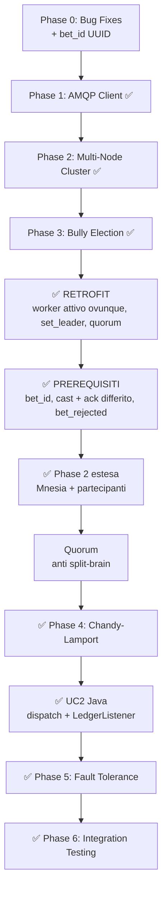

# Implementation Plan: Distributed Systems Features for Distributed Crazy Time

## Background & Goal

The Distributed Crazy Time project is a real-time betting web app with a hybrid Java/Erlang architecture. The **web layer** (Spring Boot gateway, HTML/CSS/JS frontend) and the **game logic** (Erlang wheel + 4 mini-games) sono pienamente funzionanti.

**Le funzionalità distribuite richieste dalla specifica**:

| # | Funzionalità | Stato |
|---|---|---|
| 1 | **Native AMQP integration** — `amqp_client` al posto del polling sulla Management API | ✅ **Fase 1 implementata** |
| 2 | **Multi-node Erlang cluster** — engine su 2+ nodi che si scoprono a vicenda | ✅ **Fase 2 completa**: discovery, liste partecipanti/quorum e **Mnesia replicata** |
| 3 | **Leader Election** — Bully Algorithm per eleggere un solo "Dealer" | ✅ **Fase 3 implementata e CORRETTA** (retrofit + quorum applicati) |
| 4 | **Chandy-Lamport Snapshot** — stato globale consistente al "No more bets" | ✅ **IMPLEMENTATA e consumata**: marker sui canali applicativi, ledger su `results_queue`, checkpoint su Mnesia |
| 5 | **Fault tolerance & recovery** — crash del dealer, nuovo leader, nessuna puntata persa | ✅ **IMPLEMENTATA**: regole R1/R2/R3, rimborsi puntuali e **recovery a due rami** dal checkpoint |

> [!IMPORTANT]
> **Le Fasi 4 e 5 sono state riscritte.** L'analisi in `snapshot_analisi.md` ha mostrato che lo snapshot come era progettato era **ridondante**: catturava uno stato già disponibile in locale sul leader, su canali vuoti per costruzione, e nessuno ne consumava il risultato. Il progetto definitivo — con le motivazioni, la verifica contro il codice e l'ordine di esecuzione dettagliato — è in [snapshot_implementation_plan.md](snapshot_implementation_plan.md), di cui esiste anche un [riassunto](riassunto_snapshot_implementation.md). Questo documento ne recepisce le conclusioni.

> [!NOTE]
> Le Fasi 2 e 3 erano state implementate **prima** che quella riscrittura esistesse, quindi parte del codice andava **corretta**, non solo estesa. ✅ **Il retrofit è stato eseguito**: il `worker` è ora attivo su **tutti** i nodi e instrada al leader, e la guardia di quorum è in funzione. Il percorso operativo completo, step per step, è in [ordine_implementazione.md](ordine_implementazione.md).

> [!NOTE]
> I limiti noti del sistema — quorum, comportamenti di Mnesia, blocco del wheel nel minigioco, test non eseguiti — sono raccolti in un unico posto: [limiti_noti.md](limiti_noti.md).

> [!NOTE]
> Ogni fase si appoggia sulla precedente. Ognuna elenca i file esatti da creare/modificare, la struttura del codice Erlang e i punti di integrazione. **Si parte dalla Fase 0 (Bug Fixes)** per stabilizzare la base prima di aggiungere le funzionalità distribuite.

---

## Phase 0: Bug Fixes (Existing Codebase) — ✅ COMPLETATA E VERIFICATA

> [!NOTE]
> Le fix da 0.1.1 a 0.3.4 sono state **ricontrollate una per una nel codice** e risultano tutte applicate (lock pessimistico e `@Transactional`, `it.remove()` sui payout, marcatura `REFUNDED`, controllo di fase, force-result admin-only, `GameStateCache` immutabile, Jackson nei listener, directory `repository` minuscola, UTF-8, logout server-side; lato Erlang catch-all su `segment_type`, `maps:get/3`, multiplier `-1`, `time_left` parametrico, flapper a 120°, `parse_cell_index`, charlist, `MAX_DROPS`, zero residui HTTP, `find_segment_index`, lowercase, escaping, timeout sui minigiochi; lato frontend default CashHunt, `choiceSent`, niente cache-busting, divisione protetta). La **FIX 0.1.14** (`bet_id`) è stata aggiunta e implementata in seguito.
>
> ✅ **Chiuso anche l'ultimo punto**: «nelle scelte di default ricevo come bonus -1x». **Non è più riproducibile.** Forzando CashHunt e CrazyTime con una scommessa piazzata e **nessuna scelta inviata**, il default viene applicato e produce un moltiplicatore corretto e positivo: CashHunt `default_cell=47` → griglia 75 → payout 760 su 10 (il frontend mostra `75X`); CrazyTime → default blu, `blue_multiplier=100` → payout 1010 (mostra `100X`). Il `-1` compare **solo** nel campo `multiplier` del JSON, dove è la sentinella che dice al gateway di usare l'array `payouts`, e non raggiunge mai la schermata: `app.js` lo filtra con `data.multiplier >= 0 ? data.multiplier : 0`. Il difetto era quindi già stato eliminato dalle FIX 0.2.3 e 0.3.4.

**Goal**: Fix all bugs, race conditions, logic errors, and security issues found during the comprehensive code review. These must be fixed **before** adding distributed features, as they would compound with the increased complexity.

> [!CAUTION]
> Issues marked 🔴 CRITICAL can cause data corruption, money loss, or exploitable vulnerabilities. Fix these first.

---

### 0.1 — Java Gateway Fixes

---

#### 🔴 FIX 0.1.1: Double-Spending Race Condition in Bet Placement

**File**: [WalletController.java](file:///C:/Users/cacak/OneDrive/Desktop/distributed_crazy_time/java-gateway/src/main/java/com/crazytime/controller/WalletController.java) (lines 60–96)

**Problem**: No synchronization or DB-level locking during balance deduction. Two concurrent HTTP requests for `/api/wallet/place-bet` can both read the same balance, both pass the check, and both deduct — allowing a player with $100 to place two $100 bets (spending $200).

**Fix**: Add `@Transactional` and pessimistic locking. Add a `@Version` field to `Player` for optimistic locking, OR use `@Lock(LockModeType.PESSIMISTIC_WRITE)` on the repository query:

```java
// In PlayerRepository.java — add:
@Lock(LockModeType.PESSIMISTIC_WRITE)
@Query("SELECT p FROM Player p WHERE p.username = :username")
Optional<Player> findByUsernameForUpdate(@Param("username") String username);

// In WalletController.java — wrap placeBet with @Transactional and use the locking query:
@Transactional
@PostMapping("/place-bet")
public ResponseEntity<Map<String, Object>> placeBet(...) {
    Player updatedPlayer = playerRepository.findByUsernameForUpdate(player.getUsername())
        .orElseThrow(() -> new RuntimeException("Player not found"));
    
    if (updatedPlayer.getBalance().compareTo(amount) < 0) {
        return ResponseEntity.badRequest().body(Map.of("success", false, "error", "Saldo insufficiente"));
    }
    updatedPlayer.setBalance(updatedPlayer.getBalance().subtract(amount));
    playerRepository.save(updatedPlayer);
    // ... rest of bet logic ...
}
```

---

#### 🔴 FIX 0.1.2: Lost Update Race Condition in PayoutListener

**File**: [PayoutListener.java](file:///C:/Users/cacak/OneDrive/Desktop/distributed_crazy_time/java-gateway/src/main/java/com/crazytime/rabbitmq/PayoutListener.java) (lines 36, 79–86)

**Problem**: `PayoutListener` reads player balance, adds payout, and saves — but can execute concurrently with `WalletController` (bet deductions) or `RefundListener` (refund credits). This causes lost updates where one operation overwrites the other.

**Fix**: Add `@Transactional` to `processPayouts` and use the pessimistic locking query:

```java
@Transactional
public void processPayouts(String message) {
    // ... parsing ...
    Player player = playerRepository.findByUsernameForUpdate(bet.getUsername())
        .orElse(null);
    if (player != null) {
        player.setBalance(player.getBalance().add(finalPayout));
        playerRepository.save(player);
    }
}
```

---

#### 🔴 FIX 0.1.3: RefundListener Never Updates Bet Status → Double Payout Exploit

**File**: [RefundListener.java](file:///C:/Users/cacak/OneDrive/Desktop/distributed_crazy_time/java-gateway/src/main/java/com/crazytime/rabbitmq/RefundListener.java) (lines 44–50)

**Problem**: When Erlang rejects a late bet and sends a refund, `RefundListener` restores the player's balance but **never marks the `Bet` entity as `REFUNDED`**. The bet stays `PENDING`. When the round completes, `PayoutListener` finds this `PENDING` bet and, if the segment matches the winner, pays the player winnings **on a bet that was already refunded**. This is a free money exploit.

**Fix**: After crediting the refund, find and update the matching bet:

```java
@Transactional
@RabbitListener(queues = "refunds_queue")
public void receiveRefund(String message) {
    // ... parse username, amount, segment ...
    
    Player player = playerRepository.findByUsernameForUpdate(username).orElse(null);
    if (player != null) {
        player.setBalance(player.getBalance().add(amount));
        playerRepository.save(player);
    }
    
    // CRITICAL FIX: Mark the bet as REFUNDED so PayoutListener ignores it
    List<Bet> pendingBets = betRepository.findByUsernameAndStatus(username, "PENDING");
    for (Bet bet : pendingBets) {
        if (bet.getAmount().compareTo(amount) == 0) {
            bet.setStatus("REFUNDED");
            bet.setPayout(amount);
            betRepository.save(bet);
            break;  // Refund one matching bet at a time
        }
    }
}
```

---

#### 🔴 FIX 0.1.4: Duplicate Payout for Multiple Winning Bets

**File**: [PayoutListener.java](file:///C:/Users/cacak/OneDrive/Desktop/distributed_crazy_time/java-gateway/src/main/java/com/crazytime/rabbitmq/PayoutListener.java) (lines 50–76)

**Problem**: If a player placed multiple bets on the winning segment, and Erlang's `payoutsNode` has a single aggregated payout per username, each Java `Bet` entity finds the **same** payout entry and credits the **full** aggregated amount for each bet. Result: payout multiplied by number of bets.

**Fix**: Track which payout entries have been consumed, OR use a per-bet payout calculation instead of looking up the aggregated payout for each bet:

```java
// Option A: After finding a matching payout entry, remove it from the list
// Option B: Calculate payout per-bet using the multiplier
if (payoutsNode == null || !payoutsNode.isArray() || payoutsNode.isEmpty()) {
    // Fallback: calculate from multiplier
    finalPayout = bet.getAmount().add(bet.getAmount().multiply(BigDecimal.valueOf(multiplier)));
} else {
    // Find and REMOVE the matching entry to prevent re-use
    Iterator<JsonNode> it = payoutsNode.iterator();
    while (it.hasNext()) {
        JsonNode p = it.next();
        if (p.has("username") && p.get("username").asText().equals(bet.getUsername())) {
            finalPayout = new BigDecimal(p.get("payout").asText());
            it.remove();  // Prevent this entry from being matched again
            break;
        }
    }
}
```

---

#### 🔴 FIX 0.1.14: Nessun identificativo univoco di bet (causa radice di 0.1.3 e 0.1.4) — ✅ IMPLEMENTATA

**Files**: `Bet.java`, `WalletController.java`, `BetRepository.java`

**Problem**: una `Bet` è identificabile solo dalla coppia (username, importo). I rimborsi vengono riconciliati **per importo** (`RefundListener`) e i payout **per username** (`PayoutListener`): due puntate di pari importo su segmenti diversi sono indistinguibili. Le FIX 0.1.3 e 0.1.4 curano il sintomo, non la causa. Inoltre nessun percorso distribuito (deduplica, ledger di round, replay dopo un crash) è realizzabile senza un id stabile che viaggi insieme al messaggio AMQP.

**Fix**: `bet_id` UUID generato da Java all'accettazione, persistito sull'entity e incluso nel JSON:

```java
// Bet.java
@Column(unique = true, nullable = false)
private String betId;

// WalletController.placeBet — alla creazione della bet
String betId = UUID.randomUUID().toString();
Bet bet = new Bet(updatedPlayer.getUsername(), segAmount, segment, currentRound);
bet.setBetId(betId);
betRepository.save(bet);

// Jackson al posto di String.format: oggi l'username non viene mai escapato
ObjectNode payload = objectMapper.createObjectNode();
payload.put("bet_id", betId);
payload.put("username", updatedPlayer.getUsername());
payload.put("amount", segAmount);
payload.put("segment", segment);
rabbitTemplate.convertAndSend("bets_queue", payload.toString());

// BetRepository.java
Optional<Bet> findByBetId(String betId);
List<Bet> findByRoundAndStatus(Integer round, String status);
```

`spring.jpa.hibernate.ddl-auto=update` crea la colonna senza migrazione manuale.

> [!IMPORTANT]
> È il **prerequisito delle Fasi 3-5**: senza `bet_id` l'ack differito introdurrebbe puntate duplicate e il ledger del round non sarebbe indirizzabile.
>
> ✅ **Implementata e verificata end-to-end**: l'UUID compare nella risposta dell'API, nel messaggio AMQP e nella riga persistita, ed è la chiave con cui Erlang chiede il rimborso di una singola puntata. La colonna è `unique` ma **nullable**, così le righe già presenti nel database non impediscono l'avvio.

---

#### 🟡 FIX 0.1.5: Missing `@Transactional` on `placeBet`

**File**: [WalletController.java](file:///C:/Users/cacak/OneDrive/Desktop/distributed_crazy_time/java-gateway/src/main/java/com/crazytime/controller/WalletController.java) (line 60)

**Problem**: `placeBet` deducts balance, saves a `Bet`, and sends to RabbitMQ without a transaction. If saving the `Bet` fails or RabbitMQ throws, the balance deduction is already committed → player loses money without a bet.

**Fix**: Add `@Transactional` annotation (already addressed in Fix 0.1.1 above).

---

#### 🟡 FIX 0.1.6: No Game Phase Check Before Accepting Bets

**File**: [WalletController.java](file:///C:/Users/cacak/OneDrive/Desktop/distributed_crazy_time/java-gateway/src/main/java/com/crazytime/controller/WalletController.java) (lines 60–111)

**Problem**: The gateway accepts bets during any phase (`spinning`, `minigame`, `cooldown`), deducts balance, and relies on Erlang to reject and trigger an async refund. This is unnecessary churn.

**Fix**: Check phase before deducting:

```java
String phase = gameStateCache.getPhase();
if (!"betting".equals(phase)) {
    return ResponseEntity.badRequest().body(Map.of(
        "success", false,
        "error", "Le scommesse sono chiuse (fase: " + phase + ")"
    ));
}
```

---

#### 🟡 FIX 0.1.7: Dev Force-Result Endpoint Exposed to All Players

**File**: [WalletController.java](file:///C:/Users/cacak/OneDrive/Desktop/distributed_crazy_time/java-gateway/src/main/java/com/crazytime/controller/WalletController.java) (lines 51–57)

**Problem**: `/api/wallet/force-result` lets any authenticated player force the wheel outcome. A player can force `segment=10`, bet on 10, and guarantee a win.

**Fix**: Either remove the endpoint entirely, guard it with an admin-only check, or disable it in production:

```java
@PostMapping("/force-result")
public ResponseEntity<?> forceResult(@RequestParam String segment, 
                                     @RequestAttribute("player") Player player) {
    // Only allow admin users (or disable entirely)
    if (!"admin".equals(player.getUsername())) {
        return ResponseEntity.status(403).body(Map.of("error", "Admin only"));
    }
    // ... existing logic ...
}
```

---

#### 🟡 FIX 0.1.8: NPE and JSON Injection in `GameController.makeChoice`

**File**: [GameController.java](file:///C:/Users/cacak/OneDrive/Desktop/distributed_crazy_time/java-gateway/src/main/java/com/crazytime/controller/GameController.java) (lines 38–48)

**Problem**: 
1. If `request.minigame()` or `request.choice()` is null → `NullPointerException`.
2. Manual `String.format` JSON doesn't escape `\n`, `\r`, `\` → JSON injection.

**Fix**: Add null checks and use Jackson `ObjectMapper`:

```java
@PostMapping("/choice")
public ResponseEntity<?> makeChoice(@RequestAttribute("player") Player player,
                                    @RequestBody GameChoiceRequest request) {
    if (request.minigame() == null || request.choice() == null) {
        return ResponseEntity.badRequest().body(Map.of("error", "Minigame e choice richiesti"));
    }
    
    ObjectMapper mapper = new ObjectMapper();
    ObjectNode payload = mapper.createObjectNode();
    payload.put("type", "minigame_choice");
    payload.put("username", player.getUsername());
    payload.put("minigame", request.minigame());
    payload.put("choice", request.choice());
    
    rabbitTemplate.convertAndSend("bets_queue", payload.toString());
    return ResponseEntity.ok(Map.of("success", true));
}
```

---

#### 🟢 FIX 0.1.9: Non-Atomic `GameStateCache` Updates

**File**: [GameStateCache.java](file:///C:/Users/cacak/OneDrive/Desktop/distributed_crazy_time/java-gateway/src/main/java/com/crazytime/rabbitmq/GameStateCache.java) (lines 13–29)

**Problem**: `phase`, `timeLeft`, `round` are separate `volatile` fields updated sequentially. A reader can see new round with old phase.

**Fix**: Use an immutable state record or `AtomicReference`:

```java
@Component
public class GameStateCache {
    private record GameState(String phase, int timeLeft, int round, String lastResult) {}
    private volatile GameState state = new GameState("waiting", 0, 0, "{}");

    public void update(String phase, int timeLeft, int round) {
        state = new GameState(phase, timeLeft, round, state.lastResult());
    }
    public String getPhase()  { return state.phase(); }
    public int getTimeLeft()  { return state.timeLeft(); }
    public int getRound()     { return state.round(); }
    // ...
}
```

---

#### 🟢 FIX 0.1.10: Regex JSON Parsing in Listeners — Use Jackson

**Files**: [GameResultListener.java](file:///C:/Users/cacak/OneDrive/Desktop/distributed_crazy_time/java-gateway/src/main/java/com/crazytime/rabbitmq/GameResultListener.java) (lines 71–77), [RefundListener.java](file:///C:/Users/cacak/OneDrive/Desktop/distributed_crazy_time/java-gateway/src/main/java/com/crazytime/rabbitmq/RefundListener.java) (lines 58–62)

**Problem**: `extractField()` uses `Pattern.compile` on every call, fails on nested JSON, and misses fields with commas/braces in values.

**Fix**: Replace all `extractField` calls with Jackson `ObjectMapper`:

```java
private final ObjectMapper objectMapper = new ObjectMapper();

private String extractField(String json, String field) {
    try {
        JsonNode node = objectMapper.readTree(json);
        JsonNode fieldNode = node.get(field);
        return fieldNode != null ? fieldNode.asText() : null;
    } catch (Exception e) {
        log.warn("Failed to parse JSON field '{}': {}", field, e.getMessage());
        return null;
    }
}
```

---

#### 🟢 FIX 0.1.11: Case-Sensitive Directory/Package Mismatch

**Files**: `Repository/BetRepository.java`, `Repository/PlayerRepository.java`

**Problem**: Directory is `Repository` (capital R) but package declaration is `com.crazytime.repository` (lowercase r). Breaks on Linux/CI.

**Fix**: Rename the directory from `Repository` to `repository` on disk.

---

#### 🟢 FIX 0.1.12: Missing UTF-8 Encoding in AuthInterceptor Response

**File**: [AuthInterceptor.java](file:///C:/Users/cacak/OneDrive/Desktop/distributed_crazy_time/java-gateway/src/main/java/com/crazytime/security/AuthInterceptor.java) (lines 37–40)

**Fix**: Add `response.setCharacterEncoding("UTF-8");` before `getWriter()`.

---

#### 🟢 FIX 0.1.13: Logout Button Doesn't Call Server

**File**: [app.js](file:///C:/Users/cacak/OneDrive/Desktop/distributed_crazy_time/java-gateway/src/main/resources/static/app.js) (lines 1698–1721)

**Problem**: Frontend logout only clears local storage and disconnects STOMP, but never calls `POST /api/auth/logout` to invalidate the server-side session token.

**Fix**: Add the server call before clearing local state:

```javascript
logoutBtn.addEventListener('click', async () => {
    try {
        await authFetch('/api/auth/logout', { method: 'POST' });
    } catch (e) { /* ignore errors on logout */ }
    
    if (stompClient) { stompClient.disconnect(); stompClient = null; }
    sessionStorage.removeItem('token');
    currentUser = null;
    // ... rest of existing logic ...
});
```

---

### 0.2 — Erlang Engine Fixes

---

#### 🔴 FIX 0.2.1: Missing Catch-All in `segment_type/1` → Crashes `wheel_process`

**File**: [wheel_process.erl](file:///C:/Users/cacak/OneDrive/Desktop/distributed_crazy_time/erlang-engine/game_engine/src/wheel_process.erl) (lines 300–307)

**Problem**: No fallback clause. If an invalid segment is forced (e.g., as a charlist or unknown name), `segment_type/1` throws `function_clause` and crashes the entire `wheel_process` gen_server, disrupting the game for all players.

**Fix**: Add a catch-all:

```erlang
segment_type(<<"1">>)         -> {multiplier, 1};
segment_type(<<"2">>)         -> {multiplier, 2};
segment_type(<<"5">>)         -> {multiplier, 5};
segment_type(<<"10">>)        -> {multiplier, 10};
segment_type(<<"Pachinko">>)  -> {minigame, pachinko};
segment_type(<<"CoinFlip">>)  -> {minigame, coinflip};
segment_type(<<"CashHunt">>)  -> {minigame, cashhunt};
segment_type(<<"CrazyTime">>) -> {minigame, crazytime};
segment_type(Unknown) ->
    io:format("[WHEEL] WARNING: Unknown segment '~p', defaulting to 1x~n", [Unknown]),
    {multiplier, 1}.
```

---

#### 🔴 FIX 0.2.2: `undo_bets` Crashes on Missing Map Keys

**File**: [wheel_process.erl](file:///C:/Users/cacak/OneDrive/Desktop/distributed_crazy_time/erlang-engine/game_engine/src/wheel_process.erl) (lines 104–108)

**Problem**: Uses `maps:get/2` (no default) — crashes with `{badkey, ...}` if a malformed bet map is in the list.

**Fix**: Use `maps:get/3` with defaults:

```erlang
UserBets = lists:filter(fun(B) -> 
    maps:get(<<"username">>, B, <<"">>) == Username 
end, Bets),
OtherBets = lists:filter(fun(B) -> 
    maps:get(<<"username">>, B, <<"">>) =/= Username 
end, Bets),
TotalRefund = lists:foldl(fun(B, Acc) -> 
    Acc + maps:get(<<"amount">>, B, 0.0) 
end, 0.0, UserBets),
```

---

#### 🟡 FIX 0.2.3: Async Minigames Publish `multiplier: 0` → Zero Payouts

**File**: [wheel_process.erl](file:///C:/Users/cacak/OneDrive/Desktop/distributed_crazy_time/erlang-engine/game_engine/src/wheel_process.erl) (lines 253–254)

**Problem**: `resolve_async_minigame` calls `build_result_json` with `Multiplier = 0`. If Java's `PayoutListener` falls back to `multiplier` field for calculation, all winning bets get `0` payout.

**Fix**: Calculate a representative multiplier from the per-user payouts, or explicitly pass `result_type = "async_minigame"` so Java knows to use the `payouts` array exclusively:

```erlang
%% Use a marker value that Java ignores when payouts array is present
Payload = build_result_json(SegName, <<"async_minigame">>, -1, WinnerIndex, Details, Payouts, State#state.round),
```

And ensure `PayoutListener.java` checks `result_type` before falling back to `multiplier`.

---

#### 🟡 FIX 0.2.4: Hardcoded `time_left: 16` for CashHunt (Should Be 30)

**File**: [wheel_process.erl](file:///C:/Users/cacak/OneDrive/Desktop/distributed_crazy_time/erlang-engine/game_engine/src/wheel_process.erl) (lines 418–425)

**Problem**: `publish_minigame_start/5` hardcodes `"time_left": 16`, but CashHunt uses `WaitTimeAsync = 30000` (30 seconds). Frontend shows 16s countdown instead of 30s.

**Fix**: Pass actual `TimeLeftSec` to `publish_minigame_start`:

```erlang
%% Change publish_minigame_start/5 to accept TimeLeft as parameter:
publish_minigame_start(Round, MinigameName, WinnerIndex, Details, History, TimeLeftSec) ->
    HistStr = format_history(History),
    DetailsJSON = json_value(Details),
    Payload = lists:flatten(io_lib:format(
        "{\"type\":\"timer\",\"round\":~p,\"time_left\":~p,\"phase\":\"minigame\",\"minigame\":\"~s\",\"winner_index\":~p,\"details\":~s,\"history\":~s}",
        [Round, TimeLeftSec, MinigameName, WinnerIndex, DetailsJSON, HistStr])),
    publish_to_queue("state_queue", Payload).
```

Update the call site in `handle_info({start_minigame, ...})`:

```erlang
publish_minigame_start(State#state.round, SegName, WinnerIndex, Details, 
                       State#state.history, TimeLeftSec),
```

---

#### 🟡 FIX 0.2.5: CrazyTime Flapper Positions Are Wrong (1 Apart vs 120°)

**File**: [crazytime.erl](file:///C:/Users/cacak/OneDrive/Desktop/distributed_crazy_time/erlang-engine/game_engine/src/crazytime.erl) (lines 38–40)

**Problem**: Green and Yellow flappers are at `WinnerIdx ± 1` (adjacent segments), but in the real game they are spaced 120° apart (~21 segments on a 64-segment wheel).

**Fix**:

```erlang
NumSegments = 64,
Spacing = NumSegments div 3,  %% ~21 segments apart
BlueMult  = ResolveVal(WinnerIdx),
GreenMult = ResolveVal((WinnerIdx + Spacing) rem NumSegments),
YellowMult = ResolveVal((WinnerIdx + 2 * Spacing) rem NumSegments),
```

---

#### 🟡 FIX 0.2.6: CashHunt Choice Type Mismatch → Silent Default Fallback

**File**: [cashhunt.erl](file:///C:/Users/cacak/OneDrive/Desktop/distributed_crazy_time/erlang-engine/game_engine/src/cashhunt.erl) (lines 63–74)

**Problem**: `binary_to_integer/1` only works on binaries like `<<"42">>`. If the choice arrives as integer `42` or charlist `"42"`, it crashes and silently falls back to `DefaultCell`.

**Fix**: Create a robust parser:

```erlang
parse_cell_index(C, DefaultCell) when is_integer(C), C >= 0, C < 108 -> C;
parse_cell_index(C, DefaultCell) when is_binary(C) ->
    try binary_to_integer(C) of
        Int when Int >= 0, Int < 108 -> Int;
        _ -> DefaultCell
    catch _:_ -> DefaultCell end;
parse_cell_index(C, DefaultCell) when is_list(C) ->
    try list_to_integer(C) of
        Int when Int >= 0, Int < 108 -> Int;
        _ -> DefaultCell
    catch _:_ -> DefaultCell end;
parse_cell_index(_, DefaultCell) -> DefaultCell.
```

---

#### 🟡 FIX 0.2.7: Charlist Values Serialize as Integer Arrays in JSON

**File**: [wheel_process.erl](file:///C:/Users/cacak/OneDrive/Desktop/distributed_crazy_time/erlang-engine/game_engine/src/wheel_process.erl) (lines 381–384)

**Problem**: `json_value(L) when is_list(L)` treats all lists as JSON arrays. Erlang strings (charlists like `"heads"`) become `[104,101,97,100,115]` in JSON.

**Fix**: Add a charlist detection guard:

```erlang
json_value(L) when is_list(L) ->
    case io_lib:printable_unicode_list(L) of
        true ->
            %% It's a string — serialize as JSON string
            "\"" ++ L ++ "\"";
        false ->
            %% It's a proper list — serialize as JSON array
            Items = lists:map(fun(I) -> json_value(I) end, L),
            "[" ++ string:join(Items, ",") ++ "]"
    end;
```

---

#### 🟡 FIX 0.2.8: Pachinko Unbounded DOUBLE Recursion

**File**: [pachinko.erl](file:///C:/Users/cacak/OneDrive/Desktop/distributed_crazy_time/erlang-engine/game_engine/src/pachinko.erl) (lines 75–81)

**Problem**: No cap on consecutive `<<"DOUBLE">>` hits. Exponential multiplier growth and unbounded recursion.

**Fix**: Add a max drop count parameter:

```erlang
-define(MAX_DROPS, 7).

simulate_drops(Slots, AccDrops) ->
    simulate_drops(Slots, AccDrops, ?MAX_DROPS).

simulate_drops(_Slots, AccDrops, 0) ->
    %% Max drops reached — use highest non-DOUBLE value
    AccDrops;
simulate_drops(Slots, AccDrops, RemainingDrops) ->
    %% ... existing drop logic ...
    case LandedVal of
        <<"DOUBLE">> ->
            NewSlots = double_slots(Slots),
            simulate_drops(NewSlots, AccDrops ++ [DropData], RemainingDrops - 1);
        _Num ->
            AccDrops ++ [DropData]
    end.
```

Also fix the O(N²) list concatenation by using `[DropData | AccDrops]` and reversing at the end.

---

#### 🟡 FIX 0.2.9: Redundant `inets:start()` in `game_engine_app.erl` and `worker.erl`

**Files**: [game_engine_app.erl](file:///C:/Users/cacak/OneDrive/Desktop/distributed_crazy_time/erlang-engine/game_engine/src/game_engine_app.erl) (line 13), [worker.erl](file:///C:/Users/cacak/OneDrive/Desktop/distributed_crazy_time/erlang-engine/game_engine/src/worker.erl) (line 20)

**Problem**: `inets:start()` called manually in two places. Should be declared in `.app.src` and started by OTP.

**Fix**: Remove both `inets:start()` calls. Ensure `inets` is in the `applications` list in `game_engine.app.src` (it already is).

> [!NOTE]
> ✅ **RISOLTO dalla Fase 1**: le chiamate HTTP sono state sostituite da AMQP nativo e `inets` è stato **rimosso** dalla lista `applications` di `game_engine.app.src`. Nel codice non resta nessuna chiamata a `inets:start()` né a `httpc`.

---

#### 🟡 FIX 0.2.10: `find_segment_index/3` Returns Wrong Index for Unfound Segments

**File**: [wheel_process.erl](file:///C:/Users/cacak/OneDrive/Desktop/distributed_crazy_time/erlang-engine/game_engine/src/wheel_process.erl) (lines 295–297)

**Problem**: If `ForcedSeg` is not found (e.g., typo or wrong type), returns `0` which is `<<"CrazyTime">>`. Combined with `{Idx, ForcedSeg}`, sends mismatched `winner_index=0` with `winner="SomeInvalidName"` to frontend.

**Fix**: Return `undefined` on miss and handle it:

```erlang
find_segment_index(Target, [Target|_], Idx) -> Idx;
find_segment_index(Target, [_|T], Idx) -> find_segment_index(Target, T, Idx+1);
find_segment_index(_, [], _) -> undefined.

%% In the forced segment handling:
case find_segment_index(ForcedSeg, Segments, 0) of
    undefined ->
        io:format("[WHEEL] WARNING: Forced segment '~s' not found, using random~n", [ForcedSeg]),
        Idx = rand:uniform(54) - 1,
        {Idx, lists:nth(Idx + 1, Segments)};
    Idx ->
        {Idx, ForcedSeg}
end
```

---

#### 🟢 FIX 0.2.11: CrazyTime Choice Case-Sensitivity

**File**: [crazytime.erl](file:///C:/Users/cacak/OneDrive/Desktop/distributed_crazy_time/erlang-engine/game_engine/src/crazytime.erl) (lines 78–83)

**Problem**: Only exact binary matches (`<<"green">>`, `<<"yellow">>`) work. `"green"`, `<<"Green">>`, `<<"GREEN">>` all fall through to default `BlueMult`.

**Fix**: Normalize the choice:

```erlang
NormalizedChoice = string:lowercase(UserChoice),
UserMult = case NormalizedChoice of
    <<"green">> -> GreenMult;
    <<"yellow">> -> YellowMult;
    _ -> BlueMult
end,
```

---

#### 🟢 FIX 0.2.12: JSON Injection Risk in `publish_refund/1`

**File**: [worker.erl](file:///C:/Users/cacak/OneDrive/Desktop/distributed_crazy_time/erlang-engine/game_engine/src/worker.erl) (lines 199–203)

**Problem**: Usernames with quotes or backslashes produce malformed JSON.

**Fix**: Escape the username before formatting:

```erlang
escape_json_string(Str) when is_binary(Str) ->
    escape_json_string(binary_to_list(Str));
escape_json_string(Str) ->
    lists:flatmap(fun($") -> "\\\""; ($\\) -> "\\\\"; (C) -> [C] end, Str).
```

---

#### 🟢 FIX 0.2.13: Synchronous `Module:play/1` Inside `handle_info` — Deadlock Risk

**File**: [wheel_process.erl](file:///C:/Users/cacak/OneDrive/Desktop/distributed_crazy_time/erlang-engine/game_engine/src/wheel_process.erl) (line 191)

**Problem**: `wheel_process` does a synchronous `gen_server:call` to mini-game workers inside `handle_info`. If a mini-game is blocked, `wheel_process` blocks for 5s (default timeout), potentially causing a cascade.

**Fix**: Add an explicit timeout to prevent long hangs:

```erlang
case gen_server:call(Module, {play, BonusBets}, 10000) of
```

Or convert to async pattern with `gen_server:cast` + a response message.

---

### 0.3 — Frontend Fixes

---

#### 🟡 FIX 0.3.1: CashHunt Default Choice Never Sent to Backend

**File**: [app.js](file:///C:/Users/cacak/OneDrive/Desktop/distributed_crazy_time/java-gateway/src/main/resources/static/app.js) (lines 978–995)

**Problem**: Line 978 assigns `pickedIndex = defaultCell` if negative. Then line 986 checks `if (pickedIndex < 0)` — this is **always false** because it was just set. If a player doesn't click, no choice is sent to the backend.

**Fix**: Remove the first assignment or restructure:

```javascript
setTimeout(() => {
    clearInterval(countdownIv);
    timerBar.classList.remove('visible');
    
    allCells.forEach(cell => {
        cell.classList.remove('pickable');
        cell.style.cursor = 'default';
    });

    // If user never picked, send default choice to backend
    if (pickedIndex < 0) {
        pickedIndex = defaultCell;
        if (currentUser) {
            authFetch(`/api/game/choice`, {
                method: 'POST',
                body: {minigame: 'CashHunt', choice: pickedIndex.toString()}
            }).catch(e => console.error("Errore invio scelta", e));
        }
    }

    startPhase6(pickedIndex);
}, pickDuration * 1000);
```

---

#### 🟡 FIX 0.3.2: CrazyTime Duplicate Choice Submission

**File**: [app.js](file:///C:/Users/cacak/OneDrive/Desktop/distributed_crazy_time/java-gateway/src/main/resources/static/app.js) (lines 1600–1633)

**Problem**: Choice is sent once on click (line 1601) and again when timer expires in `finishSelection()` (line 1629). Duplicate message to RabbitMQ.

**Fix**: Add a `choiceSent` flag:

```javascript
let choiceSent = false;

// On click:
if (!choiceSent) {
    choiceSent = true;
    authFetch('/api/game/choice', { method: 'POST', body: { ... } });
}

// In finishSelection():
if (!choiceSent) {
    choiceSent = true;
    authFetch('/api/game/choice', { method: 'POST', body: { ... } });
}
```

---

#### 🟢 FIX 0.3.3: Image Cache Busting on Every Round

**File**: [app.js](file:///C:/Users/cacak/OneDrive/Desktop/distributed_crazy_time/java-gateway/src/main/resources/static/app.js) (lines 623, 722, 1050)

**Problem**: `Date.now()` query params force full HTTP re-download of large PNGs every round.

**Fix**: Remove `?v=${Date.now()}` or use a static version string:

```javascript
// Before:  background-image: url('img/coinflip.png?v=${Date.now()}');
// After:   background-image: url('img/coinflip.png');
```

---

#### 🟢 FIX 0.3.4: Division by Zero in Multiplier Calculation

**File**: [app.js](file:///C:/Users/cacak/OneDrive/Desktop/distributed_crazy_time/java-gateway/src/main/resources/static/app.js) (line 454)

**Fix**:

```javascript
myMultiplier = myBetAmount > 0 ? Math.round((winAmount - myBetAmount) / myBetAmount) : 0;
```

---

### Bug Fix Summary Matrix

| ID | Severity | Component | Description |
|---|---|---|---|
| 0.1.1 | 🔴 CRITICAL | Java | Double-spending race condition on bet placement |
| 0.1.2 | 🔴 CRITICAL | Java | Lost update race between payout and bet operations |
| 0.1.3 | 🔴 CRITICAL | Java | Refund doesn't update bet status → double payout exploit |
| 0.1.4 | 🔴 CRITICAL | Java | Duplicate payout for multiple winning bets per user |
| 0.2.1 | 🔴 CRITICAL | Erlang | Missing catch-all in `segment_type/1` crashes wheel |
| 0.2.2 | 🔴 CRITICAL | Erlang | `undo_bets` crashes on missing map keys |
| 0.1.14 | 🔴 CRITICAL | Java | Nessun `bet_id`: rimborsi per importo, payout per username |
| 0.1.5 | 🟡 HIGH | Java | Missing `@Transactional` on wallet operations |
| 0.1.6 | 🟡 HIGH | Java | No phase check before accepting bets |
| 0.1.7 | 🟡 HIGH | Java | Dev force-result endpoint unprotected |
| 0.1.8 | 🟡 HIGH | Java | NPE + JSON injection in game choice |
| 0.2.3 | 🟡 HIGH | Erlang | Async minigames send `multiplier: 0` |
| 0.2.4 | 🟡 HIGH | Erlang | Hardcoded `time_left: 16` for CashHunt |
| 0.2.5 | 🟡 HIGH | Erlang | CrazyTime flapper 1-apart instead of 120° |
| 0.2.6 | 🟡 HIGH | Erlang | CashHunt choice type mismatch |
| 0.2.7 | 🟡 HIGH | Erlang | Charlists serialize as integer arrays |
| 0.2.8 | 🟡 HIGH | Erlang | Pachinko unbounded DOUBLE recursion |
| 0.2.10 | 🟡 HIGH | Erlang | `find_segment_index` returns wrong index |
| 0.3.1 | 🟡 HIGH | Frontend | CashHunt default choice never sent |
| 0.3.2 | 🟡 HIGH | Frontend | CrazyTime double choice submission |
| 0.1.9 | 🟢 MEDIUM | Java | Non-atomic GameStateCache |
| 0.1.10 | 🟢 MEDIUM | Java | Regex JSON parsing (use Jackson) |
| 0.1.11 | 🟢 MEDIUM | Java | Repository directory case mismatch |
| 0.1.12 | 🟢 MEDIUM | Java | Missing UTF-8 encoding in 401 response |
| 0.1.13 | 🟢 MEDIUM | Frontend | Logout doesn't call server |
| 0.2.9 | 🟢 MEDIUM | Erlang | Redundant `inets:start()` |
| 0.2.11 | 🟢 MEDIUM | Erlang | CrazyTime choice case-sensitivity |
| 0.2.12 | 🟢 MEDIUM | Erlang | JSON injection in `publish_refund` |
| 0.2.13 | 🟢 MEDIUM | Erlang | Sync `Module:play` deadlock risk |
| 0.3.3 | 🟢 LOW | Frontend | Image cache busting every round |
| 0.3.4 | 🟢 LOW | Frontend | Division by zero in multiplier calc |

---

## Phase 1: Native AMQP Client Integration ✅ IMPLEMENTATA

**Goal**: Replace all `httpc` HTTP Management API calls with proper AMQP 0-9-1 protocol using the `amqp_client` Erlang library. This is the foundation for everything else — multi-node communication through RabbitMQ must be robust.

> [!NOTE]
> **Questa sezione è stata allineata al codice realmente implementato.** In fase di revisione sono emerse 6 divergenze rispetto alla stesura originale: sono elencate nella tabella qui sotto e segnalate inline con il marcatore **🔧 MODIFICA #n** nei punti in cui il piano è cambiato.

### Divergenze rispetto alla stesura originale

| # | Stesura originale | Problema | Soluzione adottata |
|---|---|---|---|
| 1 | `{amqp_client, "3.12.14"}` | La macchina di sviluppo ha **OTP 28 / ERTS 16.1** (rebar3 3.27.0). La serie 3.12.x precede OTP 27/28 e non compila. | `{amqp_client, "4.3.4"}` — verificata, compila pulita su OTP 28. |
| 2 | `app.src`: aggiungere solo `amqp_client` | Dopo la migrazione non resta nessun `httpc` nel codice Erlang, ma `inets` restava dichiarato. | Rimosso anche `inets` (chiude il **FIX 0.2.9**) e aggiunta la configurazione del broker in `env`. |
| 3 | Manager riceve le delivery e le inoltra con `gen_server:cast(worker, ...)`, senza ack | Con `rest_for_one` il `worker` parte **per ultimo**: un messaggio consegnato prima che sia registrato verrebbe scartato in silenzio da `gen_server:cast`. Senza ack, inoltre, un crash del nodo perde la scommessa. | Il manager sottoscrive `bets_queue` passando **il PID del worker come consumer**: le delivery arrivano direttamente al worker, che fa **ack manuale** dopo l'elaborazione, con `prefetch_count`. |
| 4 | La connessione viene aperta dentro `init/1` | Se RabbitMQ non è ancora su, `init` fallisce → 5 restart in 10 s → l'**intera applicazione si spegne**. | `init/1` ritorna subito con connessione `undefined` e ritenta in background ogni 5 s; il manager non crasha mai su disconnessione. |
| 5 | `publish/2` implementata come chiamata al gen_server | Un `gen_server:call` serializzerebbe tutte le pubblicazioni e bloccherebbe `wheel_process` (che pubblica **ogni secondo**) mentre il manager è occupato a riconnettersi. | Il PID del publish channel è esposto in una **tabella ETS pubblica**: `publish/2` lo legge e fa `amqp_channel:cast` diretto, senza hop né blocco. |
| 6 | `list_to_binary(Payload)` | I payload contengono username arbitrari: un carattere accentato è un codepoint > 255 e `list_to_binary` solleva `badarg`. | `unicode:characters_to_binary/1`. |

### Why this matters
The current implementation uses HTTP POST to `localhost:15672/api/...` for both consuming (`worker.erl`) and publishing (`wheel_process.erl`). This is:
- Fragile (regex-based JSON parsing of HTTP responses)
- Slow (HTTP overhead per message vs persistent AMQP connection)
- Not suitable for distributed nodes (each node needs its own AMQP connection)

---

### [MODIFY] [rebar.config](erlang-engine/game_engine/rebar.config)

Add `amqp_client` as a dependency — **🔧 MODIFICA #1: versione 4.3.4, non 3.12.14**:

```erlang
{erl_opts, [debug_info]}.
{deps, [
    {amqp_client, "4.3.4"}
]}.

{shell, [
    {apps, [game_engine]}
]}.
```

> [!IMPORTANT]
> La serie **3.12.x non compila su OTP 28**. La 4.3.4 sì, ed è quella verificata. Le dipendenze transitive scaricate sono `rabbit_common 4.3.4`, `credentials_obfuscation 3.5.0`, `ranch 2.2.0`, `recon 2.5.6`, `thoas 1.2.1`. Fallback in caso di problemi su un'altra macchina: 4.1.6 → 4.0.3.

---

### [MODIFY] [game_engine.app.src](erlang-engine/game_engine/src/game_engine.app.src)

**🔧 MODIFICA #2**: oltre ad aggiungere `amqp_client`, si **rimuove `inets`** (non resta nessun `httpc`) e si aggiunge la configurazione del broker in `env`, così le Fasi 2-3 potranno sovrascriverla per nodo:

```erlang
{application, game_engine, [
    {description, "Distributed Crazy Time - Erlang Game Engine"},
    {vsn, "0.1.0"},
    {registered, [rabbitmq_manager, wheel_process, worker, minigames_sup,
                  pachinko, coinflip, cashhunt, crazytime]},
    {mod, {game_engine_app, []}},
    {applications, [
        kernel,
        stdlib,
        crypto,
        amqp_client     %% <-- AGGIUNTO   (inets RIMOSSO)
    ]},
    {env, [
        {rabbitmq, #{
            host => "localhost",
            port => 5672,
            username => <<"guest">>,
            password => <<"guest">>,
            vhost => <<"/">>,
            prefetch => 10,
            retry_interval => 5000
        }}
    ]},
    {modules, []},
    {licenses, ["Apache-2.0"]},
    {links, []}
 ]}.
```

---

### [NEW] [rabbitmq_manager.erl](erlang-engine/game_engine/src/rabbitmq_manager.erl)

Un `gen_server` che possiede la connessione AMQP e i suoi canali. Centralizza il ciclo di vita della connessione a RabbitMQ.

**Behavior**: `gen_server`, registrato come `rabbitmq_manager`, con `-include_lib("amqp_client/include/amqp_client.hrl")`.

**State**:
```erlang
%% Una sottoscrizione attiva
-record(sub, {queue, pid, mref, tag = undefined}).

-record(state, {
    conn = undefined, conn_ref = undefined,
    pub_ch = undefined, pub_ref = undefined,
    cons_ch = undefined, cons_ref = undefined,
    subs = [] :: [#sub{}],
    cfg = ?DEFAULT_CFG
}).
```

**API**:
```erlang
-export([start_link/0, publish/2, subscribe/2, ack/1, reject/2, is_connected/0]).

%% publish(Queue :: binary(), Payload :: binary()) -> ok | {error, Reason}
%% subscribe(Queue :: binary(), ConsumerPid :: pid()) -> ok
%% ack(DeliveryTag) -> ok | {error, Reason}
%% reject(DeliveryTag, Requeue :: boolean()) -> ok | {error, Reason}
%% is_connected() -> boolean()
```

`reject/2` è modellata su `ack/1` (stesso accesso lock-free ai canali via ETS) e serve a rimettere un messaggio in coda: la usano il ramo "nessun leader disponibile" e l'ack differito della Fase 3.

**Init logic** — **🔧 MODIFICA #4: nessuna connessione dentro `init/1`**:
1. `process_flag(trap_exit, true)` — i processi di `amqp_client` possono essere linkati e non devono abbattere il manager.
2. Creare la tabella ETS pubblica `rabbitmq_manager_tab` (`named_table, public, set, read_concurrency`).
3. Leggere la config con `maps:merge(?DEFAULT_CFG, application:get_env(game_engine, rabbitmq, #{}))`.
4. `self() ! connect` e **ritornare `{ok, State}` senza mai fallire**.

**Connessione** (`handle_info(connect, ...)`):
1. `amqp_connection:start(#amqp_params_network{host, port, username, password, virtual_host})`.
2. Errore → log + `erlang:send_after(5000, self(), connect)`. **Mai un crash**: fallire qui farebbe scattare il limite di restart del supervisor e spegnerebbe l'applicazione.
3. Successo → `amqp_connection:open_channel/1` **×2** (uno publish, uno consume).
4. Dichiarare le 4 code con `amqp_channel:call(PubCh, #'queue.declare'{queue = Q, durable = true})` — `bets_queue`, `state_queue`, `results_queue`, `refunds_queue`. **`durable = true` è obbligatorio**: il gateway Java le dichiara così in `GatewayApplication.java`, e parametri diversi darebbero `PRECONDITION_FAILED`.
5. `#'basic.qos'{prefetch_count = N}` sul canale consume.
6. `ets:insert(?TAB, [{pub_ch, PubCh}, {cons_ch, ConsCh}])` e `erlang:monitor/2` su connessione e canali.
7. Riattivare tutte le sottoscrizioni memorizzate.

**Publish** — **🔧 MODIFICA #5: non passa dal gen_server**:
```erlang
publish(Queue, Payload) when is_binary(Queue), is_binary(Payload) ->
    case lookup_channel(pub_ch) of          %% lettura diretta dalla ETS
        {ok, Ch} ->
            amqp_channel:cast(Ch,
                              #'basic.publish'{exchange = <<>>, routing_key = Queue},
                              #amqp_msg{payload = Payload});
        Error -> Error                       %% {error, not_connected} | {error, not_started}
    end.
```
Exchange di default + routing key = nome della coda: l'esatto equivalente della vecchia POST su `amq.default`.

**Subscribe** — **🔧 MODIFICA #3: il consumer è il PID del chiamante**:
```erlang
amqp_channel:subscribe(ConsCh, #'basic.consume'{queue = Queue, no_ack = false}, Pid)
```
Il terzo argomento è il processo che riceverà le delivery: passando il PID del `worker`, i messaggi finiscono **direttamente nella sua mailbox**, senza rimbalzare sul manager. Se la connessione non è ancora pronta la sottoscrizione viene memorizzata e attivata al primo `connect` riuscito. Il PID del consumer è monitorato: se il worker muore, la sottoscrizione viene cancellata; se si ri-registra (dopo un restart) quella vecchia viene sostituita.

**Ack**: `ack(Tag)` legge `cons_ch` dalla ETS e fa `amqp_channel:cast(Ch, #'basic.ack'{delivery_tag = Tag})`.

**Resilienza**: `handle_info({'DOWN', ...})` su connessione o canali (e `{'EXIT', ...}` sui processi AMQP) → `teardown` (pulizia ETS, demonitor, chiusura) + retry dopo 5 s. Le sottoscrizioni sopravvivono con `tag = undefined` e vengono riattivate da sole. **Il manager non crasha mai su disconnessione**, così `rest_for_one` non resetta il round in corso a ogni singhiozzo del broker.

**Supervision**: `rabbitmq_manager` è il **primo** figlio di `game_engine_sup`, prima di `worker` e `wheel_process` che dipendono da lui.

---

### [MODIFY] [worker.erl](erlang-engine/game_engine/src/worker.erl)

**Major changes**:
- **Remove** tutta la logica di polling HTTP (`handle_info(poll, ...)`, `httpc:request/4`, `extract_payload/1`, i define `?POLL_IDLE`/`?POLL_ACTIVE`).
- **Add** `-include_lib("amqp_client/include/amqp_client.hrl")`.
- **Init**: `ok = rabbitmq_manager:subscribe(<<"bets_queue">>, self())`.
- **Keep** tutta la logica di parsing (`parse_bet_json/1`, `extract_string_field/2`, `extract_number_field/2`, `escape_json_string/1`) — funziona già sul payload JSON grezzo.
- `process_message/1` **conserva firma e corpo** (dispatch `force_segment` / `minigame_choice` / `UNDO_BETS` / `FORCE_*` / `place_bet` + rimborso): cambia solo il fatto che riceve il payload direttamente, senza il wrapper della Management API da sbucciare con `extract_payload/1`.

**🔧 MODIFICA #3 — il worker è il consumer, con ack manuale**:
```erlang
handle_info(#'basic.consume_ok'{}, State) -> {noreply, State};
handle_info(#'basic.cancel_ok'{}, State)  -> {noreply, State};
handle_info(#'basic.cancel'{}, State) ->
    io:format("[WORKER] Consumer cancellato dal broker.~n"),
    {noreply, State};

handle_info({#'basic.deliver'{delivery_tag = Tag}, #amqp_msg{payload = Payload}}, State) ->
    %% L'ack viene sempre inviato, anche in caso di errore di parsing: un
    %% messaggio malformato rimesso in coda verrebbe riconsegnato all'infinito.
    try
        process_message(binary_to_list(Payload))
    catch
        Class:Err:Stack ->
            io:format("[WORKER] Errore elaborazione messaggio: ~p:~p~nStacktrace: ~p~n",
                      [Class, Err, Stack])
    end,
    rabbitmq_manager:ack(Tag),
    {noreply, State};
```

> [!TIP]
> L'ack manuale è ciò che rende possibile la Fase 5: se il nodo dealer muore mentre elabora una scommessa, il messaggio non-ackato viene **riconsegnato** dal broker invece di andare perso (il vecchio `ack_requeue_false` HTTP lo cancellava subito).

**New publish_refund** — **🔧 MODIFICA #6: `unicode:characters_to_binary`, non `list_to_binary`**:
```erlang
publish_refund(BetMap) ->
    Username = maps:get(<<"username">>, BetMap, <<"unknown">>),
    Amount = maps:get(<<"amount">>, BetMap, 0),
    Payload = lists:flatten(io_lib:format(
        "{\"username\":\"~s\",\"amount\":~p,\"reason\":\"betting_closed\"}",
        [escape_json_string(Username), Amount])),
    case rabbitmq_manager:publish(<<"refunds_queue">>, unicode:characters_to_binary(Payload)) of
        ok ->
            io:format("[WORKER] Rimborso pubblicato per ~s ($~p)~n", [Username, Amount]);
        {error, Reason} ->
            io:format("[WORKER] Errore pubblicazione rimborso: ~p~n", [Reason])
    end.
```
Sparisce il doppio escaping (`EscapedPayload`), che serviva solo al wrapper JSON dell'HTTP.

---

### [MODIFY] [wheel_process.erl](erlang-engine/game_engine/src/wheel_process.erl)

**Change**: sostituire la sola `publish_to_queue/2` — **🔧 MODIFICA #6**:

```erlang
%% unicode:characters_to_binary/1 (e non list_to_binary/1) perche' i payload
%% contengono username arbitrari: un accento e' un codepoint > 255.
publish_to_queue(QueueName, Payload) ->
    case rabbitmq_manager:publish(list_to_binary(QueueName),
                                  unicode:characters_to_binary(Payload)) of
        ok -> ok;
        {error, Reason} ->
            io:format("[WHEEL] Publish fallita su ~s: ~p~n", [QueueName, Reason])
    end.
```

È una sostituzione di una sola funzione. Tutti i chiamanti (`publish_timer`, `publish_spinning`, `publish_minigame_start`, `resolve_round`, ecc.) usano già `publish_to_queue/2` e passano `QueueName` come stringa letterale e `Payload` come stringa piatta: passano automaticamente ad AMQP nativo senza altre modifiche.

---

### [MODIFY] [game_engine_sup.erl](erlang-engine/game_engine/src/game_engine_sup.erl)

Aggiungere `rabbitmq_manager` come **primo** figlio, con strategia `rest_for_one` (se il manager crasha, worker e wheel_process vanno riavviati anch'essi, nell'ordine):

```erlang
init([]) ->
    SupFlags = #{strategy => rest_for_one, intensity => 5, period => 10},
    ChildSpecs = [
        #{id => rabbitmq_manager,
          start => {rabbitmq_manager, start_link, []},
          restart => permanent,
          type => worker},
        #{id => wheel_process,
          start => {wheel_process, start_link, []},
          restart => permanent,
          type => worker},
        #{id => minigames_sup,
          start => {minigames_sup, start_link, []},
          restart => permanent,
          type => supervisor},
        #{id => worker,
          start => {worker, start_link, []},
          restart => permanent,
          type => worker}
    ],
    {ok, {SupFlags, ChildSpecs}}.
```

---

### Nota sul build

Da questa fase l'engine **richiede `rebar3`** (`../rebar3 shell` / `../rebar3 compile`): `Emakefile` e `erl_compile.escript` non gestiscono le dipendenze e restano solo come fallback legacy.

---

### Verification for Phase 1 — ✅ eseguita

| # | Test | Esito |
|---|---|---|
| 1 | `../rebar3 compile` con `amqp_client` risolto | ✅ pulito, zero warning; deps in `_build/default/lib/` |
| 2 | `grep -rn "httpc\|15672\|inets" src/` | ✅ nessun residuo HTTP |
| 3 | Avvio dell'engine **senza broker** | ✅ parte lo stesso, logga `Broker non raggiungibile`, ritenta ogni 5 s, tutti e 4 i figli vivi (verifica della **MODIFICA #4**) |
| 4 | Avvio con broker attivo | ✅ `is_connected = true`, 4 code dichiarate `durable=true` senza `PRECONDITION_FAILED`, timer accumulati su `state_queue` |
| 5 | Bet pubblicata su `bets_queue` | ✅ `[WORKER] Bet ricevuta` → `[WHEEL] Scommessa accettata` → coda a 0, ack confermato |
| 6 | Stop e restart del broker a caldo | ✅ disconnessione rilevata, manager/wheel/worker restano vivi, riconnessione e **ri-sottoscrizione automatiche**; la bet successiva arriva in fase `spinning` → rifiutata → rimborso pubblicato su `refunds_queue` via AMQP |

Test end-to-end con il gateway Java (bet → payout dal browser) non ancora eseguito: da fare con `mvn spring-boot:run` seguendo `comandi_avvio.md`.

> [!NOTE]
> **Scelta lasciata aperta**: i messaggi sono pubblicati **transient** (`delivery_mode` di default), identico al comportamento HTTP precedente — le code sono durable ma i messaggi non sopravvivono a un riavvio del broker. Per `results_queue` e `refunds_queue` la persistenza (`#'P_basic'{delivery_mode = 2}`) avrebbe senso: va valutata nella **Fase 5 (Fault Tolerance)**, non qui.

---

## Phase 2: Multi-Node Erlang Cluster ✅ IMPLEMENTATA

**Goal**: Run the Erlang game engine on multiple nodes (e.g., `node1@host`, `node2@host`, `node3@host`) that form a cluster and can discover each other. Only **one node** runs the game (the Leader/Dealer); others are hot standby.

> [!NOTE]
> **Questa sezione è stata allineata al codice realmente implementato.** In fase di realizzazione sono emerse 3 divergenze rispetto alla stesura originale: sono elencate nella tabella qui sotto e segnalate inline con il marcatore **🔧 MODIFICA** nei punti in cui il piano è cambiato.

### Divergenze rispetto alla stesura originale

| # | Stesura originale | Problema | Soluzione adottata |
|---|---|---|---|
| 1 | `cluster_manager` chiama direttamente `leader_election:start_election()` e `leader_election:get_leader()` | `leader_election` è della **Fase 3** e non esiste ancora: il modulo non è compilato → crash con `error:undef` al primo `nodeup`/`nodedown`. | Ogni chiamata verso `leader_election` è wrappata in `try ... catch error:undef -> ...` con funzioni helper `maybe_start_election/0` e `maybe_start_election_on_nodedown/1`. Quando il modulo non è disponibile si logga e si prosegue. |
| 2 | `net_kernel:monitor_nodes(true)` senza opzioni → messaggi `{nodeup, Node}`, `{nodedown, Node}` | Con l'opzione `{node_type, all}` si ricevono anche i nodi **hidden** (utile se in futuro si usa `-hidden` per nodi di diagnostica). I messaggi cambiano formato in `{nodeup, Node, InfoList}` / `{nodedown, Node, InfoList}`. | `monitor_nodes(true, [{node_type, all}])` + gestione di **entrambe** le forme di messaggio (con e senza InfoList) nel `handle_info`. |
| 3 | Nessun meccanismo di reconnect periodico ai peer non ancora connessi | Se un peer non è ancora avviato quando si fa il ping iniziale, resta sconnesso finché quel peer non pinga noi. | Aggiunto un `reconnect_tick` ogni 10 s che ritenta i peer dalla lista `known_nodes` che non sono in `connected_nodes`. |

---

### [NEW] [cluster_manager.erl](file:///C:/Users/cacak/OneDrive/Desktop/distributed_crazy_time/erlang-engine/game_engine/src/cluster_manager.erl)

A `gen_server` responsible for:
1. **Joining the cluster** — On init, attempts `net_adm:ping/1` to a list of known peer nodes.
2. **Monitoring nodes** — Uses `net_kernel:monitor_nodes(true)` to receive `{nodeup, Node}` and `{nodedown, Node}` messages.
3. **Tracking cluster membership** — Maintains a list of connected nodes.
4. **Triggering leader election** when the cluster topology changes.

**Behavior**: `gen_server`, registered as `cluster_manager`

**State**:
```erlang
-record(state, {
    known_nodes = [] :: [node()],        %% Configured peer nodes
    connected_nodes = [] :: [node()],    %% Currently connected nodes
    self_node :: node()
}).
```

**Init logic**:
1. Read peer nodes from application environment: `application:get_env(game_engine, peer_nodes, [])`.
2. Call `net_kernel:monitor_nodes(true)` to subscribe to cluster events.
3. Attempt to connect to each peer via `net_adm:ping(Node)`.
4. After a short delay (2s), trigger initial leader election via `leader_election:start_election()`.

**Message handling**:
```erlang
handle_info({nodeup, Node}, State) ->
    io:format("[CLUSTER] Node connected: ~p~n", [Node]),
    NewConnected = lists:usort([Node | State#state.connected_nodes]),
    %% A new node joined — trigger election so it learns who the leader is
    leader_election:start_election(),
    {noreply, State#state{connected_nodes = NewConnected}};

handle_info({nodedown, Node}, State) ->
    io:format("[CLUSTER] Node disconnected: ~p~n", [Node]),
    NewConnected = lists:delete(Node, State#state.connected_nodes),
    %% If the leader went down, we need a new election
    case leader_election:get_leader() of
        {ok, Node} ->
            io:format("[CLUSTER] LEADER DOWN! Starting emergency election...~n"),
            leader_election:start_election();
        _ -> ok
    end,
    {noreply, State#state{connected_nodes = NewConnected}}.
```

**API**:
```erlang
-export([start_link/0, get_nodes/0, get_connected_nodes/0]).
```

---

### [MODIFY] [game_engine.app.src](file:///C:/Users/cacak/OneDrive/Desktop/distributed_crazy_time/erlang-engine/game_engine/src/game_engine.app.src)

Add `cluster_manager` and `leader_election` to the registered processes list and add `peer_nodes` to env:

```erlang
{registered, [wheel_process, worker, minigames_sup, pachinko, coinflip, 
              cashhunt, crazytime, rabbitmq_manager, cluster_manager, leader_election]},
...
{env, [
    {peer_nodes, ['game2@localhost', 'game3@localhost']}
]},
```

> [!NOTE]
> When starting nodes, use short names: `erl -sname game1@localhost -setcookie crazytime`. Each node should have a different `peer_nodes` list pointing to the other nodes.

---

### [MODIFY] [game_engine_sup.erl](file:///C:/Users/cacak/OneDrive/Desktop/distributed_crazy_time/erlang-engine/game_engine/src/game_engine_sup.erl)

Add `cluster_manager` and `leader_election` (from Phase 3) as children. The new supervision tree order:

```
game_engine_sup (rest_for_one)
  ├── rabbitmq_manager      (worker)      — AMQP connection
  ├── cluster_manager       (worker)      — Node discovery & monitoring
  ├── leader_election       (worker)      — Bully algorithm
  ├── wheel_process         (worker)      — Game loop (active only on leader)
  ├── minigames_sup         (supervisor)  — 4 mini-game actors
  └── worker                (worker)      — RabbitMQ consumer (active only on leader)
```

---

### Node Startup Scripts

Create helper scripts for starting multiple nodes. Each node will be started with:

```bash
# Node 1 (e.g., the initial leader)
erl -sname game1@localhost -setcookie crazytime -pa _build/default/lib/*/ebin -eval "application:ensure_all_started(game_engine)"

# Node 2 (standby)
erl -sname game2@localhost -setcookie crazytime -pa _build/default/lib/*/ebin -eval "application:ensure_all_started(game_engine)"

# Node 3 (standby)
erl -sname game3@localhost -setcookie crazytime -pa _build/default/lib/*/ebin -eval "application:ensure_all_started(game_engine)"
```

> [!IMPORTANT]
> All nodes must use the **same Erlang cookie** (`-setcookie crazytime`) to form a cluster. On the same machine, use `-sname` (short names). For multiple machines, use `-name` with full hostnames.

---

### Estensioni richieste dalla Fase 4 (snapshot)

Le aggiunte che le Fasi 4-5 danno per presenti: tre su `cluster_manager`, una in configurazione.

| Estensione | Stato |
|---|---|
| 1. `configured_nodes/0` e `get_participants/0` | ✅ **FATTA** |
| 2. Bootstrap di Mnesia | ✅ **FATTA** |
| 3. Delega di `nodedown` a `leader_election:node_down/1` | ✅ **FATTA** |
| 4. `mnesia` fra le `applications`, `snapshot` fra i `registered` | ✅ **FATTA** |

#### 1. Due liste distinte esposte come API — ✅ FATTA

```erlang
-export([start_link/0, get_nodes/0, get_connected_nodes/0,
         configured_nodes/0, get_participants/0]).

%% Lista STATICA dei nodi configurati: e' il denominatore del quorum (Fase 3).
%% init/1 filtra il proprio nodo da peer_nodes, quindi va ri-aggiunto.
handle_call(configured_nodes, _From, State) ->
    {reply, lists:usort([State#state.self_node | State#state.known_nodes]), State};

%% Lista ORDINATA E STABILE dei nodi vivi: e' quella che lo snapshot congela
%% all'avvio del taglio. Intersecata con i nodi configurati, altrimenti una
%% shell diagnostica (-hidden esclusa) diventerebbe un partecipante fantasma
%% e il taglio non si chiuderebbe mai prima del timeout.
handle_call(get_participants, _From, State) ->
    Cfg = lists:usort([State#state.self_node | State#state.known_nodes]),
    {reply, [N || N <- lists:usort([node() | State#state.connected_nodes]),
                  lists:member(N, Cfg)], State};
```

> [!IMPORTANT]
> Il denominatore del quorum **non** può essere `nodes()`: in una partizione si riduce da solo e la guardia diventa inutile. Per lo stesso motivo anche il numeratore va intersecato con la lista statica.

#### 2. Bootstrap di Mnesia — ✅ FATTA

Va eseguito **dopo** la formazione del cluster, mai in `init/1`: il punto d'aggancio naturale è un `handle_info(mnesia_bootstrap, ...)` schedulato insieme a `initial_election`, quando i ping ai peer hanno già avuto il tempo di connettere.

Non si può usare `mnesia:create_schema(AllNodes)`: quella forma esige Mnesia **arrestata su tutti i nodi elencati**, condizione che non si verifica mai con nodi che si avviano progressivamente. Serve il join dinamico, in due rami:

**Primo nodo** (nessun peer raggiungibile che possieda la tabella):
```erlang
mnesia:create_schema([node()]),          %% ignorare {error,{_,{already_exists,_}}}
mnesia:start(),
mnesia:create_table(snapshot_record,
    [{attributes, record_info(fields, snapshot_record)},
     {type, ordered_set},
     {disc_copies, [node()]}]).
```

**Nodo che si aggiunge** a un cluster dove la tabella esiste già:
```erlang
mnesia:start(),
{ok, _} = mnesia:change_config(extra_db_nodes, [MasterNode]),
mnesia:change_table_copy_type(schema, node(), disc_copies),   %% altrimenti resta ram_copies
mnesia:add_table_copy(snapshot_record, node(), disc_copies),
ok = mnesia:wait_for_tables([snapshot_record], 5000).
```

`MasterNode` = un nodo qualsiasi già nel cluster che possiede la tabella; discriminare i due rami interrogando `mnesia:table_info(snapshot_record, disc_copies)` via `rpc:call/4` sui peer raggiungibili.

> [!IMPORTANT]
> **Chi crea lo schema quando nessuno ce l'ha.** Se tre nodi partono insieme e nessuno possiede la tabella, tutti e tre prenderebbero il ramo «primo nodo» e si creerebbero **tre database indipendenti**, che Mnesia non unisce da sola. Nel codice crea solo il nodo con il **nome più basso** fra quelli connessi; gli altri riprovano ogni 2 s e, dopo 5 tentativi, procedono comunque — così un cluster in cui quel nodo non parte mai non resta bloccato. È ciò che rende superfluo l'avvio «uno alla volta».

> [!CAUTION]
> **Se un cluster partizionato viene riavviato, quale copia sopravvive lo decide Mnesia.** Verificato sul campo: dopo una partizione 2-1, riavviando i nodi, i checkpoint scritti dalla **maggioranza** durante la partizione non erano più leggibili e sono rimasti solo quelli del nodo isolato. La perdita è un dato osservato (chiavi e file su disco); il meccanismo che l'ha causata è un'inferenza, e la sequenza del test — riavvio del nodo isolato prima degli altri — può averla influenzata. Il quorum garantisce **un solo scrittore**, quindi la divergenza non viene prodotta; non decide però quale replica vince al caricamento. Mitigazioni: `{majority, true}` sulla tabella e `mnesia:set_master_nodes/2` prima del riavvio. Da citare nella relazione come limite noto.

> [!NOTE]
> **Un nodo riavviato da solo non sempre carica la propria copia.** Mnesia la carica subito solo se quel nodo era l'**ultimo a spegnersi**; altrimenti attende i nodi che hanno le altre repliche, perché la copia locale potrebbe non essere la più recente. Non è un errore: il bootstrap lo logga nominando i nodi attesi e il gioco continua a funzionare. Per ripartire da soli dopo un guasto definitivo c'è `cluster_manager:force_load_snapshots()`, che carica la copia locale **accettando di perdere** i checkpoint scritti dagli altri nel frattempo — da usare consapevolmente, non come prassi.

> [!CAUTION]
> La `change_table_copy_type(schema, ...)` è il passo che si dimentica più spesso: senza, il nodo tiene lo schema in RAM e **perde la propria copia a ogni riavvio**, vanificando `disc_copies`.

Aggiungere inoltre `mnesia:subscribe(system)` e loggare in modo rumoroso `{inconsistent_database, _, _}`.

#### 3. Delega della caduta di un nodo all'elezione — ✅ FATTA

`handle_info({nodedown, Node, _}, ...)` chiama oggi `maybe_start_election_on_nodedown/1`, che decide da sé se rieleggere. Con il quorum la decisione dipende dal ruolo corrente e dalla maggioranza, quindi vive nell'elezione:

```erlang
%% al posto di maybe_start_election_on_nodedown(Node)
leader_election:node_down(Node),
```

Il `try/catch error:undef` che proteggeva la Fase 2 dall'assenza del modulo non serve più: `leader_election` esiste ed è nel supervisore.

#### 4. Configurazione — ✅ FATTA

```erlang
{applications, [kernel, stdlib, crypto, mnesia, amqp_client]},   %% mnesia AGGIUNTA
{registered, [rabbitmq_manager, cluster_manager, leader_election, wheel_process,
              worker, snapshot, minigames_sup,                    %% snapshot AGGIUNTO
              pachinko, coinflip, cashhunt, crazytime]},
```

Il record `snapshot_record` vive in **`include/game_engine.hrl`**, perché serve a `cluster_manager` (che crea la tabella), al collector `snapshot` e al `wheel_process` (che ricarica i checkpoint).

Le directory `Mnesia.<nodo>` create a runtime sono in `.gitignore`.

> [!NOTE]
> Con `rebar3 shell` la directory Mnesia di default è `Mnesia.<nodo>` nella cwd: avviando i tre nodi dalla stessa cartella si ottengono tre directory distinte, che è il comportamento voluto.

---

## Phase 3: Bully Leader Election Algorithm ✅ IMPLEMENTATA E CORRETTA

**Goal**: Implement the Bully Election algorithm so that exactly **one node** is elected as the "Dealer" (leader). The leader runs the game loop (`wheel_process` attivo); i nodi standby tengono i propri processi vivi ma dormienti.

> [!NOTE]
> **Questa sezione descrive il codice realmente implementato.** L'algoritmo Bully era già completo; le **5 divergenze** emerse rispetto alla stesura originale sono state **tutte applicate** (retrofit degli Step 1-3 di [ordine_implementazione.md](ordine_implementazione.md)). Restano marcate inline con **🔧 CORREZIONE #n** perché spiegano *perché* il codice ha la forma che ha.
>
> ✅ **Verificato su cluster a 3 nodi**: elezione del nodo col nome più alto, rielezione entro pochi secondi alla caduta del leader, retrocessione automatica a standby quando il quorum si perde (1/3), 6 bet distribuite fra i tre worker e tutte arrivate al wheel del solo leader, UNDO consumato da un worker qualsiasi con rimborso pubblicato correttamente.

### Divergenze rispetto alla stesura originale

> Tutte e cinque **applicate** nel codice (✅ nella prima colonna).

| # | Stesura originale | Problema | Soluzione adottata |
|---|---|---|---|
| 1 ✅ | `apply_role/1` attiva e disattiva **anche il `worker`** | Con il worker attivo solo sul leader, l'ingestione delle bet non è distribuita: i canali `worker → wheel` sono tutti locali e vuoti, e lo snapshot della Fase 4 torna a essere l'artefatto vacuo che la riscrittura vuole eliminare | Il **worker resta attivo su tutti i nodi**; solo `wheel_process` è leader-only. Il worker riceve `{set_leader, Node}` e instrada al leader |
| 2 ✅ | Il worker in standby rifiuta ogni delivery con `reject(Tag, true)` | Loop caldo: il messaggio rimbalza fra broker e nodi passivi finché non capita sul leader | Il rifiuto avviene **solo** quando `leader =:= undefined`, cioè quando nessuno può servirlo |
| 3 ✅ | Nessuna guardia di quorum | In una partizione 2-1 entrambi i lati eleggono un leader: due ledger divergenti per lo stesso round, scritture concorrenti su Mnesia, audit trail senza valore | `has_quorum/0` applicata in **due** punti: `declare_victory/1` e caduta di un nodo |
| 4 ✅ | `undo_bets/1` come `gen_server:call` | Come call cross-nodo va in timeout quando il wheel è bloccato fino a 10 s nella call al minigioco, facendo crollare il worker | Convertita a `cast`; il rimborso non torna più come valore di ritorno ma come evento `bet_rejected` pubblicato dal wheel |
| 5 ✅ | Il `nodedown` gestito dentro `leader_election` | Il monitoraggio dei nodi è già in `cluster_manager`, duplicarlo significa due sottoscrizioni e due verità | `cluster_manager` chiama `leader_election:node_down/1` |

---

### [MODIFY] [leader_election.erl](erlang-engine/game_engine/src/leader_election.erl)

**Behavior**: `gen_server` registrato localmente su ogni nodo, con message passing inter-nodo.

**The Bully Algorithm** (adattato a Erlang) — invariato e già implementato:
- ogni nodo ha come id il proprio nome (`game1@localhost`); l'ordinamento è lessicografico, vince il **più alto**;
- chi inizia l'elezione invia `{election, MyNode}` a tutti i nodi con id **maggiore**;
- se un nodo più alto risponde `{alive, _}`, l'iniziatore si ferma e attende;
- se **nessuno** risponde entro 3 s, l'iniziatore si dichiara leader e trasmette `{coordinator, MyNode}` a tutti;
- chi riceve `{coordinator, Leader}` accetta quel nodo come leader.

**State**:
```erlang
-record(state, {
    leader = undefined :: node() | undefined,
    election_in_progress = false :: boolean(),
    election_timer = undefined :: reference() | undefined,
    role = standby :: leader | standby
}).
```

**API** — 🔧 **CORREZIONE #5: `node_down/1` chiamata da `cluster_manager`**:
```erlang
-export([start_link/0, start_election/0, get_leader/0, is_leader/0, node_down/1]).

start_election() -> gen_server:cast(?MODULE, start_election).
get_leader()     -> gen_server:call(?MODULE, get_leader).
is_leader()      -> gen_server:call(?MODULE, is_leader).
node_down(Node)  -> gen_server:cast(?MODULE, {node_down, Node}).
```

#### 🔧 CORREZIONE #3: guardia di quorum

```erlang
%% Il denominatore e' la lista STATICA dei nodi configurati, non nodes().
%% Anche il NUMERATORE va intersecato con quella lista: nodes() restituisce ogni
%% nodo Erlang connesso, comprese le shell diagnostiche. Una shell attaccata al
%% lato di minoranza gli regalerebbe il quorum proprio durante il test che deve
%% dimostrare il contrario.
has_quorum() ->
    Cfg  = cluster_manager:configured_nodes(),
    Live = [N || N <- [node() | nodes()], lists:member(N, Cfg)],
    length(Live) * 2 > length(Cfg).
```

La guardia va applicata in **due punti, non uno**. `declare_victory/1` copre solo chi *sta diventando* leader; il leader **già in carica** finito nella minoranza non ripassa mai da lì e resterebbe attivo a produrre il ledger divergente — ed è proprio lui il problema:

```erlang
%% 1. Chi sta per diventare leader
declare_victory(MyNode) ->
    case has_quorum() of
        false ->
            io:format("[ELECTION] Quorum assente: non mi dichiaro leader~n"),
            standby;
        true ->
            io:format("~n*** [ELECTION] Sono il nuovo LEADER: ~p ***~n~n", [MyNode]),
            lists:foreach(fun(N) ->
                gen_server:cast({?MODULE, N}, {coordinator, MyNode})
            end, nodes()),
            apply_role(leader),
            broadcast_leader(MyNode),        %% CORREZIONE #1, vedi sotto
            leader
    end.

%% 2. Il leader gia' in carica che vede cadere un nodo
handle_cast({node_down, Node}, State = #state{role = leader}) ->
    case has_quorum() of
        true ->
            maybe_reelect(Node, State);
        false ->
            io:format("[LEADER] Quorum perso — retrocessione a standby~n"),
            apply_role(standby),
            broadcast_leader(undefined),
            {noreply, State#state{role = standby, leader = undefined}}
    end;
handle_cast({node_down, Node}, State) ->
    %% Standby: si rielegge solo con il quorum, altrimenti si eleggerebbe
    %% un leader dentro la minoranza.
    case has_quorum() of
        true  -> maybe_reelect(Node, State);
        false -> {noreply, State#state{leader = undefined}}
    end;
```

> [!WARNING]
> **Conseguenza sull'uso a nodo singolo.** `peer_nodes` elenca tutti e tre i nodi, quindi un solo nodo avviato con `-sname` vede quorum 1/3 e **resta standby**: il gioco non parte. È il comportamento corretto (si sceglie la consistenza sulla disponibilità), ma per lo sviluppo su un nodo solo bisogna avviare **senza** `-sname` — un nodo non distribuito non può essere in partizione, quindi la guardia non si applica — oppure sovrascrivere la lista con `-game_engine peer_nodes "['game1@localhost']"`.

`maybe_reelect/2` lancia `start_election` solo se il nodo caduto era il leader o se non c'è leader noto: oggi `cluster_manager` ne lancia una a **ogni** evento di topologia, incondizionatamente, e con tre nodi che partono insieme si ottiene una raffica di elezioni. Vale la pena aggiungere anche la guardia su `election_in_progress`, oggi memorizzato ma mai controllato.

#### 🔧 CORREZIONE #1: `apply_role/1` non tocca più il worker

```erlang
apply_role(leader) ->
    io:format("[ROLE] Questo nodo ora e' l'ACTIVE DEALER~n"),
    gen_server:cast(wheel_process, activate);        %% il cast al worker SPARISCE

apply_role(standby) ->
    io:format("[ROLE] Questo nodo ora e' in STANDBY~n"),
    gen_server:cast(wheel_process, deactivate).      %% idem

%% Al posto di activate/deactivate, i worker di TUTTI i nodi ricevono
%% l'identita' del leader corrente.
broadcast_leader(Leader) ->
    lists:foreach(fun(N) ->
        gen_server:cast({worker, N}, {set_leader, Leader})
    end, [node() | nodes()]).
```

Anche `handle_cast({coordinator, Leader}, ...)` deve propagare `{set_leader, Leader}` al proprio worker: è da lì che gli standby apprendono chi è il leader.

> [!IMPORTANT]
> È la correzione più importante della fase. Il worker **non** è un processo leader-only: è il consumer distribuito che rende reali i canali dello snapshot. Disattivarlo sugli standby riporta l'architettura a un solo ingestore e svuota la Fase 4.

#### Ripopolamento dello stato dopo l'elezione

Dopo `apply_role(leader)`, il nuovo leader deve:
1. chiedere al wheel di ricaricare da Mnesia i `bet_id` già liquidati negli ultimi round (deduplica, vedi Fase 4) — è **subito dopo un crash** che le riconsegne del broker arrivano;
2. inviare `{collect_inflight, R}` ai worker superstiti e raccoglierne le bet non ackate entro 2 s: servono al recovery della Fase 5.

---

### [MODIFY] [wheel_process.erl](erlang-engine/game_engine/src/wheel_process.erl) — ✅ già implementato

Il flag `active` nel record di stato, i cast `activate`/`deactivate`, la guardia sui tick e il rifiuto delle bet quando `active = false` sono **già presenti nel codice** e restano invariati:

```erlang
handle_cast(activate, State = #state{active = false}) ->
    erlang:send_after(1000, self(), tick),
    publish_timer(?BET_DURATION, State#state.round, State#state.history),
    {noreply, State#state{active = true, phase = betting, time_left = ?BET_DURATION}};

handle_info(tick, State = #state{active = false}) ->
    {noreply, State};                                %% standby: nessun tick
```

L'unica modifica dovuta a questa fase è la **🔧 CORREZIONE #4**: `undo_bets/1` passa da `call` a `cast`, restituendo i `bet_id` annullati attraverso un evento anziché come valore di ritorno.

---

### [MODIFY] [worker.erl](erlang-engine/game_engine/src/worker.erl) — 🔧 riscritto

**🔧 CORREZIONI #1, #2 e #4.** Il flag `active` e i due `handle_cast(activate|deactivate, ...)` implementati in questa fase **vanno rimossi**:

```erlang
-record(state, {
    leader   = undefined :: node() | undefined,   %% al posto di active
    inflight = #{},                               %% #{BetId => {DeliveryTag, BetMap}}
    cl       = cl_recorder:new()                  %% stato Chandy-Lamport (Fase 4)
}).

handle_cast({set_leader, Node}, State) ->
    io:format("[WORKER] Leader corrente: ~p~n", [Node]),
    {noreply, State#state{leader = Node}};
```

**Una sola clausola di delivery**, con il rifiuto riservato al caso in cui nessuno può servire il messaggio:

```erlang
handle_info({#'basic.deliver'{delivery_tag = Tag}, #amqp_msg{payload = Payload}},
            State = #state{leader = undefined}) ->
    %% Nessun leader eletto, o siamo nella minoranza dopo una partizione:
    %% il messaggio resta nel broker e verra' servito da chi puo'.
    rabbitmq_manager:reject(Tag, true),
    {noreply, State};

handle_info({#'basic.deliver'{delivery_tag = Tag}, #amqp_msg{payload = Payload}}, State) ->
    process_message(binary_to_list(Payload), Tag, State);
```

**Tutti i percorsi di `process_message/1` vanno instradati al leader**, non solo le bet. È la conseguenza meno ovvia dell'ingestione distribuita e la più facile da dimenticare: `force_segment`, `minigame_choice`, `UNDO_BETS` e `FORCE_<Seg>` oggi chiamano il `wheel_process` **locale**. Consumati da uno standby finirebbero al wheel dormiente di quel nodo e sparirebbero in silenzio — con 3 nodi capita circa 2 volte su 3, perché i worker sono competing consumer.

```erlang
Leader = State#state.leader,
gen_server:cast({wheel_process, Leader}, {force_segment, Seg}),
gen_server:cast({wheel_process, Leader}, {minigame_choice, Username, Choice}),
gen_server:cast({wheel_process, Leader}, {undo_bets, Username}),   %% CORREZIONE #4
gen_server:cast({wheel_process, Leader}, {bet, BetMap}),
```

**Ack differito** — ✅ **implementato**: il `DeliveryTag` non viene più confermato al ritorno di `process_message/3` ma conservato in `inflight`, e l'ack parte alla ricezione di `{bet_result, BetId, accepted | rejected}` dal wheel. Un `{inflight_timeout, BetId}` armato a 15 s rimette la bet in coda se il leader muore o resta bloccato. I comandi senza `bet_id` (`force_segment`, `minigame_choice`, `UNDO_BETS`) restano ad **ack immediato**.

> [!NOTE]
> Il verdetto `not_leader` esiste apposta: il worker **non** acka e rimette la scommessa in coda, invece di scartarla come farebbe con un `rejected`. Senza questa distinzione un cambio di leader mentre la bet è in volo la farebbe sparire con il saldo già scalato.

---

## Phase 4: Chandy-Lamport Snapshot Algorithm — ✅ RISCRITTA E IMPLEMENTATA

**Goal**: quando la finestra di puntata si chiude ("No more bets"), eseguire l'algoritmo di Chandy-Lamport per catturare uno **snapshot globale consistente** delle scommesse accettate. Il risultato non è un log: è il **ledger autorevole del round** verso il gateway Java e il **checkpoint** da cui un nuovo leader può completare il round dopo un crash.

> [!NOTE]
> ✅ **Implementata e verificata.** Il test che conta — bet piazzate a cavallo del gong — dà `local_bets=3 in_flight_bets=3`: i canali contengono davvero qualcosa e il ledger pubblicato include anche le puntate catturate in volo. Il checkpoint è replicato su Mnesia e leggibile dagli standby.

> [!CAUTION]
> **Questa fase sostituisce integralmente la stesura originale.** L'analisi in `snapshot_analisi.md` ha mostrato che lo snapshot come era descritto era **ridondante**: catturava uno stato già interamente disponibile in locale sul leader, su canali vuoti per costruzione, e nessuno ne consumava il risultato. Le motivazioni complete e la verifica punto per punto sono in `snapshot_implementation_plan.md`; qui c'è il progetto definitivo.

### Perché la stesura precedente non funzionava

| Problema | Conseguenza |
|---|---|
| I marker viaggiavano fra istanze del modulo `snapshot` | Un marker che non condivide la mailbox con i messaggi che deve delimitare non delimita nulla: non è Chandy-Lamport |
| `channel_states` dichiarato ma **mai popolato** | Il campo che dovrebbe contenere l'unica informazione non ottenibile altrove restava vuoto per costruzione |
| Un solo consumer di `bets_queue`, sul leader | I canali erano tutti locali: non c'era nulla in transito da catturare |
| `initiate_snapshot` come `gen_server:call` | Bloccava il wheel nel tick più denso del round |
| Il collector interrogava i partecipanti (`wheel_process:get_bets()`) | Chiamata sincrona verso un processo che durante il minigioco resta bloccato fino a 10 s → timeout ed exit del collector |
| Lista partecipanti = `nodes()` ricalcolata a ogni passo | Può cambiare fra l'invio dei marker e la verifica di completamento, e include le shell diagnostiche |
| Nessuno consumava il risultato | Un artefatto di log, non un algoritmo |

### L'architettura che rende lo snapshot reale

L'idea è una sola: **spostare i marker sui canali applicativi e rendere quei canali asincroni**, così che ci sia davvero qualcosa da catturare.

```
   [bets_queue]  ──competing consumers──┬──> worker@game1 ─┐
                                        ├──> worker@game2 ─┼─{bet, B}──> wheel_process@LEADER
                                        └──> worker@game3 ─┘
                                                  ^
                                                  └────{bet_result, BetId, accepted|rejected}────┘
```

- Grafo **fortemente connesso** (stella bidirezionale), canali **asincroni** e **FIFO** (garanzia Erlang).
- Il canale `worker_i → wheel` contiene le **bet in transito** al momento del gong: l'unica cosa che la specifica chiede di catturare e l'unica non disponibile in locale da nessuna parte.
- **Partecipanti** allo snapshot sono `wheel_process` e gli N `worker`. Il modulo `snapshot` è un puro **collector**: assegna l'id, congela i partecipanti, arma il timeout, raccoglie le porzioni, persiste su Mnesia, pubblica il ledger. **Non interroga mai i partecipanti**: sono loro a fare push.
- **Costo in latenza: zero.** Il taglio parte al gong con un budget di 5 s, mentre la risoluzione del round è già schedulata a 10,5 s per l'animazione della ruota.

> [!IMPORTANT]
> **Ordine nel tick del gong**: si estrae **prima** il segmento vincente, **poi** si inizia lo snapshot. Così il taglio cattura `{bets, winner_segment, winner_index}` insieme, e un nuovo leader eletto dopo un crash ha sia l'insieme autorevole delle puntate sia l'esito: può **completare** il round anziché annullarlo (Fase 5).

---

### [NEW] `erlang-engine/game_engine/src/cl_recorder.erl` — ✅ FATTO (8 test eunit)

Modulo di **funzioni pure** (nessun processo) con la logica Chandy-Lamport lato partecipante, condivisa da `wheel_process` e `worker` per non duplicarla. Essendo puro, è anche l'unica parte banalmente testabile in isolamento.

```erlang
-record(cl, {
    id      = undefined,   %% undefined = non sta registrando
    local   = undefined,   %% stato locale salvato al taglio
    in_open = [],          %% canali entranti ancora in registrazione, [{Role, Node}]
    chan    = #{}          %% #{{Role,Node} => [Msg]} messaggi in transito registrati
}).

-export([new/0, start/3, is_recording/1, on_marker/5, on_app_msg/3, close/2, is_complete/1]).
```

- `start(SnapId, LocalState, InChannels)` — ingresso dell'**iniziatore**, che non riceve mai un marker e quindi non può passare da `on_marker/5`: salva `local` e apre la registrazione su *tutti* gli `InChannels`. È la funzione che il wheel chiama al gong.
- `on_marker(SnapId, From, InChannels, LocalState, CL) -> {NewCL, first_marker | subsequent}` — al primo marker salva `local` e apre la registrazione su `InChannels -- [From]`; ai successivi chiude il canale `From`. **L'invio dei marker uscenti è responsabilità del chiamante**: devono partire dal processo applicativo, altrimenti non condividono mailbox e ordine FIFO con i messaggi che delimitano.
- `on_app_msg(From, Msg, CL)` — accoda a `chan[From]` **solo se** sta registrando e `From` è ancora aperto.
- `close(From, CL)` — chiude un singolo canale entrante; la usa il percorso di abort.
- `is_complete(CL)` — `in_open == []`.

---

### [MODIFY] [wheel_process.erl](erlang-engine/game_engine/src/wheel_process.erl)

#### 1. Prerequisito: promuovere lo stato del round nel record — ✅ FATTO

Oggi segmento vincente, indice e dettagli del minigioco vivono **solo dentro i messaggi `send_after` in volo**. Senza questo passo nessun recovery è possibile.

```erlang
-record(state, {
    phase, time_left, round, bets, forced_segment, history, minigame_choices,
    active = false,               %% gia' presente (Fase 3)
    winner_segment = undefined,   %% NEW
    winner_index   = undefined,   %% NEW
    minigame_mod   = undefined,   %% NEW
    minigame_details = undefined, %% NEW
    timer_ref      = undefined,   %% NEW  (send_after cancellabile/ispezionabile)
    settled_bet_ids = sets:new(), %% NEW  bet_id degli ultimi 3 round — deduplica
    cl = cl_recorder:new()        %% NEW
}).
```

`settled_bet_ids` va ripopolato dai `snapshot_record` **all'avvio e a ogni elezione**: è subito dopo un crash che le riconsegne del broker arrivano.

#### 2. `handle_cast({bet, BetMap, FromNode})` al posto di `handle_call({place_bet, ...})` — ✅ FATTO

**Deduplicare per `bet_id` prima di tutto.** Con l'ack differito una riconsegna del broker può ripresentare una bet già accettata (ack perso). Se `BetId` è già in `bets` **oppure in `settled_bet_ids`** → rispondere `{bet_result, BetId, accepted}` senza inserirla di nuovo.

Il secondo termine del test non è pleonastico: `bets` viene azzerato a ogni round, quindi da solo copre la riconsegna intra-round ma **non** quella che arriva nel round successivo — che è il caso frequente, perché nasce da un crash. Senza, la bet viene **giocata due volte e pagata due volte**.

> [!NOTE]
> ✅ **Entrambi i termini sono implementati.** `settled_bet_ids` viene ripopolato dai `snapshot_record` a ogni attivazione come leader e arricchito alla chiusura di ogni taglio. Verificato ripubblicando un `bet_id` già a ledger sia con lo stesso leader sia **dopo un crash**: nel secondo caso il nuovo leader logga `ricaricati N bet_id dai checkpoint` e deduplica.

Altrimenti:
- `phase = betting, active = true` → accetta e `cast` di `{bet_result, BetId, accepted}` al worker mittente;
- **in registrazione e canale aperto** → `cl_recorder:on_app_msg/3` e **basta**: la bet finisce nello stato del canale e verrà unita a `bets` alla chiusura del taglio. Non va aggiunta anche a `bets` qui, altrimenti si conta due volte;
- altrimenti → `{bet_result, BetId, rejected}`.

#### 3. Trigger del taglio, **dopo** l'estrazione del vincitore — ✅ FATTO

```erlang
handle_info(tick, State = #state{active = true, phase = betting, time_left = 1}) ->
    publish_timer(0, State#state.round, State#state.history),
    %% ... estrazione WinnerIndex / WinnerSeg come oggi ...

    Participants = cluster_manager:get_participants(),      %% CONGELATA qui, una volta sola
    %% SnapId calcolato in loco, NON restituito da begin_snapshot: quello e' un
    %% cast e ritorna ok, mentre lo SnapId serve subito per marcare i marker.
    SnapId = {State#state.round, node()},
    snapshot:begin_snapshot(SnapId, Participants),          %% cast, non call
    Local = #{round => State#state.round, bets => State#state.bets, phase => spinning,
              winner_segment => WinnerSeg, winner_index => WinnerIndex},
    InCh  = [{worker, N} || N <- Participants],
    CL1   = cl_recorder:start(SnapId, Local, InCh),
    [gen_server:cast({worker, N}, {cl_marker, SnapId, {wheel, node()}}) || N <- Participants],
    erlang:send_after(10000, self(), {cl_abort, SnapId}),   %% abort locale se il collector muore
    %% ... publish_spinning + send_after come oggi ...
```

#### 4. Chiusura del taglio — ✅ FATTA

```erlang
handle_info({cl_marker, SnapId, {worker, N}}, State) ->
    %% chiude il canale {worker, N}; quando cl_recorder:is_complete/1:
    %%   1. Bets' = Bets ++ lists:append(maps:values(Chan))
    %%      le bet in transito ENTRANO nel round: sono state spedite prima che il
    %%      worker apprendesse del taglio, quindi per il taglio causale sono di R;
    %%   2. {bet_result, BetId, accepted} a ciascun worker mittente;
    %%   3. report al collector:
    %%      gen_server:cast({snapshot, node()},
    %%                      {cl_part, SnapId, {wheel, node()}, Local, Chan}).
```

#### 5. Abort locale — ✅ FATTO

`handle_info({cl_abort, SnapId}, State)` — chiude forzatamente la registrazione, riporta ciò che ha, logga `degraded`. Senza, un collector morto lascerebbe i partecipanti in registrazione per sempre.

#### 6. Altre modifiche

- `build_result_json/7` — aggiungere `bet_id` a ogni entry dell'array `payouts` (la sorgente è `compute_payouts/3`, che oggi propaga solo `username`/`bet`/`payout`).
- ✅ **FATTO** — Ogni `{bet_result, BetId, rejected}` è accompagnato da un evento **`bet_rejected`** su `results_queue`: è il solo percorso che chiude le bet arrivate **dopo** la pubblicazione del ledger, che altrimenti resterebbero `PENDING` con il saldo scalato.
  ```json
  {"type":"bet_rejected","bet_id":"<uuid>","round":R,"reason":"betting_closed"}
  ```
  Lo stesso evento con `"reason":"undo"` sostituisce il rimborso aggregato dell'UNDO (Fase 3, correzione #4).
- ✅ **FATTO** — `escape_json_string/1` è stata spostata qui da `worker.erl`, dove sarebbe rimasta senza chiamanti: `build_result_json/7` costruisce le entry di `payouts` con `~s` sull'username **senza escaping**, e va comunque toccata.

> [!NOTE]
> **Limite noto, da dichiarare nella relazione**: durante il minigioco il wheel resta bloccato fino a 10 s dentro `gen_server:call(Module, {play, ...}, 10000)` e non risponde ad alcuna `call`. Tre conseguenze: (a) non può partecipare a uno snapshot in quella finestra — innocuo oggi, perché l'unico trigger è al gong, ma è ciò che impedirebbe di aggiungere un trigger sulla transizione di fase; (b) è la ragione per cui `undo_bets/1` va convertita a `cast`; (c) è la ragione per cui l'`inflight_timeout` del worker non può scendere sotto i ~12 s.

---

### [MODIFY] [worker.erl](erlang-engine/game_engine/src/worker.erl) — ✅ FATTO

```erlang
handle_info({cl_marker, SnapId, From}, S) ->
    InCh  = [{wheel, S#state.leader}],
    Local = #{unacked => maps:values(S#state.inflight)},
    {CL, Kind} = cl_recorder:on_marker(SnapId, From, InCh, Local, S#state.cl),
    case Kind of
        first_marker ->
            %% marker uscente sul MIO canale applicativo verso il wheel:
            %% stesso mittente, stessa mailbox dei {bet, ...} => FIFO garantito
            gen_server:cast({wheel_process, S#state.leader},
                            {cl_marker, SnapId, {worker, node()}});
        subsequent -> ok
    end,
    maybe_report(SnapId, CL, S).
```

Il worker ha **un solo canale entrante**, quindi il suo taglio si chiude immediatamente e riporta subito al collector:
```erlang
gen_server:cast({snapshot, InitiatorNode},
                {cl_part, SnapId, {worker, node()}, Local, ChanStates}).
```

`handle_cast({bet_result, BetId, Verdict}, S)` — passa da `cl_recorder:on_app_msg/3` se in registrazione, poi `rabbitmq_manager:ack(Tag)` e rimuove da `inflight`. **È l'unico punto in cui si acka.**

---

### [NEW] `erlang-engine/game_engine/src/snapshot.erl` — collector — ✅ FATTO

```erlang
-record(state, {
    running = #{}   %% #{SnapId => #run{round, participants, expected, parts, timer, degraded}}
}).                 %% SnapId = {Round, node()}: nessun contatore locale da tenere in sync

-export([start_link/0, begin_snapshot/2, get_last/0, get_for_round/1]).
```

- `begin_snapshot(SnapId, Participants)` — **cast**. Registra `expected = [{wheel, Leader} | [{worker, N} || N <- Participants]]` e arma `send_after(5000, {snapshot_timeout, SnapId})`.
- `handle_cast({cl_part, SnapId, Who, Local, Chan}, S)` — accumula; quando `parts == expected` chiama `finalize/2`.
- `handle_info({snapshot_timeout, SnapId}, S)` — `finalize/2` con `degraded = true` e l'elenco dei partecipanti mancanti. Il ledger resta **deterministico**: bet locali del leader + transiti effettivamente registrati.
- `finalize/2`:
  1. compone `#snapshot_record{}`;
  2. `mnesia:transaction(fun() -> mnesia:write(Rec) end)` → replica automatica su tutti i nodi;
  3. **solo sul leader**: `rabbitmq_manager:publish(<<"results_queue">>, LedgerJson)` con `type: "round_ledger"`;
  4. log con conteggi separati: `local_bets`, `in_flight_bets`, `degraded`.

---

### [NEW] tabella Mnesia `snapshot_record` — ✅ FATTA

```erlang
-record(snapshot_record, {
    id,              %% chiave = {Round, Initiator}: due leader concorrenti producono
                     %% record DISTINTI e diagnosticabili invece di sovrascriversi
    round,
    taken_at,        %% erlang:system_time(millisecond)
    initiator,       %% node()
    degraded,        %% boolean()
    phase,           %% fase al taglio
    winner_segment, winner_index,
    local_states,    %% #{Participant => term()}
    channel_states,  %% #{{From,To} => [term()]}
    ledger           %% [BetMap] insieme autorevole delle bet del round
}).
```

Tipo `ordered_set`, così `mnesia:dirty_last/1` restituisce l'ultimo round e `mnesia:dirty_read({Round, Node})` il record di un round specifico. `local_states` e `channel_states` sono conservati **integralmente**: senza di essi il post-mortem non potrebbe dire cosa fosse in volo.

---

### [MODIFY] [game_engine_sup.erl](erlang-engine/game_engine/src/game_engine_sup.erl) — ✅ FATTO

`snapshot` è stato aggiunto come **ULTIMO** figlio:

```
game_engine_sup (rest_for_one)
  ├── rabbitmq_manager      (worker)      — connessione AMQP
  ├── cluster_manager       (worker)      — discovery nodi, Mnesia, partecipanti
  ├── leader_election       (worker)      — Bully + quorum
  ├── wheel_process         (worker)      — game loop (attivo solo sul leader)
  ├── minigames_sup         (supervisor)  — 4 mini-game actors
  ├── worker                (worker)      — consumer AMQP (attivo su TUTTI i nodi)
  └── snapshot              (worker)      — collector Chandy-Lamport   ← ULTIMO
```

> [!IMPORTANT]
> **Ultimo, non prima di `wheel_process`.** Con `rest_for_one` un figlio che crasha fa ripartire tutti quelli sotto di lui: mettendo il collector in mezzo, un suo crash azzererebbe il round in corso.

---

## Phase 5: Fault Tolerance & Crash Recovery — ✅ RISCRITTA E IMPLEMENTATA

**Goal**: quando il nodo dealer crasha a metà round, il sistema deve:
1. rilevare il crash (`nodedown` in `cluster_manager`);
2. eleggere un nuovo leader (Bully + quorum, Fase 3);
3. **completare** il round se esiste un checkpoint, oppure annullarlo rimborsando **solo** le bet realmente perse;
4. riprendere il gioco.

> [!NOTE]
> ✅ **Implementata e verificata** su cluster a 3 nodi con gateway: uccidendo il leader in fase `spinning` il round viene **completato** con l'esito catturato nel taglio (nessun rimborso, nessun round perso); uccidendolo in fase di puntata il round viene annullato e la puntata rimborsata.
>
> Il discriminante è il campo `result_published` del checkpoint, scritto dal wheel subito dopo aver pubblicato l'esito. Il bootstrap Mnesia migra con `transform_table` le tabelle create prima che quel campo esistesse.

> [!CAUTION]
> **Il punto 3 sostituisce l'approccio originale «annulla il round e rimborsa tutte le PENDING».** Quel rimborso globale colpiva anche round estranei, e soprattutto **si contraddiceva con l'ack differito**: una bet non ackata viene rigiocata dal broker, quindi rimborsarla significa restituire i soldi *e* farla girare lo stesso.

### Le tre regole di riconciliazione

Al crash del leader in fase `betting`, ogni bet del round R sta in **uno solo** di tre insiemi:

| Insieme | Come si riconosce | Destino corretto |
| :--- | :--- | :--- |
| **Ackata** — accettata dal wheel morto | assente dalle `inflight` dei worker **e** dal broker | **Rimborso**: è l'unico caso realmente perso |
| **Non ackata** — consumata ma senza `bet_result` | presente nelle `inflight` di un worker vivo | **Replay**: il broker la riconsegna, entra nel round R+1 |
| **Mai consumata** | ancora nella coda | **Replay**: idem |

`{collect_inflight, R}` (Fase 3) serve esattamente a separare il primo insieme dagli altri due. Da qui tre regole da rispettare ovunque:

> **R1 — Chi rimborsa.** Si rimborsa una bet solo se è assente da ogni ledger **e** da `exclude_bet_ids`. In dubbio non si rimborsa: resta `PENDING` e sarà chiusa dal ledger del round in cui verrà rigiocata.
>
> **R2 — Chi è autoritativo.** `Bet.status` lato Java è autoritativo sui **movimenti di denaro**; il ledger Erlang sull'**esito di gioco**. Una bet già `REFUNDED` che ricompare in un ledger successivo **non viene mai pagata**, ma va loggata come `replay_after_refund` e chiusa in stato terminale: è l'unico caso in cui l'utente vede sulla ruota una puntata che gli è stata restituita. Anomalia visiva da documentare, non duplicazione di denaro.
>
> **R3 — L'insieme di deduplica è l'unione dei ledger persistiti**, non `bets` in memoria. `bets` viene azzerato a ogni round, quindi da solo garantisce l'idempotenza soltanto *dentro la finestra del round*: una riconsegna che arriva nel round successivo verrebbe accettata di nuovo, **giocata due volte e pagata due volte**. È la regola che rende sicuro l'ack differito.

---

### [MODIFY] [leader_election.erl](erlang-engine/game_engine/src/leader_election.erl) — recovery a due rami — ✅ FATTO

```erlang
apply_role(leader) ->
    io:format("[ROLE] Questo nodo ora e' l'ACTIVE DEALER~n"),
    gen_server:cast(wheel_process, activate),
    %% NIENTE gen_server:cast(worker, activate): il worker e' attivo su tutti
    %% i nodi (Fase 3, correzione #1).
    recover_from_checkpoint().

recover_from_checkpoint() ->
    case snapshot:get_last() of
        {ok, #snapshot_record{round = R, ledger = Ledger,
                              winner_segment = Seg, winner_index = Idx}} ->
            case result_already_published(R) of
                true  -> ok;                       %% round chiuso: si riparte pulito
                false ->
                    %% RAMO A — checkpoint presente: COMPLETA il round R.
                    io:format("[RECOVERY] Checkpoint del round ~p trovato: completo il round~n", [R]),
                    gen_server:cast(wheel_process, {complete_round, R, Ledger, Seg, Idx})
            end;
        _ ->
            %% RAMO B — nessun checkpoint: il crash e' avvenuto in fase betting.
            io:format("[RECOVERY] Nessun checkpoint: annullo il solo round interrotto~n"),
            cancel_round_selectively()
    end.
```

> [!IMPORTANT]
> **Il recovery parte solo alla transizione standby → leader.** Le elezioni si ripetono a ogni nodo che entra o esce dal cluster: eseguendolo a ogni `apply_role(leader)`, un leader già in carica annullerebbe il round che sta giocando, rimborsando puntate ancora sulla ruota. È un bug che si manifesta solo con più rielezioni di fila, quindi facile da non vedere.
>
> Per la stessa ragione il wheel, quando si attiva, allinea il numero di round all'ultimo checkpoint conosciuto: il contatore di un nodo standby è fermo da quando ha smesso di giocare, e ripartire da lì rinumererebbe round già esistenti.

> [!NOTE]
> Il flag `previous_leader_crashed` nel **process dictionary** previsto dalla stesura originale è stato **sostituito**, non affiancato: non sopravvive al riavvio di `leader_election` e soprattutto non dice *quale* round è stato interrotto — informazione indispensabile per annullare un round solo anziché tutti.

**Ramo A — checkpoint presente, risultato non ancora pubblicato**: il nuovo leader ricarica `bets` dal ledger, riusa `winner_segment`/`winner_index` catturati nel taglio, calcola i payout e pubblica su `results_queue`. **Nessun rimborso, nessun round perso.** È ciò che rende lo snapshot *load-bearing*: il risultato non era ottenibile in altro modo.

**Ramo B — nessun checkpoint** (crash durante la fase di puntata):
1. il nuovo leader invia `{collect_inflight, R}` ai worker superstiti e ne raccoglie le `inflight` entro 2 s: sono bet consumate ma **non ackate**, che il broker riconsegnerà. Vanno **escluse** dal rimborso;
2. pubblica su `results_queue`:
   ```json
   {"type":"round_cancelled","round":R,"exclude_bet_ids":["<uuid>", "..."]}
   ```
3. Java rimborsa `findByRoundAndStatus(R, "PENDING")` **meno** `exclude_bet_ids` (regola R1).

> [!NOTE]
> AMQP non ha un timeout di inflight lato broker: la riconsegna avviene per il `reject(Tag, true)` che il worker emette allo scadere del proprio `inflight_timeout`, oppure per caduta del canale. Il `round` nel messaggio è quello **provvisorio** che `WalletController` assegna da `gameStateCache`: stima locale soggetta a lag al confine di round, ammessa **solo** in questo ramo di fallback — ed è la ragione per cui deve viaggiare esplicito.

---

### [MODIFY] [wheel_process.erl](erlang-engine/game_engine/src/wheel_process.erl) — ✅ FATTO

Alla riattivazione il wheel **non** azzera incondizionatamente le bet: consulta prima il checkpoint.

```erlang
handle_cast({complete_round, R, Ledger, Seg, Idx}, State) ->
    %% Ramo A: chiude il round interrotto con l'esito catturato nel taglio
    resolve_round(Seg, multiplier_of(Seg), Idx, Ledger, R),
    erlang:send_after(?COOLDOWN, self(), new_round),
    {noreply, State#state{phase = cooldown, round = R, bets = []}};
```

`settled_bet_ids` va ripopolato dai `snapshot_record` **a ogni elezione** (regola R3): è proprio dopo un crash che le riconsegne del broker arrivano, quindi un nuovo leader con il set vuoto è il caso in cui la deduplica serve di più.

---

### [MODIFY] Java Gateway — dispatch e riconciliazione per ledger

#### 1. `GameResultListener.java` — dispatchare sul campo `type` — ✅ FATTO

Oggi il campo `type` è **completamente ignorato**: qualunque messaggio su `results_queue` viene passato a `PayoutListener` come se fosse un risultato di round.

```java
@RabbitListener(queues = "results_queue")
public void receiveGameResult(String message) {
    JsonNode root = objectMapper.readTree(message);
    String type = root.path("type").asText("result");

    switch (type) {
        case "result"         -> payoutListener.processPayouts(message);
        case "round_ledger"   -> ledgerListener.processLedger(root);
        case "round_cancelled"-> ledgerListener.cancelRound(root);
        case "bet_rejected"   -> ledgerListener.rejectBet(root);
        default -> log.warn("Tipo di messaggio sconosciuto: {}", type);
    }
    gameStateCache.setLastResult(message);
    messagingTemplate.convertAndSend("/topic/game-results", message);
}
```

#### 2. [NEW] `rabbitmq/LedgerListener.java` — implementa R1 e R2 — ✅ FATTO

`@Transactional`:
- per ogni `bet_id` nel ledger con `Bet` `PENDING`: setta `Bet.round = R`, lascia `PENDING`;
- per ogni `bet_id` nel ledger con `Bet` già `REFUNDED` (caso R2): **non** riaprire, **non** pagare; loggare `replay_after_refund` e chiudere in stato terminale;
- per ogni `Bet` `PENDING` con `round = R` **assente** dal ledger: `REFUNDED` + accredito saldo, idempotente sul `betId`.

#### 3. [NEW] handler `bet_rejected` — rimborso puntuale — ✅ FATTO (`BetRejectionHandler.java`)

`@Transactional`: `findByBetId(id)`, e **solo se** `PENDING` → `REFUNDED` + accredito. L'idempotenza è la guardia sullo stato stesso: una riconsegna del messaggio trova la bet già `REFUNDED` e non fa nulla. È la sostituzione **deterministica** del match per importo di `RefundListener`, fragile per costruzione perché due puntate di pari importo su segmenti diversi sono indistinguibili.

#### 4. handler `round_cancelled` — ✅ FATTO

Rimborsa `findByRoundAndStatus(R, "PENDING")` **meno** `exclude_bet_ids` (regola R1).

> [!CAUTION]
> Va **rimosso** il `findByStatus("PENDING")` globale previsto dalla stesura originale: rimborsa anche bet di round estranei.

#### 5. `PayoutListener.java` — per round e per `bet_id` — ✅ FATTO

> [!CAUTION]
> **Chi costruisce le entry di `payouts` deve includere il `bet_id`.** Passando dal match per username a quello per identificativo, ogni produttore di payout va aggiornato — non solo `wheel_process:compute_payouts/3`. I minigiochi **asincroni** ne hanno uno proprio: `crazytime:compute_payouts/3` e `cashhunt:compute_payouts/3`. Finché quei due emettevano entry senza `bet_id`, il gateway non trovava corrispondenza, ricadeva sul campo `multiplier` — che per gli asincroni è la sentinella `-1` — e **saltava il pagamento**, lasciando la scommessa `PENDING` con il saldo scalato. Trovato provando il punto aperto della Fase 0 e corretto: ora la vincita di un CashHunt giocato col default viene accreditata (verificato: saldo 90 → 150, `Payout di $60 accreditato … (bet 5460dbc0-…)`).

`findByRoundAndStatus(round, "PENDING")` al posto della scansione globale; match per `bet_id` invece che per `username`; via l'`it.remove()`, che era una toppa alla mancanza di un id (FIX 0.1.4).

#### 6. `RefundListener.java` — rimosso — ✅ FATTO

Classe e coda `refunds_queue` spariscono: la funzione è assorbita dall'handler `bet_rejected`. Togliere `refunds_queue` da `?QUEUES` in `rabbitmq_manager.erl` e il bean `refundsQueue` da `GatewayApplication.java`.

> [!NOTE]
> **Prerequisito d'ordine rispettato**: l'UNDO è passato a `bet_rejected` **prima** che la coda venisse rimossa. Verificato sul saldo: 125 → bet da 30 → 95 → UNDO → 125.

#### 7. Rimuovere i `catch` che inghiottono le eccezioni — ✅ FATTO in `PayoutListener`

In `PayoutListener` e `RefundListener`: essendo i metodi `@Transactional`, l'eccezione catturata **non provoca rollback** e i `save` parziali vengono committati.

---

### [MODIFY] Frontend — `app.js` — ✅ FATTO

```javascript
// Dentro la subscription a /topic/game-results
if (data.type === 'round_cancelled') {
    showNotification('⚠️ Round annullato — il nodo dealer è caduto. Le puntate non giocate sono state rimborsate.', 'warning');
    resetBettingUI();
    fetchBalance();
    return;
}
if (data.type === 'round_ledger') {
    return;  // il ledger è per la riconciliazione lato server, non per la UI
}
```

---

## Phase 6: Integration Testing & Startup Scripts — ✅ ESEGUITA

### Avvio del cluster a 3 nodi

Le istruzioni operative complete (cmd.exe e PowerShell) sono in [istruzioni.txt](istruzioni.txt), sezione «CLUSTER ERLANG — 3 NODI». In sintesi, da `erlang-engine/game_engine`:

```batch
set ERL_FLAGS=-sname game1@localhost -setcookie crazytime
escript ..\rebar3 shell
```

ripetuto con `game2` e `game3` in altri due terminali.

> [!NOTE]
> Serve `rebar3 shell`, non `erl` diretto: su Windows il glob `_build/default/lib/*/ebin` non espande e i moduli non vengono trovati. La lista dei peer sta in `game_engine.app.src` (`peer_nodes` contiene **tutti** i nodi, `cluster_manager` filtra il proprio); si può sovrascrivere con `-game_engine peer_nodes "['game2@localhost','game3@localhost']"`.

**Verifica del cluster** (da qualsiasi shell):
```erlang
nodes().                                %% nodi connessi (kernel)
cluster_manager:get_connected_nodes().  %% stessa cosa via API
cluster_manager:get_participants().     %% partecipanti allo snapshot (Fase 2 estesa)
leader_election:get_leader().           %% chi e' il dealer
mnesia:dirty_last(snapshot_record).     %% ultimo checkpoint replicato
```

> [!WARNING]
> Durante i test di partizione, una shell distribuita attaccata al cluster **compare in `nodes()`** e verrebbe contata nel quorum e fra i partecipanti allo snapshot. Usare `-hidden`, oppure restare fuori dal cluster e passare da `rpc:call/4`. È il motivo per cui `has_quorum/0` e `get_participants/0` intersecano con la lista statica dei nodi configurati.

---

### Unit test

- **`cl_recorder`** (funzioni pure, banali da testare): il primo marker apre i canali giusti; un marker successivo chiude solo il proprio; `on_app_msg` accoda solo sui canali aperti; `is_complete` scatta esattamente quando tutti i canali sono chiusi.
- `rebar3 eunit` per l'engine, `mvn test` per il gateway.

---

### Integration Test Checklist

> [!CAUTION]
> La riga originale *«Snapshot during "No more bets" → Snapshot log shows consistent state capture»* è stata rimossa perché **non falsificabile**: quel log si stampa anche con i canali vuoti, cioè anche quando lo snapshot non sta catturando nulla. I test qui sotto sono scritti per poter **fallire**.

**Precondizione per i test di distribuzione**: abbassare temporaneamente `prefetch` da 10 a 1 in `game_engine.app.src`. Con 10, un burst breve può finire quasi tutto sul primo consumer con credito disponibile e far sembrare rotto un refactoring corretto. In esercizio si torna a 10.

| Test Case | Expected Result |
|-----------|----------------|
| Avvio dei 3 nodi in qualsiasi ordine | Cluster formato, leader eletto (vince il nome più alto), `peer_nodes` filtrato correttamente |
| Bootstrap Mnesia, nodi avviati **uno alla volta** | Il 2° e il 3° passano dal ramo `add_table_copy`; riavviando un secondario, `mnesia:table_info(snapshot_record, disc_copies)` lo elenca ancora. Se non lo elenca, manca la `change_table_copy_type(schema, ...)` |
| **Nessun requeue a vuoto** | Con traffico di bet, i log degli standby non mostrano rifiuti/riconsegne continue: la clausola `reject` scatta solo con `leader = undefined` |
| Bet piazzate da 3 browser durante `betting` | Distribuite sui 3 worker (visibile nei log per-nodo), tutte accettate dal wheel del leader |
| **Comandi non-bet consumati da uno standby** | Ripetere `minigame_choice`, `UNDO_BETS` e `force_segment` finché i log mostrano che li ha presi un worker **non** sul leader (con 3 nodi capita ~2 volte su 3). Effetto identico a quando li prende il leader. Se una scelta sparisce in silenzio, manca l'instradamento della Fase 3 |
| **UNDO durante `minigame`** | Il worker non crasha e non va in timeout: `undo_bets` è un `cast`, non una `call` verso un wheel bloccato fino a 10 s |
| **UNDO, saldo accreditato** | Un `bet_rejected` con `"reason":"undo"` per **ogni** `bet_id` annullato, saldo riaccreditato per intero. Protegge dalla regressione della rimozione di `refunds_queue` |
| **Canali non vuoti** — bet negli ultimi 200 ms della fase betting | Il log dello snapshot mostra `in_flight_bets > 0` su almeno un canale. **È il test che falsifica la vacuità denunciata dall'analisi**: se resta sempre 0, la riscrittura non ha prodotto canali reali. Forzabile con un `timer:sleep/1` nel worker sotto flag di debug |
| Ledger su `results_queue` | `type:"round_ledger"` con i `bet_id` di **tutte** le bet, incluse quelle in transito |
| Bet in transito | Presente nel ledger **e** pagata correttamente; nessun rimborso |
| Bet piazzata dopo la chiusura del taglio | `rejected`, assente dal ledger, `REFUNDED`, **mai** `WON` |
| Due bet di pari importo su segmenti diversi | Nessuno scambio di attribuzione (verifica diretta contro il vecchio match per importo) |
| **Kill del leader dopo il gong, prima del payout** | Nuovo leader eletto, legge `snapshot_record` da Mnesia, **completa** il round con il vincitore del taglio. Nessun rimborso, nessun round perso |
| **Kill del leader durante `betting`** | Nessun checkpoint → `round_cancelled` con i soli `bet_id` del round R; le bet non ackate rientrano dal broker nel round successivo. **`Σ wallet` non cala**, bet di round precedenti non toccate |
| Kill di un worker standby durante lo snapshot | Snapshot concluso in `degraded` entro 5 s, ledger comunque pubblicato e deterministico |
| Kill del collector `snapshot` durante il taglio | `{cl_abort, _}` scatta sui partecipanti entro 10 s; nessun processo resta in registrazione |
| **Rimborso + replay della stessa bet** (R1) | Nessuna bet è contemporaneamente `REFUNDED` in Java e presente nel ledger di R+1. Se fallisce, `exclude_bet_ids` non funziona |
| **Replay dopo rimborso** (R2, caso residuo) | Uccidere leader **e** un worker insieme: la bet di quel worker non finisce in `exclude_bet_ids`, viene rimborsata, riappare nel ledger di R+1. Atteso: log `replay_after_refund`, bet **non** pagata, `Σ wallet` invariato |
| **Riconsegna cross-round** (R3) | Uccidere il worker dopo che il wheel ha accettato la bet e pubblicato il ledger di R, ma prima dell'ack. Atteso: il wheel la trova in `settled_bet_ids`, risponde `accepted` **senza rigiocarla**, il ledger di R+1 non la contiene. Se compare in due ledger, la deduplica guarda solo `bets` |
| Riconsegna del messaggio `bet_rejected` | La bet è già `REFUNDED`: nessun secondo accredito |
| **Partizione 2-1 isolando il LEADER in carica** | Il vecchio leader si autoretrocede da `node_down/1` entro il tempo di rilevazione. **Un solo ledger pubblicato.** Se continua a pubblicare, la guardia è nel posto sbagliato |
| Partizione 2-1 isolando uno standby | La minoranza non elegge un leader; i suoi worker fanno `reject{requeue=true}` e le bet vengono servite dalla maggioranza |
| Riconnessione dopo la partizione | `{inconsistent_database, running_partitioned_network, _}` **è normale** e va solo loggato: Mnesia lo emette alla rilevazione della partizione, non della divergenza. Ciò che si verifica è l'assenza di **divergenza**: esattamente una scrittura di `snapshot_record` e un `round_ledger` per round |
| Nessuna bet orfana | A gioco fermo, `SELECT * FROM bets WHERE status='PENDING'` deve tornare **vuota** |
| Invariante di conservazione | Su snapshot consecutivi: `Σ wallet + Σ bet_bloccate + Σ payout_in_volo` costante |
| Restart di un nodo ucciso | Rientra nel cluster, riceve `{set_leader, _}`, resta standby, riprende a consumare bet |

---

## Summary of All Files

### New Files (5)
| File | Type | Purpose |
|------|------|---------|
| `rabbitmq_manager.erl` | gen_server | ✅ **FATTO** — connessione/canali AMQP, `publish/2` via ETS, `subscribe/2` con PID del consumer, `ack/1`, `reject/2`, riconnessione automatica |
| `cluster_manager.erl` | gen_server | ✅ **FATTO** — discovery, `monitor_nodes`, reconnect, `configured_nodes/0`, `get_participants/0`, delega a `node_down/1`, **bootstrap Mnesia** a due rami + `subscribe(system)` |
| `leader_election.erl` | gen_server | ✅ **FATTO** — Bully Algorithm, ruoli leader/standby, guardia di **quorum** nei due punti, `{set_leader, N}` a tutti i worker, `node_down/1` |
| `cl_recorder.erl` | modulo puro | ✅ **FATTO** — logica Chandy-Lamport lato partecipante, condivisa da `wheel_process` e `worker`, con 8 test eunit |
| `snapshot.erl` | gen_server | ✅ **FATTO** — collector: congela i partecipanti, raccoglie le porzioni, persiste su Mnesia, pubblica il ledger, chiude in `degraded` allo scadere dei 5 s |
| tabella `snapshot_record` | Mnesia | ✅ **FATTA** — `ordered_set` con chiave `{Round, Initiator}`, `disc_copies` replicate su tutti i nodi; record definito in `include/game_engine.hrl` |

### Modified Files (Phase 0 Bug Fixes)
| File | Changes |
|------|---------|
| `WalletController.java` | `@Transactional`, pessimistic locking, phase check, force-result admin-only, **`bet_id` UUID + Jackson (FIX 0.1.14)** |
| `PayoutListener.java` | `@Transactional`, fix duplicate payout, accesso JSON null-safe |
| `RefundListener.java` | `@Transactional`, marcatura `REFUNDED` (classe poi **rimossa** in Fase 5) |
| `GameResultListener.java` | Jackson al posto delle regex |
| `GameController.java` | Null check + Jackson |
| `GameStateCache.java` | Aggiornamenti atomici via record immutabile |
| `AuthInterceptor.java` | Encoding UTF-8 |
| `PlayerRepository.java` | `findByUsernameForUpdate` con `@Lock` |
| `Bet.java` / `BetRepository.java` | ✅ **FATTO** — `betId` univoco, `findByBetId`, `findByRoundAndStatus` (FIX 0.1.14) |
| `wheel_process.erl` | Catch-all `segment_type`, `maps:get/3`, charlist JSON, `find_segment_index` |
| `worker.erl` | Rimozione `inets:start()`, escaping JSON |
| `cashhunt.erl` / `crazytime.erl` / `pachinko.erl` | Parser robusto, flapper a 120°, cap sulle ricorsioni, **`bet_id` nelle entry di `payouts`** |
| `app.js` | CashHunt default choice, CrazyTime dedup, logout server-side, cache bust, div/0 |

### Modified Files (Phases 1–6)
| File | Changes |
|------|---------|
| `rebar.config` | ✅ **FATTO** — `{amqp_client, "4.3.4"}` (🔧 non 3.12.14: incompatibile con OTP 28) |
| `game_engine.app.src` | ✅ **FATTO** — `amqp_client` e `mnesia` fra le `applications`, `snapshot` fra i `registered`, config broker + `peer_nodes` |
| `game_engine_sup.erl` | ✅ **FATTO** — `rest_for_one` con `rabbitmq_manager`, `cluster_manager`, `leader_election` come primi tre figli e `snapshot` come **ultimo** |
| `cluster_manager.erl` | ✅ **FATTO** — due liste, delega a `node_down/1`, bootstrap Mnesia, `mnesia:subscribe(system)`, `force_load_snapshots/0` |
| `leader_election.erl` | ✅ **Completo** — quorum nei due punti, `{set_leader, N}`, **recovery a due rami** alla sola transizione a leader, `collect_inflight`, `cancel_round/1` |
| `wheel_process.erl` | ✅ **Completo** — AMQP, `{bet, _}` asincrona con deduplica intra e cross-round, `bet_rejected`, stato del round, trigger e chiusura del taglio, `complete_round`, `mark_result_published` |
| `worker.erl` | ✅ Completo per le Fasi 1-4 — AMQP, attivo su ogni nodo, instradamento al leader, ack differito con `inflight`, **handler dei marker** e riporto al collector |
| `GameResultListener.java` | ✅ **FATTO** — dispatch completo sul campo `type`: `result`, `round_ledger`, `round_cancelled`, `bet_rejected` |
| `BetRejectionHandler.java` | ✅ **NUOVO, FATTO** — rimborso puntuale e idempotente per `bet_id` |
| `LedgerListener.java` | ✅ **NUOVO, FATTO** — regole R1/R2, riconciliazione per round e per `bet_id`, prudente sui ledger `degraded`, handler di `round_cancelled` con `exclude_bet_ids` |
| `PayoutListener.java` | ✅ **FATTO** — query per round, match per `bet_id`, niente più `catch` che inghiotte le eccezioni |
| `RefundListener.java` | ✅ **RIMOSSO** insieme a `refunds_queue` (bean, coda e `?QUEUES`) |
| `app.js` | ✅ **FATTO** — banner di round annullato e ricarica del saldo |
| `istruzioni.txt` | ✅ **FATTO** — istruzioni per il cluster a 3 nodi |

---

## Execution Order



> [!CAUTION]
> **Il retrofit viene prima di tutto.** Finché `apply_role/1` disattiva il worker sugli standby, l'ingestione resta su un solo nodo, i canali dello snapshot restano vuoti e la Fase 4 torna a essere l'artefatto ridondante che la riscrittura elimina.
>
> **Il quorum viene prima della Fase 4.** Senza, gli `snapshot_record` concorrenti di due leader corrompono Mnesia al primo test di partizione.
>
> **`bet_id` viene prima dell'ack differito.** Senza, il differimento introduce puntate duplicate invece di proteggerle.

---

## Verification Plan

### Automated Tests
- `rebar3 compile` — dopo ogni fase.
- `rebar3 eunit` — in particolare i test puri di `cl_recorder`.
- `mvn test` — gateway Java.

### Manual Verification
1. **Phase 0**: giro end-to-end, UNDO durante `betting`, bet dopo "No more bets" (rimborso + stato aggiornato), piazzamento concorrente.
2. **Phase 1** ✅: verificata — compilazione, avvio con e senza broker, consumo di una bet con ack, stop/restart del broker a caldo con ri-sottoscrizione automatica.
3. **Phase 2** ✅: verificata — 3 nodi che si trovano in qualsiasi ordine di avvio, reconnect periodico, bootstrap Mnesia nei due rami, replica del checkpoint su tutti i nodi e persistenza su disco dopo il riavvio.
4. **Phase 3** ✅: verificata su cluster a 3 nodi — elezione, rielezione alla caduta del leader, retrocessione a standby con quorum 1/3, bet distribuite fra i tre worker e tutte inoltrate al wheel del leader, comandi non-bet consumati da uno standby (UNDO incluso, anche durante il minigioco), e **partizione di rete 2-1** con il leader isolato che si autoretrocede.
5. **Phase 4** ✅: verificata. Il test che conta — **«canali non vuoti»** — dà `in_flight_bets=3` con le tre puntate in volo che entrano nel round e finiscono nel ledger; checkpoint replicato e leggibile dagli standby; deduplica cross-round funzionante anche dopo un cambio di leader; ledger consumato da Java con payout per `bet_id`, rimborso R1 e `replay_after_refund` R2.
6. **Phase 5** ✅: verificata. Kill del leader in `spinning` → il ramo A **completa** il round dal checkpoint (bet chiusa sull'esito catturato, nessun rimborso); kill in fase di puntata → il ramo B annulla il solo round interrotto e rimborsa (`Σ wallet` invariato).
7. **Phase 6** ✅: checklist completata, **partizione di rete inclusa**. Isolando il leader in carica con una partizione 2-1 stabile (`net_kernel:allow/1` su entrambi i lati), il leader si autoretrocede, la maggioranza ne elegge uno nuovo, la minoranza rimette le puntate nel broker, e per ogni round esiste **un solo** `round_ledger`. Alla ricomposizione compare `inconsistent_database, running_partitioned_network`, loggato in modo rumoroso come previsto.
