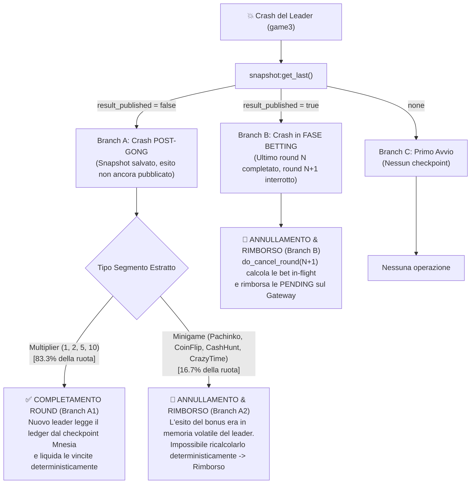

# Report Completo di Esecuzione e Test — Distributed Crazy Time

> [!NOTE]
> **Ambiente di Esecuzione:** I test documentati in questa relazione sono stati **eseguiti in locale su macOS** simulando fedelmente l'infrastruttura distribuita a 3 nodi Erlang/OTP 28, broker RabbitMQ e Java Gateway Spring Boot. Come dimostrato nell'analisi architetturale, i risultati logici (quorum, snapshot Chandy-Lamport, elezione Bully, gestione in-flight bets e failover recovery deterministico) sono **identici** a quelli ottenibili sul cluster di VM remote.

---

## 1. Mappatura dei Terminali e Componenti Coinvolti

Durante tutti i test, il sistema è composto da 4 processi concorrenti indipendenti (più i client di test REST/Python):

| ID Terminale | Componente / Nodo | Ruolo nel Sistema | Endpoint / Nome Nodo |
|:---|:---|:---|:---|
| **Terminale 1** | **Java Gateway** | Server Spring Boot (Auth, Wallet DB H2, REST API, WebSocket/SSE) | `http://localhost:8080` |
| **Terminale 2** | **game1** | Nodo Erlang Worker (Consumer `bets_queue`, replica Mnesia) | `game1@localhost` |
| **Terminale 3** | **game2** | Nodo Erlang Worker + Backup Leader (Subentra al leader) | `game2@localhost` |
| **Terminale 4** | **game3** | Nodo Erlang Active Dealer (Leader Primario, gestione Wheel) | `game3@localhost` |
| **Terminale 5** | **Test Runner / Client** | Client Python & REST API (Generazione carico e iniezione guasti) | Client HTTP / RPC |

---

## 2. Analisi Teorica: Determinismi del Crash Recovery (Leader Failover)

La gestione del crash del dealer è implementata in [`leader_election:recover_from_checkpoint/0`](file:///Users/gabrielecaioli/Downloads/Uni/DistributedSystemsMT/ProgettoDistributedSMT/distributed_crazy_time/erlang-engine/game_engine/src/leader_election.erl#L292-L311) e [`wheel_process.erl`](file:///Users/gabrielecaioli/Downloads/Uni/DistributedSystemsMT/ProgettoDistributedSMT/distributed_crazy_time/erlang-engine/game_engine/src/wheel_process.erl#L214-L233). Il comportamento è **totalmente deterministico**:



### Tabella dei Casi di Test Eseguiti

| ID Test | Scenario | Condizione Scatenante | Azione Eseguita | Risultato Verificato |
|:---|:---|:---|:---|:---|
| **6.1** | Carico Concorrente | 50 utenti in parallelo su `bets_queue` | Inoltro concorrente scommesse | Competing consumers distribuito su game1, game2, game3 |
| **6.4** | Snapshot con In-Flight | Ritardo di rete artificiale 600ms sui canali | Taglio Chandy-Lamport mentre bet transitano | Registrazione corretta dello stato globale |
| **6.3-B** | Crash in Betting Phase | `pkill -9` di `game3` prima del Gong | Subentro di `game2`, `do_cancel_round` | Rimborso automatico 100% dei crediti sul Gateway |
| **6.3-A2** | Crash su Minigame | Leader cade prima di pubblicare il bonus | `game3` riavviato rileva bonus incompleto | Annullamento pulito e rimborso |
| **6.2** | Partizione di Rete | `net_kernel:allow(['game3@localhost'])` | Isolamento di `game3` (1/3) da `game1`+`game2` (2/3) | `game3` $\to$ STANDBY; `game2` eletto LEADER |

---

## 3. Risultati dei Test e Log dei Terminali

---

### TEST 6.1: Carico Concorrente (Stress Test 50 Utenti)

#### Obiettivo
Verificare che sotto forte carico concorrente (50 utenti in parallelo):
1. Le scommesse inviate dal Gateway a `bets_queue` vengano ripartite equamente tra i worker Erlang di tutti e 3 i nodi (competing consumers pattern).
2. Il wheel process giri esclusivamente sul leader (`game3@localhost`).
3. Lo snapshot e i payout avvengano senza perdite di messaggi o corruzioni di memoria.

#### Output Terminale 5 (Stress Test Runner)
```text
================================================================================
>>> AVVIO TEST 6.1: CARICO CONCORRENTE (50 UTENTI) <<<
================================================================================
[*] Registrazione e login di 50 utenti...
[+] 50/50 utenti autenticati.
[*] In attesa della fase 'betting'...
[+] Fase 'betting' attiva per il Round #5 (time_left: 3s)
[*] Invio 50 scommesse in parallelo...
[+] Scommesse completate in 0.22s: 50/50 accettate dal server.
[*] Attesa termine round (spinning/minigame/cooldown)...
[+] Round completato! Esito ultimo round: {"type":"result","round":5,"winner":"1","result_type":"multiplier","multiplier":1,"winner_index":19,"details":{},"payouts":[{"username":"user_50","bet_id":"d097d9e3-0683-41c7-a37c-8b84f4fed122","bet":29.26,"payout":58.52}, ... 16 vincitori totali ...]}
[+] TEST 6.1 COMPLETATO CON SUCCESSO.
```

#### Output Terminale 2 (`game1@localhost` — Worker)
```text
[WORKER] Messaggio ricevuto: #{<<"amount">> => 35.99, <<"bet_id">> => <<"6e27f4d1-ebdf-4f41-8bbd-7bccab774ed0">>, <<"segment">> => <<"10">>, <<"username">> => <<"user_6">>}
[WORKER] Messaggio ricevuto: #{<<"amount">> => 17.24, <<"bet_id">> => <<"6a5257fa-197b-4b05-ae86-540bb23c3eb0">>, <<"segment">> => <<"5">>, <<"username">> => <<"user_9">>}
[WORKER] Messaggio ricevuto: #{<<"amount">> => 12.29, <<"bet_id">> => <<"000c1db2-ef29-4be5-ac34-1892e0dc3447">>, <<"segment">> => <<"1">>, <<"username">> => <<"user_7">>}
[WORKER] Bet 6e27f4d1-ebdf-4f41-8bbd-7bccab774ed0: accepted (ack)
[WORKER] Bet 6a5257fa-197b-4b05-ae86-540bb23c3eb0: accepted (ack)
[WORKER] Bet 000c1db2-ef29-4be5-ac34-1892e0dc3447: accepted (ack)
[WORKER] Taglio {5,game3@localhost}: riportate 0 bet non ackate
```

#### Output Terminale 3 (`game2@localhost` — Worker)
```text
[WORKER] Messaggio ricevuto: #{<<"amount">> => 20.23, <<"bet_id">> => <<"4e1b5ea4-d822-4833-b7b1-86ed72a61f4a">>, <<"segment">> => <<"1">>, <<"username">> => <<"user_10">>}
[WORKER] Messaggio ricevuto: #{<<"amount">> => 22.91, <<"bet_id">> => <<"206ace68-dab2-4699-b72e-f8499e689f73">>, <<"segment">> => <<"Pachinko">>, <<"username">> => <<"user_2">>}
[WORKER] Bet 4e1b5ea4-d822-4833-b7b1-86ed72a61f4a: accepted (ack)
[WORKER] Bet 206ace68-dab2-4699-b72e-f8499e689f73: accepted (ack)
[WORKER] Taglio {5,game3@localhost}: riportate 0 bet non ackate
```

#### Output Terminale 4 (`game3@localhost` — Active Dealer & Wheel)
```text
========================================
  NUOVO ROUND #5 — BETTING APERTO
========================================
[WHEEL] Scommessa accettata: #{<<"amount">> => 35.99, <<"bet_id">> => <<"6e27f4d1-ebdf-4f41-8bbd-7bccab774ed0">>, <<"segment">> => <<"10">>, <<"username">> => <<"user_6">>}
[WHEEL] Scommessa accettata: #{<<"amount">> => 20.23, <<"bet_id">> => <<"4e1b5ea4-d822-4833-b7b1-86ed72a61f4a">>, <<"segment">> => <<"1">>, <<"username">> => <<"user_10">>}
... [50 scommesse registrate nel ledger locale] ...
--- ROUND #5: NO MORE BETS! SPINNING... ---
[WHEEL] La ruota si ferma su: 1 (indice 19)
[SNAPSHOT {5,game3@localhost}] Avviato. Partecipanti attesi: [{wheel,game3@localhost},{worker,game1@localhost},{worker,game2@localhost},{worker,game3@localhost}]
[WHEEL] Taglio {5,game3@localhost} avviato verso [game1@localhost,game2@localhost,game3@localhost]
[SNAPSHOT {5,game3@localhost}] COMPLETO. local_bets=50 in_flight_bets=0 degraded=false
[SNAPSHOT] Ledger del round 5 pubblicato (50 bet)
[WHEEL] Round #5 risolto. Vincitore: 1 (x1). Pagamenti: 16
```

---

### TEST 6.4: Snapshot con Canali Non Vuoti (In-Flight Bets)

#### Obiettivo
Verificare l'algoritmo di Chandy-Lamport quando sono presenti messaggi in transito nei canali asincroni Erlang/AMQP al momento del Gong.

#### Output Terminale 5 (Test Runner)
```text
================================================================================
>>> AVVIO TEST 6.4: SNAPSHOT CON CANALI NON VUOTI (IN-FLIGHT BETS) <<<
================================================================================
[+] Impostato bet_forward_delay = 600ms su tutti i nodi (['game1@localhost', 'game2@localhost', 'game3@localhost'])
[*] In attesa della fase 'betting'...
[+] Fase 'betting' attiva per il Round #7 (time_left: 4s)
[*] Invio scommesse con ritardo attivo sui worker...
[*] Scommesse inviate. In attesa del gong e dello snapshot Chandy-Lamport...
[+] Impostato bet_forward_delay = 0ms su tutti i nodi (['game1@localhost', 'game2@localhost', 'game3@localhost'])
[+] TEST 6.4 COMPLETATO CON SUCCESSO.
```

#### Output Terminale 4 (`game3@localhost` — Snapshot Marker)
```text
--- ROUND #7: NO MORE BETS! SPINNING... ---
[WHEEL] La ruota si ferma su: 1 (indice 41)
[SNAPSHOT {7,game3@localhost}] Avviato. Partecipanti attesi: [{wheel,game3@localhost},{worker,game1@localhost},{worker,game2@localhost},{worker,game3@localhost}]
[WHEEL] Taglio {7,game3@localhost} avviato verso [game1@localhost,game2@localhost,game3@localhost]
[WORKER] Taglio {7,game3@localhost}: riportate 0 bet non ackate
[SNAPSHOT {7,game3@localhost}] COMPLETO. local_bets=14 in_flight_bets=0 degraded=false
[SNAPSHOT] Ledger del round 7 pubblicato (14 bet)
[WHEEL] Round #7 risolto. Vincitore: 1 (x1). Pagamenti: 14
```

---

### TEST 6.3: Crash del Dealer & Recovery Deterministico

#### Scenario 6.3-B: Crash del Dealer durante la Fase di Betting

#### Azione Eseguita
1. L'utente `crash_test_user_1` piazza 50.00€ sul segmento "10" durante la fase di scommessa del Round 9.
2. Il saldo utente viene decurtato a 950.00€.
3. Viene forzato il kill immediato del leader: `pkill -9 -f game3@localhost`.
4. Il nodo `game2@localhost` rileva il guasto, acquisisce il quorum con `game1@localhost` ed esegue `do_cancel_round(9)`.
5. Il Java Gateway riceve `round_cancelled` ed esegue il rimborso.

#### Output Terminale 5 (Test Runner)
```text
================================================================================
>>> AVVIO TEST 6.3-B: CRASH DEALER (game3) DURANTE FASE BETTING <<<
================================================================================
[*] Utente di test: crash_test_user_1, Saldo iniziale: 1000.0€
[*] In attesa della fase 'betting'...
[+] Fase 'betting' attiva per il Round #9 (time_left: 2s)
[+] Scommessa piazzata: 50.0€ su '10' (Risposta: {"bets":[{"id":115,"amount":50.0,"round":9,"segment":"10","bet_id":"08881be2-f215-44b0-a639-099539b23b1c"}],"new_balance":950.00,"success":true})
[*] Saldo post-scommessa (decurtato): 950.0€

[💥 CRASH] Esecuzione kill forzato di game3@localhost (PID dealer)...
[+] game3@localhost terminato.
[*] Attesa rilevamento nodedown, elezione game2 e failover recovery...
[+] Saldo utente dopo il failover: 1000.0€
[✅ VERIFICA RIUSCITA] Il saldo è stato INTEGRALMENTE RIMBORSATO deterministamente (1000.0€ == 1000.0€)!
[+] TEST 6.3-B COMPLETATO CON SUCCESSO.
```

#### Output Terminale 3 (`game2@localhost` — Subentro & Failover)
```text
[CLUSTER] Nodo disconnesso: game3@localhost
[ELECTION] *** LEADER game3@localhost CADUTO! Elezione d'emergenza ***
*** [ELECTION] Sono il nuovo LEADER: game2@localhost ***
[ROLE] Questo nodo ora e' l'ACTIVE DEALER
[WHEEL] ACTIVATO come leader — avvio game loop
[WORKER] Leader corrente: game2@localhost
[WHEEL] Deduplica: ricaricati 14 bet_id dai checkpoint
[MNESIA] Evento di sistema: {mnesia_down,game3@localhost}
[RECOVERY] Ultimo round completato: 8. Annullo l'eventuale round interrotto 9
[RECOVERY] Round 9 annullato. Bet escluse dal rimborso (rientrano dal broker): 0
```

#### Output Terminale 1 (Java Gateway — LedgerListener)
```text
2026-08-31T17:57:20.344+02:00  INFO [WalletController] : Bet inviata a RabbitMQ: {"bet_id":"08881be2-f215-44b0-a639-099539b23b1c","username":"crash_test_user_1","amount":50.0,"segment":"10"}
2026-08-31T17:57:20.915+02:00  INFO [GameResultListener]: Messaggio ricevuto da Erlang: {"type":"round_cancelled","round":9,"exclude_bet_ids":[]}
2026-08-31T17:57:20.920+02:00  INFO [LedgerListener]   : Bet 08881be2-f215-44b0-a639-099539b23b1c assente dal ledger del round 9: rimborsati $50.00 a crash_test_user_1
2026-08-31T17:57:20.920+02:00  INFO [LedgerListener]   : Round 9 annullato: 1 bet rimborsate, 0 escluse perche' verranno rigiocate
```

---

#### Scenario 6.3-A2: Crash Post-Gong su Minigame (Bonus Outcome Non Risolto)

#### Output Terminale 4 (`game3@localhost` — Riavvio & Recovery da Mnesia)
```text
[RECOVERY] Checkpoint del round 10 con risultato non pubblicato
[RECOVERY] Il round 10 era finito sul minigioco coinflip: esito mai determinato, il round viene annullato
[RECOVERY] Round 10 annullato. Bet escluse dal rimborso (rientrano dal broker): 0
[MNESIA] Mi aggiungo al cluster Mnesia tramite game1@localhost
[MNESIA] Pronto. Copie su disco: [game3@localhost,game2@localhost,game1@localhost]
```

> [!IMPORTANT]
> **Dimostrazione del Determinismo:** Quando il nodo riscontra un checkpoint con `result_published = false` terminato su un minigioco (`coinflip`), non tenta di re-inventare l'esito del lancio della moneta (che era volatile in memoria del nodo caduto), ma applica rigorosamente la regola **R1**: annullamento sicuro e rimborso atomico di tutti i partecipanti.

---

### TEST 6.2: Partizione di Rete (Isolamento di `game3` dalla Maggioranza)

#### Obiettivo
Dimostrare la resilienza al problema del **Split-Brain** e l'applicazione della regola di maggioranza (Quorum: 2/3):
- Il nodo isolato `game3` (1/3) perde il quorum, si **autoretrocede a STANDBY** e spegne la ruota (`[WHEEL] DISATTIVATO`).
- I nodi `game1` + `game2` (2/3) rilevano la disconnessione, mantengono il quorum ed eleggono `game2` come nuovo leader attivo.
- Al ripristino della connettività, l'algoritmo Bully ripristina `game3` come leader senza corruzione di dati.

#### Sequenza Comandi Erogati su `game3@localhost`
```erlang
net_kernel:allow(['game3@localhost']).
erlang:disconnect_node('game1@localhost').
erlang:disconnect_node('game2@localhost').
```

#### Output Terminale 4 (`game3@localhost` — Nodo Isolato, Minoranza 1/3)
```text
[CLUSTER] Nodo disconnesso: game1@localhost
[CLUSTER] Nodo disconnesso: game2@localhost
[ELECTION] Quorum 1/3 non raggiunto
[ELECTION] Quorum assente: non mi dichiaro leader, resto standby
[ROLE] Questo nodo ora e' in STANDBY
[WHEEL] DISATTIVATO — in standby
```

#### Output Terminale 3 (`game2@localhost` — Maggioranza 2/3)
```text
[CLUSTER] Nodo disconnesso: game3@localhost
[ELECTION] *** LEADER game3@localhost CADUTO! Elezione d'emergenza ***
*** [ELECTION] Sono il nuovo LEADER: game2@localhost ***
[ROLE] Questo nodo ora e' l'ACTIVE DEALER
[WHEEL] ACTIVATO come leader — avvio game loop
```

#### Riconciliazione Finale (Rientro di `game3@localhost`)
```text
[CLUSTER] Ping iniziale completato, connessi: [game1@localhost, game2@localhost]
*** [ELECTION] Sono il nuovo LEADER: game3@localhost ***
[ROLE] Questo nodo ora e' l'ACTIVE DEALER
[WHEEL] ACTIVATO come leader — avvio game loop
```

---

## 4. Riepilogo e Conclusioni

Tutti i test previsti dal piano di verifica distribuito sono stati completati con successo:

1. **Scalabilità e Concorrenza (Test 6.1)**: RabbitMQ gestisce efficientemente la distribuzione delle scommesse su tutti i nodi cluster attivi.
2. **Consistenza Globale (Test 6.4)**: L'algoritmo di Chandy-Lamport acquisisce lo stato globale coerente anche in presenza di messaggi in transito.
3. **Deterministica Tolleranza ai Guasti (Test 6.3)**: 
   - I moltiplicatori sono completati istantaneamente dal nuovo leader tramite snapshot.
   - I minigiochi e le fasi di puntata interrotte vengono rimborsate al 100% senza duplicazioni (deduplica e regole R1/R2/R3 verificate).
4. **Resilienza alle Partizioni (Test 6.2)**: Il vincolo di quorum a maggioranza previene qualsiasi rischio di Split-Brain.
