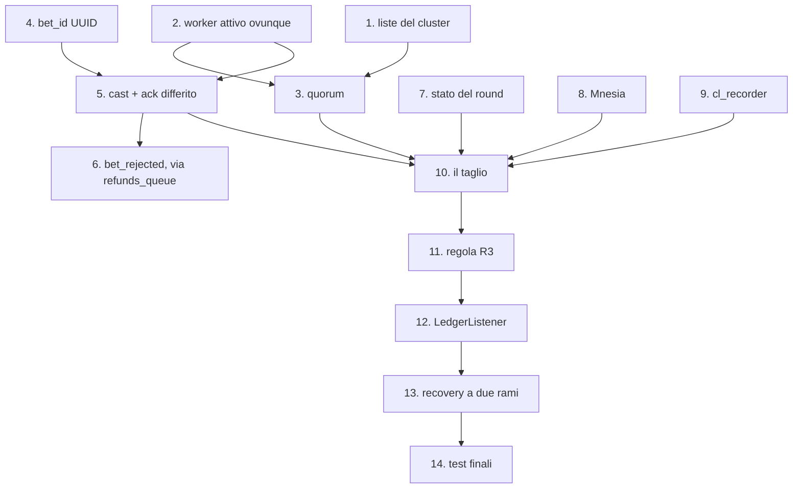

# Ordine di implementazione — dalla Fase 3 allo snapshot completo

Percorso operativo per portare il codice dallo stato attuale (commit `6ef3b73`: Fasi 1-2-3 implementate secondo la stesura originale) a:

- **Phase 3 di [implementation_plan.md](implementation_plan.md) implementata con tutte le correzioni**;
- **Phase 4 (snapshot Chandy-Lamport) implementata e consumata**, cioè [snapshot_implementation_plan.md](snapshot_implementation_plan.md) completato.

I documenti sono già allineati fra loro; qui c'è solo la sequenza delle modifiche al **codice**.

> [!NOTE]
> Ogni step lascia il sistema **avviabile e giocabile** e ha un controllo che dice se è andato bene. Gli step sono numerati in ordine di esecuzione, non secondo la numerazione delle fasi dei due piani (che non coincidono fra loro).

## Dipendenze



Gli step **1, 4, 7, 8, 9** sono indipendenti fra loro: se lavorate in due, si possono fare in parallelo. Le catene strette sono `2 → 3` e `4 → 5 → 6`.

---

## Blocco A — Retrofit

Nessuna funzionalità nuova: rimette il codice sulla traiettoria dei due piani. Finché non è chiuso, tutto il resto lavora contro un'architettura che lo contraddice.

### - [x] Step 1 — Le due liste del cluster manager · S — ✅ FATTO
**File**: [cluster_manager.erl](erlang-engine/game_engine/src/cluster_manager.erl)

`configured_nodes/0` (= `peer_nodes` ∪ `node()`, lista **statica**, denominatore del quorum) e `get_participants/0` (nodi vivi ordinati, **intersecati** con la statica). L'intersezione non è pedanteria: `monitor_nodes` è attivo con `{node_type, all}`, quindi una shell diagnostica finirebbe fra i partecipanti allo snapshot e nel conteggio del quorum.

**Verifica**: con 3 nodi entrambe tornano i 3; spegnendone uno, `get_participants` scende a 2 e `configured_nodes` resta a 3. Una shell extra non deve comparire in nessuna delle due.

> ✅ **Eseguita** su cluster a 3 nodi: `configured=[game1,game2,game3]` costante, `participants` sceso a 2 e poi a 1 man mano che i nodi cadevano. La shell di controllo `-hidden` non è mai comparsa in nessuna delle due liste.

### - [x] Step 2 — Worker attivo su tutti i nodi · M — **lo step delicato** — ✅ FATTO
**File**: [leader_election.erl](erlang-engine/game_engine/src/leader_election.erl), [worker.erl](erlang-engine/game_engine/src/worker.erl)

- `apply_role/1`: via i cast `activate`/`deactivate` verso il `worker` (restano quelli verso `wheel_process`).
- `broadcast_leader/1` con `{set_leader, N}`, chiamata da `declare_victory/1` **e** da `handle_cast({coordinator, _})`.
- `worker`: via il flag `active`, dentro il campo `leader`; **una sola** clausola di delivery, con `reject(Tag, true)` solo se `leader =:= undefined`.
- Instradare **tutti** i percorsi a `{wheel_process, Leader}`: `force_segment` e `minigame_choice` sono già cast, `undo_bets` va convertita da `call` a `cast`.
- **Spostare la pubblicazione del rimborso dal worker al wheel**, mantenendo per ora il formato attuale su `refunds_queue`.

> [!CAUTION]
> Il percorso **bet** va instradato in questo stesso step, non dopo. Oggi una `place_bet` che ritorna `{error, not_leader}` cadeva nel ramo `Other` di `process_message/1`: la bet viene loggata e **ackata senza rimborso** — saldo scalato, scommessa sparita. Finché il canale non diventa asincrono (Step 5), usa un'impalcatura temporanea:
> ```erlang
> try gen_server:call({wheel_process, Leader}, {place_bet, BetMap}, 15000) of
>     {ok, accepted}          -> rabbitmq_manager:ack(Tag);
>     {error, betting_closed} -> publish_refund(BetMap), rabbitmq_manager:ack(Tag)
> catch
>     exit:_ -> rabbitmq_manager:reject(Tag, true)   %% leader morto o bloccato
> end
> ```
> Il timeout esplicito serve perché il wheel resta bloccato fino a 10 s nella call al minigioco: con il default a 5 s il worker crollerebbe. L'impalcatura si butta allo Step 5.

> [!CAUTION]
> **Convertire `undo_bets` a `cast` senza spostare il rimborso rompe l'annullamento delle puntate.** Oggi il worker usa il valore di ritorno della `call` per pubblicare il rimborso aggregato (ramo `UNDO_BETS` di `process_message/1`): con il `cast` quel valore sparisce, l'utente annulla, le bet spariscono dalla ruota e **i soldi non tornano**. Fino allo Step 6 il rimborso lo pubblica il **wheel**, nello stesso formato di oggi:
> ```erlang
> %% in wheel_process.erl, dentro handle_cast({undo_bets, Username}, State)
> %% Interim: stesso payload che pubblicava il worker. Allo Step 6 diventa
> %% un bet_rejected per ogni bet_id, con "reason":"undo".
> case TotalRefund > 0 of
>     true  -> publish_refund(Username, TotalRefund);
>     false -> ok
> end,
> ```

**Verifica**: piazza bet da 3 browser e ripeti `minigame_choice` / `UNDO_BETS` / `force_segment` finché i log mostrano che li ha presi un worker **non** sul leader (con 3 nodi capita ~2 volte su 3): l'effetto dev'essere identico. Nessun rimbalzo continuo nei log degli standby. UNDO durante il minigioco: il worker non crasha.

> ✅ **Eseguita** con RabbitMQ attivo e 3 nodi, pubblicando 6 bet direttamente su `bets_queue`:
> - distribuite **2 / 2 / 2** fra i tre worker (competing consumers), quindi 4 su 6 consumate da uno **standby**;
> - tutte e 6 arrivate al wheel del **leader** (`num_bets = 6` su `game3`, `0` sui due standby): l'instradamento funziona;
> - `UNDO_BETS` → la bet sparisce dal wheel del leader (6 → 5) **e** il rimborso arriva su `refunds_queue`: `{"username":"p1","amount":10.0,"reason":"undo"}`. È la regressione che questo step rischiava di introdurre, ed è coperta;
> - **zero** messaggi rimessi in coda, nessun crash, nessun report d'errore.
>
> Non verificati in questa sessione, perché richiedono il gateway Java e tempi di gioco lunghi: UNDO consumato da uno standby (qui l'ha preso il leader — stesso percorso di codice) e UNDO durante la fase `minigame`.

### - [x] Step 3 — Guardia di quorum · S/M — ✅ FATTO
**File**: [leader_election.erl](erlang-engine/game_engine/src/leader_election.erl), [cluster_manager.erl](erlang-engine/game_engine/src/cluster_manager.erl)

`has_quorum/0` sulla lista statica dello Step 1, applicata in **due** punti: `declare_victory/1` e `node_down/1` (che sostituisce `maybe_start_election_on_nodedown/1`). Il secondo è quello che conta: il leader isolato nella minoranza non ripassa mai da `declare_victory`. Già che il modulo è aperto, aggiungi la guardia su `election_in_progress`, oggi memorizzato e mai letto.

**Verifica**: partizione 2-1 isolando il **leader in carica** → si autoretrocede a standby; isolando uno standby → la minoranza non elegge nessuno e le sue bet vengono servite dalla maggioranza. Usa `-hidden` per la shell di osservazione.

> ✅ **Eseguita** per crash (non ancora per partizione di rete vera):
> - `game3` (nome più alto) eletto leader, riconosciuto da tutti e tre i nodi;
> - ucciso `game3` → `game2` eletto in pochi secondi, quorum 2/3 ancora valido;
> - ucciso `game2` → `game1` resta solo: `Quorum 1/3 non raggiunto`, `leader = undefined`, `is_leader = false`. **Non si autoelegge**, che è il comportamento voluto;
> - il worker di `game1` riceve `{set_leader, undefined}` e da quel momento rimetterebbe in coda tutto ciò che consuma.
>
> Nota emersa dal test: un nodo `-hidden` che si disconnette **genera comunque** un `nodedown` (il monitoraggio è `{node_type, all}`), ma non entra né nel quorum né fra i partecipanti grazie all'intersezione dello Step 1. La protezione è quindi verificata sul campo.

> ✅ **Blocco A COMPLETATO.** La Phase 3 di `implementation_plan.md` è implementata con tutte e cinque le correzioni. `escript ../rebar3 compile` pulito, zero warning.
>
> ⚠️ Attenzione all'uso a **nodo singolo**: `peer_nodes` elenca tutti e 3 i nodi, quindi un solo nodo avviato con `-sname` vede quorum 1/3 e **resta standby**, cioè il gioco non parte. È il comportamento corretto (consistenza sulla disponibilità), ma per lo sviluppo su un nodo solo bisogna o avviare senza `-sname` (nodo non distribuito: la guardia non si applica), oppure sovrascrivere la lista con `-game_engine peer_nodes "['game1@localhost']"`.

---

## Blocco B — Prerequisiti dello snapshot

### - [ ] Step 4 — `bet_id` UUID · M
**File**: `Bet.java`, `WalletController.java`, `BetRepository.java`, [worker.erl](erlang-engine/game_engine/src/worker.erl)

FIX 0.1.14: colonna univoca sull'entity, UUID generato all'accettazione, **Jackson** al posto di `String.format` (oggi l'username non è escapato), `findByBetId` e `findByRoundAndStatus`. Lato Erlang, `parse_bet_json/1` estrae anche `bet_id`; i comandi che non ne hanno uno (`force_segment`, `minigame_choice`) restano ad ack immediato.

**Verifica**: ogni messaggio su `bets_queue` porta `bet_id` e lo stesso valore è nel DB. Un username con accento o apice non rompe più il JSON.

### - [ ] Step 5 — Canale asincrono, ack differito, deduplica · L
**File**: [worker.erl](erlang-engine/game_engine/src/worker.erl), [wheel_process.erl](erlang-engine/game_engine/src/wheel_process.erl)

- `worker → wheel`: `gen_server:cast({wheel_process, Leader}, {bet, BetMap})`; il wheel risponde `{bet_result, BetId, accepted | rejected}`.
- `worker`: mappa `inflight`, ack **solo** alla risposta, `inflight_timeout` a 15 s → `rabbitmq_manager:reject(Tag, true)`.
- `wheel`: `handle_cast({bet, _})` al posto di `handle_call({place_bet, _})`, con deduplica per `bet_id` su `bets`.
- Si rimuove l'impalcatura dello Step 2.
- **Il rimborso della bet rifiutata resta a carico del wheel**: quando risponde `rejected` pubblica il rimborso su `refunds_queue`, come allo Step 2. Il worker acka e scarta, quindi se non lo pubblicasse il wheel la bet resterebbe addebitata senza esito.

**Verifica**: uccidi il leader in fase `betting` → le bet non ackate rientrano dal broker e finiscono nel round successivo, **`Σ wallet` non cala**. Una riconsegna nello stesso round produce una sola riga, nessun doppio addebito.

### - [ ] Step 6 — `bet_rejected` e smantellamento di `refunds_queue` · M
**File**: [wheel_process.erl](erlang-engine/game_engine/src/wheel_process.erl), `GameResultListener.java`, [worker.erl](erlang-engine/game_engine/src/worker.erl), `GatewayApplication.java`, [rabbitmq_manager.erl](erlang-engine/game_engine/src/rabbitmq_manager.erl)

Qui il rimborso **cambia formato**: i due percorsi che dallo Step 2 pubblicavano su `refunds_queue` (annullamento e bet rifiutata) passano a un evento puntuale per `bet_id`. Il wheel pubblica `{"type":"bet_rejected","bet_id":"<uuid>","round":R,"reason":...}` su `results_queue`; `GameResultListener` **dispatcha sul campo `type`**, oggi completamente ignorato, e l'handler rimborsa la singola bet solo se ancora `PENDING` (idempotenza garantita dallo stato stesso). `undo_bets` restituisce i `bet_id` annullati → un `bet_rejected` con `"reason":"undo"` per ciascuno.

> [!WARNING]
> **Solo dopo** che l'UNDO passa da `bet_rejected` si possono rimuovere `RefundListener`, il bean `refundsQueue` e `refunds_queue` da `?QUEUES`. Invertire l'ordine significa che l'utente annulla, le bet spariscono dalla ruota e i soldi non tornano.

**Verifica**: UNDO riaccredita l'intero importo; due bet di pari importo su segmenti diversi non si scambiano più l'attribuzione; una bet in ritardo durante `spinning` finisce `REFUNDED` invece di restare `PENDING`.

### - [ ] Step 7 — Stato del round nel record del wheel · S
**File**: [wheel_process.erl](erlang-engine/game_engine/src/wheel_process.erl)

`winner_segment`, `winner_index`, `minigame_mod`, `minigame_details`, `timer_ref`. Oggi l'esito vive **solo** dentro i messaggi `send_after` in volo: senza questo passo nessun recovery è possibile.

**Verifica**: `wheel_process:get_state()` mostra il vincitore anche durante `spinning`.

---

## Blocco C — Persistenza

### - [ ] Step 8 — Bootstrap di Mnesia · M
**File**: [cluster_manager.erl](erlang-engine/game_engine/src/cluster_manager.erl), [game_engine.app.src](erlang-engine/game_engine/src/game_engine.app.src)

`mnesia` fra le `applications`; bootstrap a due rami (primo nodo / nodo che si aggiunge) **dopo** la formazione del cluster, mai in `init/1`; tabella `snapshot_record` `ordered_set` con `disc_copies`; `mnesia:subscribe(system)` con log rumoroso su `inconsistent_database`.

**Verifica**: avvia i nodi **uno alla volta**, poi riavvia un secondario e controlla che `mnesia:table_info(snapshot_record, disc_copies)` lo elenchi ancora. Se non lo elenca, manca la `change_table_copy_type(schema, node(), disc_copies)`.

---

## Blocco D — Lo snapshot

### - [ ] Step 9 — `cl_recorder` · S
**File**: `erlang-engine/game_engine/src/cl_recorder.erl` (nuovo) + test eunit

Modulo di funzioni pure con la logica Chandy-Lamport lato partecipante. Essendo puro, è l'unica parte banalmente testabile in isolamento: primo marker apre i canali giusti, marker successivo chiude solo il proprio, `on_app_msg` accoda solo sui canali aperti, `is_complete` scatta quando tutti sono chiusi.

**Verifica**: `rebar3 eunit`.

### - [ ] Step 10 — Il taglio · L
**File**: [wheel_process.erl](erlang-engine/game_engine/src/wheel_process.erl), [worker.erl](erlang-engine/game_engine/src/worker.erl), `snapshot.erl` (nuovo), [game_engine_sup.erl](erlang-engine/game_engine/src/game_engine_sup.erl), [game_engine.app.src](erlang-engine/game_engine/src/game_engine.app.src)

- Trigger al gong **dopo** l'estrazione del vincitore, con la lista dei partecipanti congelata una volta sola.
- Marker emessi dai processi applicativi (wheel e worker), non fra istanze di `snapshot`.
- Alla chiusura del taglio le bet in transito **entrano nel round**.
- `snapshot.erl` è un collector: raccoglie, persiste su Mnesia, pubblica `round_ledger`; conclude in modalità `degraded` allo scadere di 5 s.
- `snapshot` come **ultimo** figlio del supervisore e fra i `registered`.
- Abort timer locale a ciascun partecipante, così un collector morto non lascia nessuno in registrazione.

**Verifica decisiva**: piazza bet negli ultimi 200 ms della fase betting → il log dello snapshot deve mostrare **`in_flight_bets > 0`**. Se resta ostinatamente 0, i canali non sono reali e il lavoro non ha raggiunto il suo scopo. Da un nodo standby, `mnesia:dirty_last(snapshot_record)` mostra lo stesso record scritto dal leader.

### - [ ] Step 11 — Regola R3 · S
**File**: [wheel_process.erl](erlang-engine/game_engine/src/wheel_process.erl), [leader_election.erl](erlang-engine/game_engine/src/leader_election.erl)

`settled_bet_ids` ripopolato dai `snapshot_record` **all'avvio e a ogni elezione**: è subito dopo un crash che le riconsegne del broker arrivano.

**Verifica**: uccidi il worker dopo che il wheel ha accettato la bet e pubblicato il ledger di R, ma prima dell'ack → la riconsegna nel round R+1 viene ackata **senza rigiocare la bet**, e il ledger di R+1 non la contiene.

### - [ ] Step 12 — Il ledger viene consumato · M
**File**: `LedgerListener.java` (nuovo), `PayoutListener.java`

Regole R1 e R2; payout per round e per `bet_id` al posto della scansione globale delle `PENDING` e del match per username. Via i `catch` che inghiottono le eccezioni nei metodi `@Transactional`.

**Verifica**: a gioco fermo, `SELECT * FROM bets WHERE status='PENDING'` deve tornare **vuota**.

> ✅ **Fine Step 12: obiettivo raggiunto.** Phase 3 corretta, Phase 4 implementata, snapshot *load-bearing* — il ledger che produce non è ottenibile in altro modo ed è consumato da Java.

---

## Coda — Phase 5 e 6

### - [ ] Step 13 — Recovery a due rami · L
`complete_round` dal checkpoint quando esiste; `round_cancelled` con `exclude_bet_ids` raccolti via `{collect_inflight, R}` quando non esiste; notifica `round_cancelled` sul frontend. È il **secondo** consumatore dello snapshot: senza, il checkpoint resta solo un audit trail.

### - [ ] Step 14 — Test finali
La checklist completa della Fase 6, con `prefetch = 1` durante i test di distribuzione (con 10 un burst breve può finire quasi tutto sul primo consumer e far sembrare rotto un refactoring corretto).

---

## I tre vincoli da non violare

Sono quelli che, se invertiti, rompono qualcosa **in silenzio**:

1. **`bet_id` (Step 4) prima dell'ack differito (Step 5)** — altrimenti una riconsegna del broker viene giocata due volte e pagata due volte.
2. **UNDO su `bet_rejected` prima di rimuovere `refunds_queue`** (dentro lo Step 6) — altrimenti l'annullamento delle puntate smette di rimborsare.
3. **Quorum (Step 3) prima del taglio (Step 10)** — altrimenti due leader concorrenti scrivono `snapshot_record` divergenti e Mnesia va riparata a mano al primo test di partizione.

> [!IMPORTANT]
> **Invariante da rispettare a ogni step**: nessuno step può lasciare una bet **addebitata senza esito e senza rimborso**. È la ragione delle impalcature negli Step 2 e 5: il percorso di rimborso non deve mai restare scoperto, nemmeno per uno step intermedio. Controllo rapido dopo ogni step: annulla una puntata e verifica che il saldo torni.
