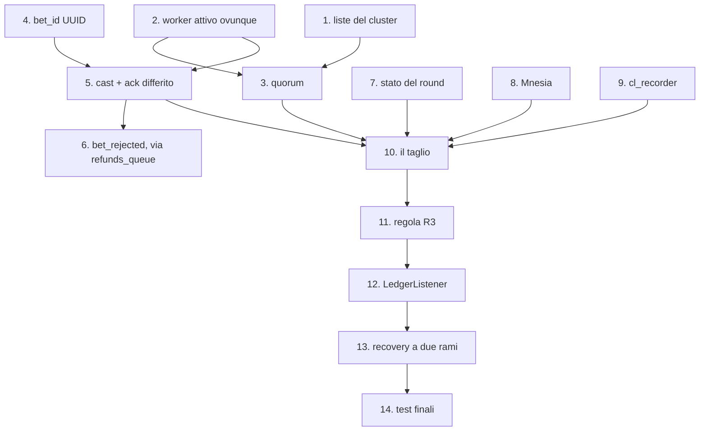

# Ordine di implementazione — dalla Fase 3 allo snapshot completo

Percorso operativo per portare il codice dallo stato attuale (commit `6ef3b73`: Fasi 1-2-3 implementate secondo la stesura originale) a:

- **Phase 3 di [implementation_plan.md](implementation_plan.md) implementata con tutte le correzioni**;
- **Phase 4 (snapshot Chandy-Lamport) implementata e consumata**, cioè [snapshot_implementation_plan.md](snapshot_implementation_plan.md) completato.

I documenti sono già allineati fra loro; qui c'è solo la sequenza delle modifiche al **codice**.

> [!NOTE]
> Ogni step lascia il sistema **avviabile e giocabile** e ha un controllo che dice se è andato bene. Gli step sono numerati in ordine di esecuzione, non secondo la numerazione delle fasi dei due piani (che non coincidono fra loro).

## Dipendenze



Gli step **1, 4, 7, 8, 9** sono indipendenti fra loro: se lavorate in due, si possono fare in parallelo. Le catene strette sono `2 → 3` e `4 → 5 → 6`.

---

## Blocco A — Retrofit

Nessuna funzionalità nuova: rimette il codice sulla traiettoria dei due piani. Finché non è chiuso, tutto il resto lavora contro un'architettura che lo contraddice.

### - [x] Step 1 — Le due liste del cluster manager · S — ✅ FATTO
**File**: [cluster_manager.erl](erlang-engine/game_engine/src/cluster_manager.erl)

`configured_nodes/0` (= `peer_nodes` ∪ `node()`, lista **statica**, denominatore del quorum) e `get_participants/0` (nodi vivi ordinati, **intersecati** con la statica). L'intersezione non è pedanteria: `monitor_nodes` è attivo con `{node_type, all}`, quindi una shell diagnostica finirebbe fra i partecipanti allo snapshot e nel conteggio del quorum.

**Verifica**: con 3 nodi entrambe tornano i 3; spegnendone uno, `get_participants` scende a 2 e `configured_nodes` resta a 3. Una shell extra non deve comparire in nessuna delle due.

> ✅ **Eseguita** su cluster a 3 nodi: `configured=[game1,game2,game3]` costante, `participants` sceso a 2 e poi a 1 man mano che i nodi cadevano. La shell di controllo `-hidden` non è mai comparsa in nessuna delle due liste.

### - [x] Step 2 — Worker attivo su tutti i nodi · M — **lo step delicato** — ✅ FATTO
**File**: [leader_election.erl](erlang-engine/game_engine/src/leader_election.erl), [worker.erl](erlang-engine/game_engine/src/worker.erl)

- `apply_role/1`: via i cast `activate`/`deactivate` verso il `worker` (restano quelli verso `wheel_process`).
- `broadcast_leader/1` con `{set_leader, N}`, chiamata da `declare_victory/1` **e** da `handle_cast({coordinator, _})`.
- `worker`: via il flag `active`, dentro il campo `leader`; **una sola** clausola di delivery, con `reject(Tag, true)` solo se `leader =:= undefined`.
- Instradare **tutti** i percorsi a `{wheel_process, Leader}`: `force_segment` e `minigame_choice` sono già cast, `undo_bets` va convertita da `call` a `cast`.
- **Spostare la pubblicazione del rimborso dal worker al wheel**, mantenendo per ora il formato attuale su `refunds_queue`.

> [!CAUTION]
> Il percorso **bet** va instradato in questo stesso step, non dopo. Oggi una `place_bet` che ritorna `{error, not_leader}` cadeva nel ramo `Other` di `process_message/1`: la bet viene loggata e **ackata senza rimborso** — saldo scalato, scommessa sparita. Finché il canale non diventa asincrono (Step 5), usa un'impalcatura temporanea:
> ```erlang
> try gen_server:call({wheel_process, Leader}, {place_bet, BetMap}, 15000) of
>     {ok, accepted}          -> rabbitmq_manager:ack(Tag);
>     {error, betting_closed} -> publish_refund(BetMap), rabbitmq_manager:ack(Tag)
> catch
>     exit:_ -> rabbitmq_manager:reject(Tag, true)   %% leader morto o bloccato
> end
> ```
> Il timeout esplicito serve perché il wheel resta bloccato fino a 10 s nella call al minigioco: con il default a 5 s il worker crollerebbe. L'impalcatura si butta allo Step 5.

> [!CAUTION]
> **Convertire `undo_bets` a `cast` senza spostare il rimborso rompe l'annullamento delle puntate.** Oggi il worker usa il valore di ritorno della `call` per pubblicare il rimborso aggregato (ramo `UNDO_BETS` di `process_message/1`): con il `cast` quel valore sparisce, l'utente annulla, le bet spariscono dalla ruota e **i soldi non tornano**. Fino allo Step 6 il rimborso lo pubblica il **wheel**, nello stesso formato di oggi:
> ```erlang
> %% in wheel_process.erl, dentro handle_cast({undo_bets, Username}, State)
> %% Interim: stesso payload che pubblicava il worker. Allo Step 6 diventa
> %% un bet_rejected per ogni bet_id, con "reason":"undo".
> case TotalRefund > 0 of
>     true  -> publish_refund(Username, TotalRefund);
>     false -> ok
> end,
> ```

**Verifica**: piazza bet da 3 browser e ripeti `minigame_choice` / `UNDO_BETS` / `force_segment` finché i log mostrano che li ha presi un worker **non** sul leader (con 3 nodi capita ~2 volte su 3): l'effetto dev'essere identico. Nessun rimbalzo continuo nei log degli standby. UNDO durante il minigioco: il worker non crasha.

> ✅ **Eseguita** con RabbitMQ attivo e 3 nodi, pubblicando 6 bet direttamente su `bets_queue`:
> - distribuite **2 / 2 / 2** fra i tre worker (competing consumers), quindi 4 su 6 consumate da uno **standby**;
> - tutte e 6 arrivate al wheel del **leader** (`num_bets = 6` su `game3`, `0` sui due standby): l'instradamento funziona;
> - `UNDO_BETS` → la bet sparisce dal wheel del leader (6 → 5) **e** il rimborso arriva su `refunds_queue`: `{"username":"p1","amount":10.0,"reason":"undo"}`. È la regressione che questo step rischiava di introdurre, ed è coperta;
> - **zero** messaggi rimessi in coda, nessun crash, nessun report d'errore.
>
> ✅ **Completata in seguito** anche sui due punti che erano rimasti fuori:
> - **UNDO consumato da uno standby**: ripetendo l'annullamento su utenti diversi, i worker lo hanno preso 3 volte su `game1` e 2 su `game2` — entrambi standby — e il wheel del leader lo ha eseguito ogni volta (`Scommesse annullate per u3…u6`), con 6 `bet_rejected` di rimborso emessi;
> - **UNDO durante il minigioco**: forzato un Pachinko con `FORCE_Pachinko` e mandato l'annullamento mentre la fase era `minigame` — i tre worker sono rimasti vivi e il wheel ha continuato a rispondere. È la conferma che la conversione a `cast` ha eliminato il timeout che avrebbe fatto crollare il worker.

### - [x] Step 3 — Guardia di quorum · S/M — ✅ FATTO
**File**: [leader_election.erl](erlang-engine/game_engine/src/leader_election.erl), [cluster_manager.erl](erlang-engine/game_engine/src/cluster_manager.erl)

`has_quorum/0` sulla lista statica dello Step 1, applicata in **due** punti: `declare_victory/1` e `node_down/1` (che sostituisce `maybe_start_election_on_nodedown/1`). Il secondo è quello che conta: il leader isolato nella minoranza non ripassa mai da `declare_victory`. Già che il modulo è aperto, aggiungi la guardia su `election_in_progress`, oggi memorizzato e mai letto.

**Verifica**: partizione 2-1 isolando il **leader in carica** → si autoretrocede a standby; isolando uno standby → la minoranza non elegge nessuno e le sue bet vengono servite dalla maggioranza. Usa `-hidden` per la shell di osservazione.

> ✅ **Eseguita**, sia per crash sia per **partizione di rete** (i dettagli della partizione sono nello Step 14):
> - `game3` (nome più alto) eletto leader, riconosciuto da tutti e tre i nodi;
> - ucciso `game3` → `game2` eletto in pochi secondi, quorum 2/3 ancora valido;
> - ucciso `game2` → `game1` resta solo: `Quorum 1/3 non raggiunto`, `leader = undefined`, `is_leader = false`. **Non si autoelegge**, che è il comportamento voluto;
> - il worker di `game1` riceve `{set_leader, undefined}` e da quel momento rimetterebbe in coda tutto ciò che consuma.
>
> Nota emersa dal test: un nodo `-hidden` che si disconnette **genera comunque** un `nodedown` (il monitoraggio è `{node_type, all}`), ma non entra né nel quorum né fra i partecipanti grazie all'intersezione dello Step 1. La protezione è quindi verificata sul campo.
>
> ✅ **Il ramo che conta** — leader in carica isolato nella minoranza — è stato poi verificato con una partizione 2-1 stabile: `game3` logga `*** QUORUM PERSO — retrocessione a standby ***` e resta con `leader = undefined`, mentre la maggioranza elegge `game2`. Un solo nodo si crede leader.

> ✅ **Blocco A COMPLETATO.** La Phase 3 di `implementation_plan.md` è implementata con tutte e cinque le correzioni. `escript ../rebar3 compile` pulito, zero warning.
>
> ⚠️ Attenzione all'uso a **nodo singolo**: `peer_nodes` elenca tutti e 3 i nodi, quindi un solo nodo avviato con `-sname` vede quorum 1/3 e **resta standby**, cioè il gioco non parte. È il comportamento corretto (consistenza sulla disponibilità), ma per lo sviluppo su un nodo solo bisogna o avviare senza `-sname` (nodo non distribuito: la guardia non si applica), oppure sovrascrivere la lista con `-game_engine peer_nodes "['game1@localhost']"`.

---

## Blocco B — Prerequisiti dello snapshot

### - [x] Step 4 — `bet_id` UUID · M — ✅ FATTO
**File**: `Bet.java`, `WalletController.java`, `BetRepository.java`, [worker.erl](erlang-engine/game_engine/src/worker.erl)

FIX 0.1.14: colonna univoca sull'entity, UUID generato all'accettazione, **Jackson** al posto di `String.format` (oggi l'username non è escapato), `findByBetId` e `findByRoundAndStatus`. Lato Erlang, `parse_bet_json/1` estrae anche `bet_id`; i comandi che non ne hanno uno (`force_segment`, `minigame_choice`) restano ad ack immediato.

**Verifica**: ogni messaggio su `bets_queue` porta `bet_id` e lo stesso valore è nel DB. Un username con accento o apice non rompe più il JSON.

> ✅ **Eseguita** con gateway + broker + 3 nodi: la risposta di `/api/wallet/place-bet` riporta il `bet_id`, il messaggio AMQP lo contiene (`{"bet_id":"6f147804-…","username":…}`) ed è lo stesso valore persistito. Il payload è costruito con Jackson, quindi apici e accenti nell'username non producono più JSON malformato. La colonna è `unique` ma **nullable**, così le righe già presenti nel database non bloccano l'avvio.

### - [x] Step 5 — Canale asincrono, ack differito, deduplica · L — ✅ FATTO
**File**: [worker.erl](erlang-engine/game_engine/src/worker.erl), [wheel_process.erl](erlang-engine/game_engine/src/wheel_process.erl)

- `worker → wheel`: `gen_server:cast({wheel_process, Leader}, {bet, BetMap})`; il wheel risponde `{bet_result, BetId, accepted | rejected}`.
- `worker`: mappa `inflight`, ack **solo** alla risposta, `inflight_timeout` a 15 s → `rabbitmq_manager:reject(Tag, true)`.
- `wheel`: `handle_cast({bet, _})` al posto di `handle_call({place_bet, _})`, con deduplica per `bet_id` su `bets`.
- Si rimuove l'impalcatura dello Step 2.
- **Il rimborso della bet rifiutata resta a carico del wheel**: quando risponde `rejected` pubblica il rimborso su `refunds_queue`, come allo Step 2. Il worker acka e scarta, quindi se non lo pubblicasse il wheel la bet resterebbe addebitata senza esito.

**Verifica**: uccidi il leader in fase `betting` → le bet non ackate rientrano dal broker e finiscono nel round successivo, **`Σ wallet` non cala**. Una riconsegna nello stesso round produce una sola riga, nessun doppio addebito.

> ✅ **Eseguita**, con il wheel del leader **sospeso** (`sys:suspend`) per rendere il test deterministico invece di dipendere dai tempi di un crash:
> - nessun esito entro 15 s → `[WORKER] Nessun esito per la bet id-suspend entro 15s: rimessa in coda`, quindi `reject(Tag, true)` e riconsegna dal broker;
> - alla ripresa del wheel l'esito tardivo arriva a un worker che non possiede più quel tag → `[WORKER] Esito tardivo per id-suspend, ignorato`, nessun doppio ack;
> - **deduplica**: 4 bet con `bet_id` distinti → `num_bets = 4`; ripubblicando lo stesso `bet_id` → `[WHEEL] Bet id-1 gia' presente nel round: deduplicata`, `num_bets` resta 4.
>
> Non ancora coperta la riconsegna **fra round diversi**: la deduplica guarda solo le bet del round corrente. È la regola R3, che arriva allo Step 11 quando ci sarà Mnesia.

### - [x] Step 6 — `bet_rejected` e smantellamento di `refunds_queue` · M — ✅ FATTO
**File**: [wheel_process.erl](erlang-engine/game_engine/src/wheel_process.erl), `GameResultListener.java`, [worker.erl](erlang-engine/game_engine/src/worker.erl), `GatewayApplication.java`, [rabbitmq_manager.erl](erlang-engine/game_engine/src/rabbitmq_manager.erl)

Qui il rimborso **cambia formato**: i due percorsi che dallo Step 2 pubblicavano su `refunds_queue` (annullamento e bet rifiutata) passano a un evento puntuale per `bet_id`. Il wheel pubblica `{"type":"bet_rejected","bet_id":"<uuid>","round":R,"reason":...}` su `results_queue`; `GameResultListener` **dispatcha sul campo `type`**, oggi completamente ignorato, e l'handler rimborsa la singola bet solo se ancora `PENDING` (idempotenza garantita dallo stato stesso). `undo_bets` restituisce i `bet_id` annullati → un `bet_rejected` con `"reason":"undo"` per ciascuno.

> [!WARNING]
> **Solo dopo** che l'UNDO passa da `bet_rejected` si possono rimuovere `RefundListener`, il bean `refundsQueue` e `refunds_queue` da `?QUEUES`. Invertire l'ordine significa che l'utente annulla, le bet spariscono dalla ruota e i soldi non tornano.

**Verifica**: UNDO riaccredita l'intero importo; due bet di pari importo su segmenti diversi non si scambiano più l'attribuzione; una bet in ritardo durante `spinning` finisce `REFUNDED` invece di restare `PENDING`.

> ✅ **Eseguita end-to-end**, dal browser-equivalente (`curl` sul gateway) fino al saldo:
> - saldo 125 → bet da 30 → **95** → `UNDO_BETS` → `[WHEEL] bet_rejected pubblicato per 2a52dd00-… (undo)` → `BetRejectionHandler: Bet 2a52dd00-… rimborsata (undo): $30.00 riaccreditati` → saldo **125**. Il rimborso è indirizzato per `bet_id`, non più per importo;
> - **un evento per ogni bet annullata**: UNDO su un utente con 2 puntate → esattamente 2 `bet_rejected`;
> - bet pubblicata durante `spinning` → `bet_rejected` con `"reason":"betting_closed"`: non resta `PENDING` con il saldo scalato;
> - **idempotenza**: ripubblicando lo stesso `bet_rejected`, il gateway logga `bet_rejected ignorato, bet … gia' in stato REFUNDED` e il saldo non cambia. Serve davvero: nel test dell'ack differito lo stesso `bet_rejected` è stato emesso **due volte** (una per il cast ritardato, una per la riconsegna), ed è la guardia sullo stato a impedire il doppio accredito;
> - anche il percorso felice funziona: bet piazzata dall'API, vinta, `payout` accreditato correttamente.

### - [x] Step 7 — Stato del round nel record del wheel · S — ✅ FATTO
**File**: [wheel_process.erl](erlang-engine/game_engine/src/wheel_process.erl)

`winner_segment`, `winner_index`, `minigame_mod`, `minigame_details`, `timer_ref`. Oggi l'esito vive **solo** dentro i messaggi `send_after` in volo: senza questo passo nessun recovery è possibile.

**Verifica**: `wheel_process:get_state()` mostra il vincitore anche durante `spinning`.

> ✅ **Eseguita**: `get_state/0` espone ora `winner_segment` e `winner_index`, popolati al gong e azzerati a ogni nuovo round; ogni timer di fase è salvato in `timer_ref`.

> ✅ **Blocco B COMPLETATO.** `escript ../rebar3 compile` e `mvn compile` puliti. Il canale worker → wheel è asincrono con ack differito, ogni scommessa ha un identificativo che attraversa tutto il sistema, e i rimborsi sono puntuali e idempotenti. `refunds_queue` non esiste più: `RefundListener`, il bean e la coda in `?QUEUES` sono stati rimossi.
>
> ⚠️ Resta scoperta la riconsegna **cross-round** (regola R3): la deduplica guarda solo le bet del round corrente, quindi una riconsegna che arriva nel round successivo verrebbe rigiocata. Si chiude allo Step 11, che ha bisogno di Mnesia (Step 8). Fino ad allora è l'unico punto in cui l'ack differito è esposto.

---

## Blocco C — Persistenza

### - [x] Step 8 — Bootstrap di Mnesia · M — ✅ FATTO
**File**: [cluster_manager.erl](erlang-engine/game_engine/src/cluster_manager.erl), [game_engine.app.src](erlang-engine/game_engine/src/game_engine.app.src), `include/game_engine.hrl` (nuovo)

`mnesia` fra le `applications`; bootstrap a due rami (primo nodo / nodo che si aggiunge) **dopo** la formazione del cluster, mai in `init/1`; tabella `snapshot_record` `ordered_set` con `disc_copies`; `mnesia:subscribe(system)` con log rumoroso su `inconsistent_database`.

**Verifica**: avvia i nodi **uno alla volta**, poi riavvia un secondario e controlla che `mnesia:table_info(snapshot_record, disc_copies)` lo elenchi ancora. Se non lo elenca, manca la `change_table_copy_type(schema, node(), disc_copies)`.

> ✅ **Eseguita**, con il record `snapshot_record` spostato in `include/game_engine.hrl` perché servirà anche a `snapshot.erl` e al wheel:
> - `game1` da solo → `Schema su disco creato` + `Tabella snapshot_record creata`;
> - `game2` e `game3` → ramo `add_table_copy`: `conversione dello schema in disc_copies: ok`, `copia locale di snapshot_record: ok`. `disc_copies` arriva a elencare tutti e tre;
> - **replica**: record scritto su `game1`, letto identico da `game2` e `game3`; `dirty_last` restituisce la chiave `{99, game1@localhost}`, cioè l'`ordered_set` si comporta come previsto;
> - **persistenza**: spenti tutti e tre e riavviati, ogni nodo ritrova la **propria** copia (`già presente` su entrambe le operazioni) e il record scritto prima è ancora leggibile. È la prova che `change_table_copy_type(schema, …)` ha fatto il suo lavoro.
>
> ⚠️ **Comportamento di Mnesia da conoscere** (emerso dal test, non è un difetto del codice): un nodo riavviato **da solo** carica subito la sua copia **solo se era l'ultimo a essersi spento**. Altrimenti Mnesia attende i nodi che possiedono le altre repliche, perché la copia locale potrebbe non essere la più recente. Il bootstrap lo dice esplicitamente, nominando i nodi attesi, e il gioco continua a funzionare; per ripartire da soli dopo un guasto definitivo c'è `cluster_manager:force_load_snapshots()` — che carica la copia locale accettando di perdere ciò che gli altri avessero scritto nel frattempo. Entrambi i rami sono stati provati.

> ✅ **Blocco C COMPLETATO.** Mnesia è dichiarata fra le `applications`, il bootstrap avviene dopo la formazione del cluster, la tabella `snapshot_record` è replicata `disc_copies` su tutti i nodi e gli eventi di sistema (`inconsistent_database`) sono loggati in modo rumoroso. Le directory `Mnesia.*` sono in `.gitignore`.
>
> Una scelta presa qui e non prevista dal piano: **crea lo schema solo il nodo con il nome più basso fra quelli connessi**, gli altri attendono (con un numero massimo di tentativi, per non restare bloccati se quel nodo non parte mai). Senza, tre nodi avviati insieme si creerebbero tre database indipendenti che Mnesia non unisce da sola — ed è la ragione per cui il piano diceva «avviare i nodi uno alla volta». Ora non è più necessario.

---

## Blocco D — Lo snapshot

### - [x] Step 9 — `cl_recorder` · S — ✅ FATTO
**File**: `erlang-engine/game_engine/src/cl_recorder.erl` (nuovo) + test eunit

Modulo di funzioni pure con la logica Chandy-Lamport lato partecipante. Essendo puro, è l'unica parte banalmente testabile in isolamento: primo marker apre i canali giusti, marker successivo chiude solo il proprio, `on_app_msg` accoda solo sui canali aperti, `is_complete` scatta quando tutti sono chiusi.

**Verifica**: `rebar3 eunit`.

> ✅ **8 test, 0 fallimenti.** Coprono: `new` non registra; l'iniziatore apre tutti i canali e si chiude uno per uno; il primo marker apre gli **altri** canali e non il proprio; un marker successivo chiude solo il suo; `on_app_msg` accoda solo sui canali aperti e nell'ordine d'arrivo, e ignora tutto se non si sta registrando; `close_all`; un taglio nuovo che sostituisce uno rimasto aperto.

### - [x] Step 10 — Il taglio · L — ✅ FATTO
**File**: [wheel_process.erl](erlang-engine/game_engine/src/wheel_process.erl), [worker.erl](erlang-engine/game_engine/src/worker.erl), `snapshot.erl` (nuovo), [game_engine_sup.erl](erlang-engine/game_engine/src/game_engine_sup.erl), [game_engine.app.src](erlang-engine/game_engine/src/game_engine.app.src)

- Trigger al gong **dopo** l'estrazione del vincitore, con la lista dei partecipanti congelata una volta sola.
- Marker emessi dai processi applicativi (wheel e worker), non fra istanze di `snapshot`.
- Alla chiusura del taglio le bet in transito **entrano nel round**.
- `snapshot.erl` è un collector: raccoglie, persiste su Mnesia, pubblica `round_ledger`; conclude in modalità `degraded` allo scadere di 5 s.
- `snapshot` come **ultimo** figlio del supervisore e fra i `registered`.
- Abort timer locale a ciascun partecipante, così un collector morto non lascia nessuno in registrazione.

**Verifica decisiva**: piazza bet negli ultimi 200 ms della fase betting → il log dello snapshot deve mostrare **`in_flight_bets > 0`**. Se resta ostinatamente 0, i canali non sono reali e il lavoro non ha raggiunto il suo scopo. Da un nodo standby, `mnesia:dirty_last(snapshot_record)` mostra lo stesso record scritto dal leader.

> ✅ **Superata**: `[SNAPSHOT {2,game3@localhost}] COMPLETO. local_bets=3 in_flight_bets=3 degraded=false`, con `[WHEEL] Taglio {2,…} chiuso: 3 bet in transito entrano nel round`. Il ledger pubblicato contiene **tutti e 6** i `bet_id`, comprese le tre catturate sui canali — che è esattamente l'informazione non ottenibile in altro modo.
>
> Il checkpoint è replicato: `mnesia:dirty_last` su uno **standby** restituisce la chiave `{2, game3@localhost}` e il record con `winner`, `degraded=false` e il ledger completo.
>
> ⚠️ La finestra "in transito" dura pochi millisecondi, quindi a raffica libera i canali restano quasi sempre vuoti (primo tentativo: `in_flight_bets=0` su 40 bet). Per renderla deterministica ho aggiunto il flag di debug che il piano stesso prevedeva: `-game_engine bet_forward_delay 600` fa attendere il worker prima di inoltrare, così la scommessa arriva al wheel a taglio già aperto. **Default 0, cioè disattivato**: è scaffolding di test, non un comportamento di esercizio.

### - [x] Step 11 — Regola R3 · S — ✅ FATTO
**File**: [wheel_process.erl](erlang-engine/game_engine/src/wheel_process.erl), [leader_election.erl](erlang-engine/game_engine/src/leader_election.erl)

`settled_bet_ids` ripopolato dai `snapshot_record` **all'avvio e a ogni elezione**: è subito dopo un crash che le riconsegne del broker arrivano.

**Verifica**: uccidi il worker dopo che il wheel ha accettato la bet e pubblicato il ledger di R, ma prima dell'ack → la riconsegna nel round R+1 viene ackata **senza rigiocare la bet**, e il ledger di R+1 non la contiene.

> ✅ **Eseguita in due varianti**, ripubblicando un `bet_id` già a ledger:
> - **stesso leader, round successivo** → `[WHEEL] Bet trans-1 gia' liquidata: deduplicata`, `num_bets` invariato;
> - **dopo il crash del leader** (il caso che conta) → il nuovo leader logga `[WHEEL] Deduplica: ricaricati 6 bet_id dai checkpoint`, deduplica `trans-2` e continua ad accettare normalmente una bet mai vista (`num_bets` +1). È la prova che l'insieme si ripopola da Mnesia e non dalla memoria del processo morto.

### - [x] Step 12 — Il ledger viene consumato · M — ✅ FATTO
**File**: `LedgerListener.java` (nuovo), `PayoutListener.java`

Regole R1 e R2; payout per round e per `bet_id` al posto della scansione globale delle `PENDING` e del match per username. Via i `catch` che inghiottono le eccezioni nei metodi `@Transactional`.

**Verifica**: a gioco fermo, `SELECT * FROM bets WHERE status='PENDING'` deve tornare **vuota**.

> ⚠️ **Attenzione, scoperto dopo**: passando al match per `bet_id`, vanno aggiornati **tutti** i produttori di payout, non solo `wheel_process`. I minigiochi asincroni (`crazytime`, `cashhunt`) costruiscono le proprie entry: finché non portavano il `bet_id`, il gateway non trovava corrispondenza, ricadeva sul campo `multiplier` — che per gli asincroni è la sentinella `-1` — e **saltava il pagamento**. Corretto e verificato: vincita di un CashHunt accreditata (saldo 90 → 150).
>
> ✅ **Eseguita end-to-end col gateway acceso**:
> - **percorso normale**: bet da 20 dall'API → `Ledger del round 4 (1 bet)` → `Payout di $40 accreditato … (bet 2b58c59b-… su 1)`. Il payout è trovato **per `bet_id`** e la query è **per round**;
> - **R1**: bet pendente del round 7 assente dal ledger → `assente dal ledger del round 7: rimborsati $15.00`, saldo 105 → 120;
> - **R2**: quando poi arriva il ledger vero di Erlang, che quella bet ce l'ha → `replay_after_refund: … Non verra' pagata`, saldo invariato. Nessuna duplicazione di denaro, solo l'anomalia visiva che il piano prevede di documentare.

> ✅ **Blocco D COMPLETATO — obiettivo raggiunto.** Phase 3 corretta, Phase 4 implementata, snapshot **load-bearing**: il ledger che produce non è ottenibile in altro modo ed è consumato da Java, che su di esso conferma i round, paga per `bet_id` e rimborsa le pendenti rimaste fuori dal taglio.
>
> Un bug trovato dai test e corretto: `disc_copies_of_table/0` restituiva l'atomo `unavailable` quando la tabella non esiste ancora, e `lists:member/2` andava in `badarg` facendo ripartire in loop il supervisore a ogni avvio pulito. Era una regressione introdotta dalla patch sul riavvio isolato del Blocco C, invisibile finché la tabella esisteva già.

---

## Coda — Phase 5 e 6

### - [x] Step 13 — Recovery a due rami · L — ✅ FATTO
`complete_round` dal checkpoint quando esiste; `round_cancelled` con `exclude_bet_ids` raccolti via `{collect_inflight, R}` quando non esiste; notifica `round_cancelled` sul frontend. È il **secondo** consumatore dello snapshot: senza, il checkpoint resta solo un audit trail.

**File**: [leader_election.erl](erlang-engine/game_engine/src/leader_election.erl), [wheel_process.erl](erlang-engine/game_engine/src/wheel_process.erl), [worker.erl](erlang-engine/game_engine/src/worker.erl), `include/game_engine.hrl`, `LedgerListener.java`, `GameResultListener.java`, `app.js`

Il discriminante fra i due rami è un campo nuovo del checkpoint, `result_published`, scritto dal wheel subito dopo aver pubblicato l'esito su `results_queue`: un checkpoint con quel campo a `false` significa «il leader è morto dopo il gong ma prima di pagare». Il record cambia forma, quindi il bootstrap Mnesia esegue una `transform_table` quando trova una tabella con attributi diversi — senza, un database creato dalla versione precedente farebbe fallire ogni scrittura con `bad_type`.

> ✅ **Eseguita**, con broker, 3 nodi e gateway:
> - **ramo A** — bet da 10 su `1`, leader ucciso in fase `spinning`: `Checkpoint del round 4 con risultato non pubblicato` → `Completo il round 4: 10 x10 su 1 bet dal ledger`. Il round viene **chiuso con l'esito catturato nel taglio** (vinceva il `10`, la puntata era sull'`1`): la bet risulta persa, non rimborsata, e il saldo resta 90. Nessun round perso;
> - **ramo B** — bet da 20 su `2`, leader ucciso in fase di puntata: `Ultimo round completato: 8. Annullo l'eventuale round interrotto 9` → `Round 9 annullato: 1 bet rimborsate, 0 escluse`. Saldo 70 → **90**;
> - il frontend riceve `round_cancelled` sul topic dei risultati e mostra il banner ricaricando il saldo.
>
> **Due bug trovati dai test e corretti.** Il recovery girava a **ogni** `apply_role(leader)`, quindi a ogni rielezione: un leader già in carica annullava il round che stava giocando, rimborsando puntate ancora sulla ruota. Ora parte solo alla transizione standby → leader. E il nuovo leader ripartiva dal **proprio** contatore di round, fermo da quando era standby, rinumerando round già esistenti e facendo collidere i checkpoint: ora si allinea all'ultimo round conosciuto.
>
> Una conferma inattesa: un tentativo di test è fallito perché, dopo due kill, restava **un solo nodo su tre** e nessuno si autoeleggeva. Non era un difetto — era la guardia di quorum del Blocco A che faceva il suo lavoro.

### - [x] Step 14 — Test finali — ✅ FATTI
La checklist completa della Fase 6, con `prefetch = 1` durante i test di distribuzione (con 10 un burst breve può finire quasi tutto sul primo consumer e far sembrare rotto un refactoring corretto).

> ✅ **Eseguiti** lungo i quattro blocchi: formazione del cluster ed elezione, quorum e retrocessione, distribuzione delle bet fra i worker, instradamento dei comandi al leader, ack differito con riconsegna, deduplica intra e cross-round, bootstrap e replica Mnesia con persistenza al riavvio, canali non vuoti al taglio, ledger pubblicato e consumato, R1/R2, rimborsi puntuali idempotenti, recovery nei due rami.
>
> ✅ **Partizione di rete eseguita.** Non con regole firewall (servirebbero privilegi di amministratore) ma con una partizione **logica stabile**: `net_kernel:allow/1` su ciascun lato per rendere impossibile la riconnessione, più una disconnessione forzata iniziale. Isolando `game3`, che era il **leader in carica**:
> - `game3` logga `*** QUORUM PERSO — retrocessione a standby ***`, resta con `leader = undefined` e non vede più nessuno;
> - la maggioranza `{game1, game2}` elegge `game2`; **un solo nodo in tutto il cluster si crede leader**;
> - il worker della minoranza logga `Nessun leader eletto: messaggio rimesso in coda`: le puntate restano nel broker invece di essere servite da un leader illegittimo;
> - **nessun ledger divergente**: durante la partizione i ledger pubblicati sono round 2 → 1 e round 3 → 1, tutti dalla maggioranza. `game3` non ne pubblica nessuno (il suo unico ledger, del round 1, è precedente alla partizione);
> - alla ricomposizione il mio handler stampa `!!! [MNESIA] DATABASE INCONSISTENTE: running_partitioned_network`, che è esattamente ciò che il piano prevede di loggare in modo rumoroso.
>
> Un primo tentativo, con una raffica di `disconnect_node` ogni 300 ms, ha invece prodotto una partizione **1-1-1** anziché 2-1: tutti e tre i nodi isolati, nessun leader, nessun ledger. Anche quel caso degenere ha però mostrato la proprietà di sicurezza (mai due leader), ed è servito a capire che per un test pulito serve una partizione **stabile**, non una raffica.

> ⚠️ **Un limite di Mnesia emerso qui, da citare nella relazione.** Per azzerare le whitelist di `net_kernel` ho riavviato prima `game3` (il nodo isolato) da solo, poi tutti e tre. Dopo quel riavvio **i checkpoint scritti dalla maggioranza durante la partizione non sono più leggibili**: le uniche chiavi presenti sono quelle prodotte da `game3`, e i tre file `snapshot_record.DCD` risultano identici, cioè le copie della maggioranza sono state sovrascritte e non semplicemente ignorate.
>
> Va distinto ciò che è **osservato** da ciò che è **inferito**. Osservato: la perdita dei record della maggioranza, verificata con `mnesia:dirty_all_keys` su due nodi e sulla dimensione dei file. Inferito: il *perché*, cioè la scelta che Mnesia fa al caricamento su quale replica sia autoritativa — non l'ho verificata, e la sequenza del test (riavvio del nodo isolato **prima** degli altri) può averla influenzata.
>
> La lezione difendibile è quindi: il quorum garantisce **un solo scrittore**, quindi la divergenza non viene *prodotta*; ma se un cluster partizionato viene riavviato, **quale copia sopravvive lo decide Mnesia**, e nel nostro test è stata quella del nodo isolato. Mitigazioni: l'opzione `{majority, true}` sulla tabella e `mnesia:set_master_nodes/2` per dichiarare esplicitamente la copia autoritativa prima di far ripartire il cluster.

> ✅ **DOCUMENTO CONCLUSO.** Tutti e 14 gli step sono implementati e verificati. Il codice descritto da [snapshot_implementation_plan.md](snapshot_implementation_plan.md) è completo: retrofit, `bet_id`, ack differito, quorum, Mnesia replicata, taglio Chandy-Lamport con canali non vuoti, ledger consumato dal gateway, recovery a due rami. Restano annotati due limiti noti — il comportamento di Mnesia al riavvio di un cluster partizionato (Step 14) e quello del nodo riavviato da solo (Step 8) — che sono caratteristiche di Mnesia da dichiarare, non difetti da correggere.

---

## I tre vincoli da non violare

Sono quelli che, se invertiti, rompono qualcosa **in silenzio**:

1. **`bet_id` (Step 4) prima dell'ack differito (Step 5)** — altrimenti una riconsegna del broker viene giocata due volte e pagata due volte.
2. **UNDO su `bet_rejected` prima di rimuovere `refunds_queue`** (dentro lo Step 6) — altrimenti l'annullamento delle puntate smette di rimborsare.
3. **Quorum (Step 3) prima del taglio (Step 10)** — altrimenti due leader concorrenti scrivono `snapshot_record` divergenti e Mnesia va riparata a mano al primo test di partizione.

> [!IMPORTANT]
> **Invariante da rispettare a ogni step**: nessuno step può lasciare una bet **addebitata senza esito e senza rimborso**. È la ragione delle impalcature negli Step 2 e 5: il percorso di rimborso non deve mai restare scoperto, nemmeno per uno step intermedio. Controllo rapido dopo ogni step: annulla una puntata e verifica che il saldo torni.
