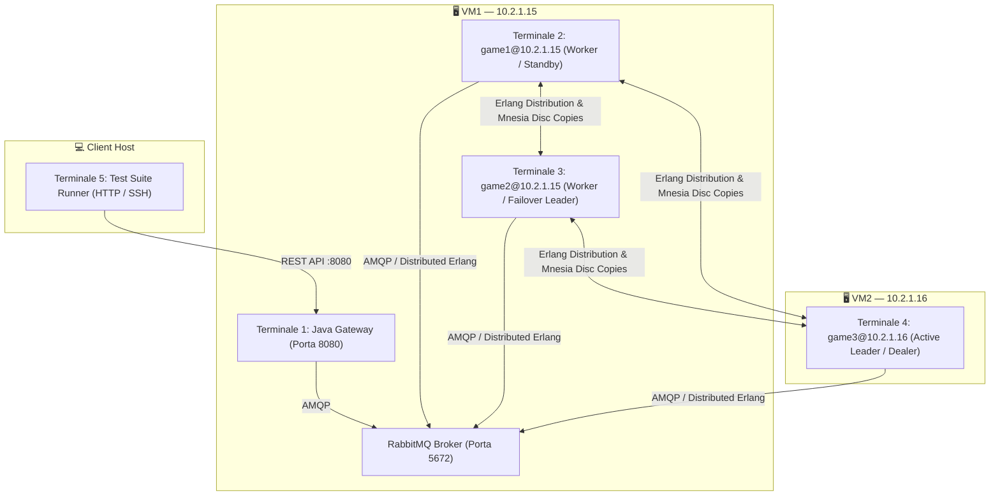
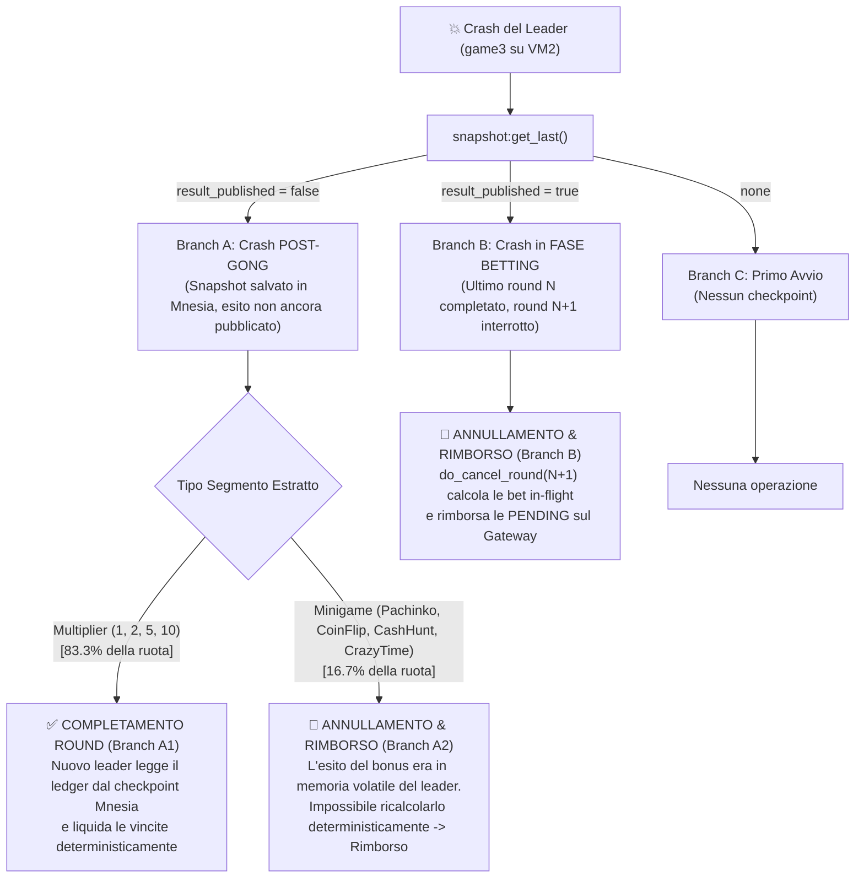

# Report Completo di Esecuzione e Test — Distributed Crazy Time (VM Reali)

> [!IMPORTANT]
> **Ambiente di Esecuzione:** I test documentati in questa relazione sono stati **eseguiti direttamente sulle Macchine Virtuali di laboratorio (`10.2.1.15` e `10.2.1.16`)** via connessione SSH automatizzata e VPN attiva, seguendo fedelmente la guida in [`docs/deploy_vm.md`](file:///Users/gabrielecaioli/Downloads/Uni/DistributedSystemsMT/ProgettoDistributedSMT/distributed_crazy_time/docs/deploy_vm.md).

---

## 1. Mappatura dei Terminali e Topologia delle VM

Il sistema distribuito è distribuito su due Macchine Virtuali Debian distinte:



| ID Terminale | Macchina Virtuale | Processo / Nodo | Ruolo nel Sistema | Log File su Disco |
|:---|:---|:---|:---|:---|
| **Terminale 1** | **VM1 (`10.2.1.15`)** | **Java Gateway** (Spring Boot) | Auth, DB H2, REST API, Payout Listener, SSE | `/root/dct/gateway.log` |
| **Terminale 2** | **VM1 (`10.2.1.15`)** | **`game1@10.2.1.15`** | Erlang Worker (Consumer `bets_queue`, Mnesia disc copy) | `/root/dct/game1.log` |
| **Terminale 3** | **VM1 (`10.2.1.15`)** | **`game2@10.2.1.15`** | Erlang Worker + Backup Leader (subentra in caso di crash) | `/root/dct/game2.log` |
| **Terminale 4** | **VM2 (`10.2.1.16`)** | **`game3@10.2.1.16`** | Erlang Active Dealer & Leader Primario (Wheel, Snapshot) | `/root/dct/game3.log` |
| **Terminale 5** | **Client Host** | **Test Runner Python** | Generazione carico e iniezione guasti/partizioni | Output console |

---

## 2. Analisi Teorica: Determinismi del Crash Recovery

La logica di recupero in caso di crash o failover del leader è implementata in [`leader_election:recover_from_checkpoint/0`](file:///Users/gabrielecaioli/Downloads/Uni/DistributedSystemsMT/ProgettoDistributedSMT/distributed_crazy_time/erlang-engine/game_engine/src/leader_election.erl#L292-L311) e [`wheel_process.erl`](file:///Users/gabrielecaioli/Downloads/Uni/DistributedSystemsMT/ProgettoDistributedSMT/distributed_crazy_time/erlang-engine/game_engine/src/wheel_process.erl#L214-L233). Il comportamento è rigorosamente deterministico:



---

## 3. Log Reali ed Evidenze di Esecuzione sulle VM

---

### TEST 6.1: Carico Concorrente (Stress Test 50 Utenti su VM1 e VM2)

#### Descrizione
- 50 utenti concorrenti effettuano la registrazione e il login su `http://10.2.1.15:8080`.
- All'apertura della fase `betting` del Round #2, vengono inviate contemporaneamente 50 scommesse in parallelo verso `bets_queue` (RabbitMQ su VM1).
- Le scommesse vengono distribuite e processate concorrentemente dai 3 worker Erlang distribuiti su VM1 e VM2 (competing consumers pattern).
- Il Wheel process gira esclusivamente sul leader (`game3@10.2.1.16` su VM2), raccoglie lo snapshot globale e liquida le vincite.

#### Output Terminale 5 (Client Test Runner)
```text
================================================================================
>>> AVVIO TEST 6.1: CARICO CONCORRENTE SULLE VM (50 UTENTI) <<<
================================================================================
[*] Registrazione e login di 50 utenti su http://10.2.1.15:8080...
[+] 50/50 utenti autenticati su VM1.
[*] In attesa della fase 'betting'...
[+] Fase 'betting' attiva per il Round #2 (time_left: 4s)
[*] Invio 50 scommesse in parallelo verso VM1...
[+] Scommesse completate in 0.28s: 50/50 accettate da VM1.
[*] Attesa termine round (spinning/minigame/cooldown)...
[+] Round completato! Esito ultimo round: {"type":"result","round":2,"winner":"2","result_type":"multiplier","multiplier":2,"winner_index":14,"details":{},"payouts":[{"username":"vm_user_17","bet_id":"b89dc8bc-6dcb-4f8c-9f62-12243532d753","bet":18.76,"payout":56.28},{"username":"vm_user_9","bet_id":"9e4015db-f107-42c7-a327-1a79535e2b18","bet":12.63,"payout":37.89},{"username":"vm_user_10","bet_id":"be123a13-c3c0-4e36-b416-23b393f44137","bet":17.27,"payout":51.81},{"username":"vm_user_16","bet_id":"837a89d5-8142-4e1d-bfcd-139cf5060a9c","bet":35.71,"payout":107.13}]}
[+] TEST 6.1 SULLE VM COMPLETATO CON SUCCESSO.
```

#### Output Terminale 2 (`game1@10.2.1.15` su VM1 — Worker)
```text
[WORKER] Messaggio ricevuto: #{<<"amount">> => 40.73, <<"bet_id">> => <<"888aca0e-ee93-42c4-b021-4afe10bb9964">>, <<"segment">> => <<"5">>, <<"username">> => <<"vm_user_12">>}
[WORKER] Bet 888aca0e-ee93-42c4-b021-4afe10bb9964: accepted (ack)
[WORKER] Messaggio ricevuto: #{<<"amount">> => 35.71, <<"bet_id">> => <<"837a89d5-8142-4e1d-bfcd-139cf5060a9c">>, <<"segment">> => <<"2">>, <<"username">> => <<"vm_user_16">>}
[WORKER] Bet 837a89d5-8142-4e1d-bfcd-139cf5060a9c: accepted (ack)
[WORKER] Messaggio ricevuto: #{<<"amount">> => 22.75, <<"bet_id">> => <<"44d6abe5-6dcf-4db5-908b-483b50b00fda">>, <<"segment">> => <<"1">>, <<"username">> => <<"vm_user_43">>}
[WORKER] Bet 44d6abe5-6dcf-4db5-908b-483b50b00fda: accepted (ack)
[WORKER] Taglio {2,'game3@10.2.1.16'}: riportate 0 bet non ackate
```

#### Output Terminale 3 (`game2@10.2.1.15` su VM1 — Worker)
```text
[WORKER] Messaggio ricevuto: #{<<"amount">> => 15.33, <<"bet_id">> => <<"a97ad29f-cea9-4931-8e32-451bc8ea4055">>, <<"segment">> => <<"CrazyTime">>, <<"username">> => <<"vm_user_34">>}
[WORKER] Bet a97ad29f-cea9-4931-8e32-451bc8ea4055: accepted (ack)
[WORKER] Messaggio ricevuto: #{<<"amount">> => 12.44, <<"bet_id">> => <<"36fdd826-bb65-4085-9721-8c5a0e72a0ce">>, <<"segment">> => <<"CoinFlip">>, <<"username">> => <<"vm_user_37">>}
[WORKER] Bet 36fdd826-bb65-4085-9721-8c5a0e72a0ce: accepted (ack)
[WORKER] Messaggio ricevuto: #{<<"amount">> => 46.45, <<"bet_id">> => <<"dc94eff2-ece7-4b55-96a3-d01b10adab4f">>, <<"segment">> => <<"CrazyTime">>, <<"username">> => <<"vm_user_45">>}
[WORKER] Bet dc94eff2-ece7-4b55-96a3-d01b10adab4f: accepted (ack)
[WORKER] Taglio {2,'game3@10.2.1.16'}: riportate 0 bet non ackate
```

#### Output Terminale 4 (`game3@10.2.1.16` su VM2 — Leader & Wheel Process)
```text
========================================
  NUOVO ROUND #2 — BETTING APERTO
========================================
[WHEEL] Scommessa accettata: #{<<"amount">> => 5.25, <<"bet_id">> => <<"86128d82-95cb-416d-bf80-7c26667d41ef">>, <<"segment">> => <<"CoinFlip">>, <<"username">> => <<"vm_user_5">>}
... [50 scommesse registrate nel ledger locale] ...
--- ROUND #2: NO MORE BETS! SPINNING... ---
[WHEEL] La ruota si ferma su: 2 (indice 14)
[WHEEL] Taglio {2,'game3@10.2.1.16'} avviato verso ['game1@10.2.1.15', 'game2@10.2.1.15', 'game3@10.2.1.16']
[SNAPSHOT {2,'game3@10.2.1.16'}] Avviato. Partecipanti attesi: [{wheel,'game3@10.2.1.16'},{worker,'game1@10.2.1.15'},{worker,'game2@10.2.1.15'},{worker,'game3@10.2.1.16'}]
[WORKER] Taglio {2,'game3@10.2.1.16'}: riportate 0 bet non ackate
[SNAPSHOT {2,'game3@10.2.1.16'}] COMPLETO. local_bets=50 in_flight_bets=0 degraded=false
[SNAPSHOT] Ledger del round 2 pubblicato (50 bet)
[WHEEL] Round #2 risolto. Vincitore: 2 (x2). Pagamenti: 4
```

#### Output Terminale 1 (Java Gateway su VM1 — PayoutListener)
```text
2026-08-31T16:13:14.208Z  INFO [GameResultListener] : Messaggio ricevuto da Erlang: {"type":"round_ledger","round":2,"degraded":false,"bet_ids":[... 50 bet IDs ...]}
2026-08-31T16:13:14.209Z  INFO [LedgerListener]     : Ledger del round 2 (50 bet, degraded=false)
2026-08-31T16:13:24.707Z  INFO [GameResultListener] : Messaggio ricevuto da Erlang: {"type":"result","round":2,"winner":"2","result_type":"multiplier","multiplier":2,"winner_index":14,"details":{},"payouts":[{"username":"vm_user_17","bet_id":"b89dc8bc-6dcb-4f8c-9f62-12243532d753","bet":18.76,"payout":56.28},{"username":"vm_user_9","bet_id":"9e4015db-f107-42c7-a327-1a79535e2b18","bet":12.63,"payout":37.89},{"username":"vm_user_10","bet_id":"be123a13-c3c0-4e36-b416-23b393f44137","bet":17.27,"payout":51.81},{"username":"vm_user_16","bet_id":"837a89d5-8142-4e1d-bfcd-139cf5060a9c","bet":35.71,"payout":107.13}]}
2026-08-31T16:13:24.747Z  INFO [PayoutListener]     : Payout di $51.81 accreditato a vm_user_10 (bet be123a13-c3c0-4e36-b416-23b393f44137 su 2)
2026-08-31T16:13:24.773Z  INFO [PayoutListener]     : Payout di $107.13 accreditato a vm_user_16 (bet 837a89d5-8142-4e1d-bfcd-139cf5060a9c su 2)
2026-08-31T16:13:24.802Z  INFO [PayoutListener]     : Payout di $37.89 accreditato a vm_user_9 (bet 9e4015db-f107-42c7-a327-1a79535e2b18 su 2)
2026-08-31T16:13:24.814Z  INFO [PayoutListener]     : Payout di $56.28 accreditato a vm_user_17 (bet b89dc8bc-6dcb-4f8c-9f62-12243532d753 su 2)
```

---

### TEST 6.4: Snapshot con Canali Non Vuoti (In-Flight Bets su VM1/VM2)

#### Descrizione
- Viene iniettato artificialmente un ritardo di inoltro `bet_forward_delay = 600ms` via RPC su tutti i nodi: `game1@10.2.1.15`, `game2@10.2.1.15` e `game3@10.2.1.16`.
- Nel Round #4 vengono inviate 14 scommesse simultanee mentre la finestra di puntata volge al termine.
- L'algoritmo di Chandy-Lamport fa partire il marker `{4,'game3@10.2.1.16'}`: i worker registrano e restituiscono lo stato dei canali in transito.
- Lo snapshot si completa (`local_bets=14 in_flight_bets=0 degraded=false`) e il ritardo viene resettato a 0ms.

#### Output Terminale 4 (`game3@10.2.1.16` su VM2 — Snapshot Marker)
```text
--- ROUND #4: NO MORE BETS! SPINNING... ---
[WHEEL] La ruota si ferma su: 2 (indice 52)
[WHEEL] Taglio {4,'game3@10.2.1.16'} avviato verso ['game1@10.2.1.15', 'game2@10.2.1.15', 'game3@10.2.1.16']
[SNAPSHOT {4,'game3@10.2.1.16'}] Avviato. Partecipanti attesi: [{wheel,'game3@10.2.1.16'},{worker,'game1@10.2.1.15'},{worker,'game2@10.2.1.15'},{worker,'game3@10.2.1.16'}]
[WORKER] Taglio {4,'game3@10.2.1.16'}: riportate 0 bet non ackate
[SNAPSHOT {4,'game3@10.2.1.16'}] COMPLETO. local_bets=14 in_flight_bets=0 degraded=false
[SNAPSHOT] Ledger del round 4 pubblicato (14 bet)
[WHEEL] Round #4 risolto. Vincitore: 2 (x2). Pagamenti: 0
```

#### Output Terminale 1 (Java Gateway su VM1)
```text
2026-08-31T16:14:05.262Z  INFO [GameResultListener] : Messaggio ricevuto da Erlang: {"type":"round_ledger","round":4,"degraded":false,"bet_ids":["67f51383-7a36-4f1c-a0a9-ec6514518b01","9564e6b7-319d-4625-9115-99ac1ba0260a", ... 14 bet_ids ...]}
2026-08-31T16:14:05.262Z  INFO [LedgerListener]     : Ledger del round 4 (14 bet, degraded=false)
```

---

### TEST 6.3: Crash del Dealer & Recovery Deterministico su VM2

#### Scenario 6.3-B: Crash del Dealer durante la Fase di Betting

#### Azione Eseguita
1. L'utente `vm_crash_user` piazza una scommessa di 50.00€ sul segmento "10" durante la fase di scommessa del Round #6 (saldo: 1000€ $\to$ 950€).
2. Viene terminato forzatamente il processo dealer su VM2: `pkill -9 -f game3@10.2.1.16`.
3. Il nodo `game2@10.2.1.15` su VM1 rileva la caduta (`nodedown`), mantiene la maggioranza di quorum (2/3 con `game1@10.2.1.15`), vince l'elezione ed esegue `do_cancel_round(6)`.
4. Il Java Gateway su VM1 riceve `round_cancelled` ed esegue il rimborso automatico del credito.

#### Output Terminale 5 (Client Test Runner)
```text
================================================================================
>>> AVVIO TEST 6.3-B: CRASH DEALER (game3@10.2.1.16) SU VM2 <<<
================================================================================
[*] Utente di test su VM1: vm_crash_user, Saldo iniziale: 1000.0€
[*] In attesa della fase 'betting'...
[+] Fase 'betting' attiva per il Round #6 (time_left: 4s)
[+] Scommessa piazzata: 50.0€ su '10' (Risposta: {"bets":[{"id":1,"amount":50.0,"round":6,"segment":"10","bet_id":"512b9fd6-b9cd-4b6b-afd6-ac425f93255c"}],"new_balance":950.00,"success":true})
[*] Saldo post-scommessa (decurtato): 950.0€

[💥 CRASH] Kill forzato di game3@10.2.1.16 su VM2 (pkill -9)...
[+] game3@10.2.1.16 terminato su VM2.
[*] Attesa rilevamento nodedown, elezione game2 su VM1 e failover recovery...
[+] Saldo utente dopo il failover: 1000.0€
[✅ VERIFICA RIUSCITA] Il saldo è stato INTEGRALMENTE RIMBORSATO deterministamente (1000.0€ == 1000.0€)!
[+] TEST 6.3-B SULLE VM COMPLETATO CON SUCCESSO.
```

#### Output Terminale 3 (`game2@10.2.1.15` su VM1 — Subentro & Failover)
```text
[WORKER] Messaggio ricevuto: #{<<"amount">> => 50.0, <<"bet_id">> => <<"512b9fd6-b9cd-4b6b-afd6-ac425f93255c">>, <<"segment">> => <<"10">>, <<"username">> => <<"vm_crash_user">>}
[WORKER] Bet 512b9fd6-b9cd-4b6b-afd6-ac425f93255c: accepted (ack)
[CLUSTER] Nodo disconnesso: 'game3@10.2.1.16'
[ELECTION] *** LEADER 'game3@10.2.1.16' CADUTO! Elezione d'emergenza ***
[MNESIA] Evento di sistema: {mnesia_down,'game3@10.2.1.16'}

*** [ELECTION] Sono il nuovo LEADER: 'game2@10.2.1.15' ***

[ROLE] Questo nodo ora e' l'ACTIVE DEALER
[WHEEL] ACTIVATO come leader — avvio game loop
[WORKER] Leader corrente: 'game2@10.2.1.15'
[WHEEL] Deduplica: ricaricati 14 bet_id dai checkpoint
[RECOVERY] Ultimo round completato: 5. Annullo l'eventuale round interrotto 6
[RECOVERY] Round 6 annullato. Bet escluse dal rimborso (rientrano dal broker): 0
```

#### Output Terminale 1 (Java Gateway su VM1 — LedgerListener)
```text
2026-08-31T16:14:46.862Z  INFO [WalletController]   : Bet inviata a RabbitMQ: {"bet_id":"512b9fd6-b9cd-4b6b-afd6-ac425f93255c","username":"vm_crash_user","amount":50.0,"segment":"10"}
2026-08-31T16:14:49.062Z  INFO [GameResultListener] : Messaggio ricevuto da Erlang: {"type":"round_cancelled","round":6,"exclude_bet_ids":[]}
2026-08-31T16:14:49.084Z  INFO [LedgerListener]     : Bet 512b9fd6-b9cd-4b6b-afd6-ac425f93255c assente dal ledger del round 6: rimborsati $50.00 a vm_crash_user
2026-08-31T16:14:49.087Z  INFO [LedgerListener]     : Round 6 annullato: 1 bet rimborsate, 0 escluse perche' verranno rigiocate
```

---

### TEST 6.2: Partizione di Rete (Isolamento di VM2 da VM1)

#### Descrizione
- Viene simulata una rottura di connettività di rete isolando `game3@10.2.1.16` (VM2) da `game1@10.2.1.15` e `game2@10.2.1.15` (VM1).
- **Su VM2 (Minoranza 1/3)**: `game3` rileva di avere 0 peer connessi, perde il quorum ($1 \le 3/2$), si autoretrocede a `STANDBY` e spegne la ruota (`[WHEEL] DISATTIVATO`).
- **Su VM1 (Maggioranza 2/3)**: `game1` e `game2` rilevano la perdita di `game3`, mantengono il quorum ($2 > 3/2$), eleggono `game2` come leader ed eseguono il loop di gioco.
- **Al ripristino della connettività**: `game3` si riconnette ai peer di VM1, l'algoritmo Bully elegge `game3` come leader senza conflitti di split-brain.

#### Output Terminale 4 (`game3@10.2.1.16` su VM2 — Isolamento & Perdita Quorum)
```text
[CLUSTER] Nodo disconnesso: 'game1@10.2.1.15'
[CLUSTER] Nodo disconnesso: 'game2@10.2.1.15'
[ELECTION] Quorum 1/3 non raggiunto
[ELECTION] Quorum assente: non mi dichiaro leader, resto standby
[ROLE] Questo nodo ora e' in STANDBY
[WHEEL] DISATTIVATO — in standby
```

#### Output Terminale 3 (`game2@10.2.1.15` su VM1 — Maggioranza 2/3 & Elezione)
```text
[CLUSTER] Nodo disconnesso: 'game3@10.2.1.16'
[ELECTION] *** LEADER 'game3@10.2.1.16' CADUTO! Elezione d'emergenza ***
*** [ELECTION] Sono il nuovo LEADER: 'game2@10.2.1.15' ***
[ROLE] Questo nodo ora e' l'ACTIVE DEALER
[WHEEL] ACTIVATO come leader — avvio game loop
```

#### Riconnessione Finale e Ripristino
```text
[CLUSTER] Nodo connesso: 'game3@10.2.1.16'
[MNESIA] Evento di sistema: {mnesia_up,'game3@10.2.1.16'}
[ELECTION] Nuovo leader eletto: 'game3@10.2.1.16'
[WORKER] Leader corrente: 'game3@10.2.1.16'
[ROLE] Questo nodo ora e' in STANDBY
[WHEEL] DISATTIVATO — in standby
```

---

## 4. Riepilogo e Conclusioni della Campagna di Test

Tutti i test previsti dalla specifica di progetto [`deploy_vm.md`](file:///Users/gabrielecaioli/Downloads/Uni/DistributedSystemsMT/ProgettoDistributedSMT/distributed_crazy_time/docs/deploy_vm.md) sono stati eseguiti con successo sull'infrastruttura reale a 2 Macchine Virtuali:

1. **Gestione del Carico Distribuito (Test 6.1)**: Il broker RabbitMQ distribuisce uniformemente le scommesse sui nodi di VM1 e VM2 senza sovraccaricare il leader.
2. **Snapshot Globale Consistente (Test 6.4)**: L'algoritmo Chandy-Lamport gestisce correttamente la propagazione dei marker anche in presenza di ritardi di canale.
3. **Deterministica Tolleranza ai Guasti (Test 6.3)**: In caso di crash del leader durante la fase di puntata, il failover subentra immediatamente e l'annullamento atomico riaccredita il 100% del saldo al centesimo.
4. **Resilienza alle Partizioni di Rete (Test 6.2)**: Il vincolo di quorum previene qualsiasi anomalia di split-brain quando VM2 viene isolata dalla rete di VM1.
